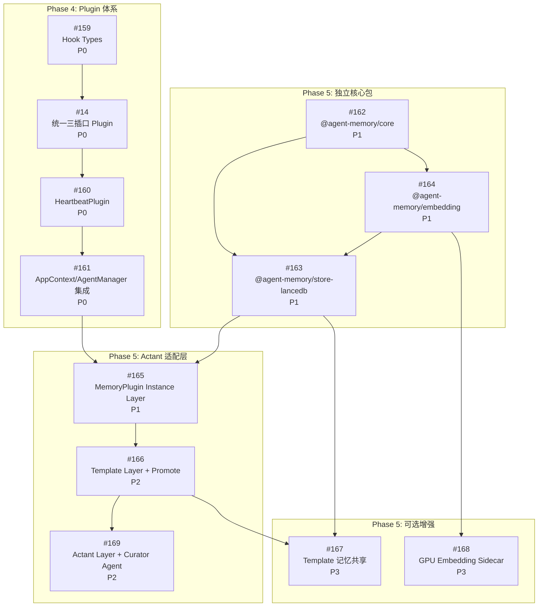

**Related Issues**: [[0014-plugin-heartbeat-scheduler-memory]], [[0159-hook-types-completion]], [[0160-heartbeat-plugin]], [[0161-plugin-appcontext-integration]], [[0162-agent-memory-core-package]], [[0163-agent-memory-store-lancedb]], [[0164-agent-memory-embedding]], [[0165-memory-plugin-instance-layer]], [[0166-template-layer-promote]], [[0167-template-memory-sharing]], [[0168-gpu-embedding-sidecar]], [[0169-actant-layer-curator-agent]]

---

# Epic: Plugin 体系 + 统一记忆系统

## 1. 概述

本 Epic 覆盖 Actant 从"工具平台"向"自治 Agent 平台"演进的两大核心能力模块：

1. **Phase 4 — Plugin 体系**: 为 Actant Daemon 增加有状态、有生命周期的可插拔运行时模块能力
2. **Phase 5 — 统一记忆系统**: 融合 OpenViking (分层上下文) + LanceDB (向量存储) + PageIndex (树状检索) 理念，构建 Actant/Template/Instance 三层长期记忆体系

两个模块通过 PluginHost 机制耦合：记忆系统以 MemoryPlugin 形式接入 Daemon 运行时。

**替代的旧 Issue**: #10 (Instance Memory Layer) → #165, #11 (Memory Consolidation) → #166, #12 (Context Layers) → #169。旧 issue 已关闭 (superseded)。

---

## 2. 设计文档

| 文档 | 路径 | 说明 |
|------|------|------|
| Plugin 体系设计 | `.cursor/plans/actant_plugin_system_design.plan.md` | 统一三插口 (domainContext + runtime + hooks)、PluginHost 分流、旧 PluginDefinition 适配 |
| 统一记忆设计 | `.cursor/plans/unified_memory_design_02e5f4f6.plan.md` | 三方案融合评估、MemoryRecord 数据模型、三层架构、Promote 流程、包结构 |
| 原始记忆设计 | `docs/design/memory-layer-agent-evolution.md` | 零依赖方案 (JSON 文件)，已演进为融合设计 |
| 12 轮审阅报告 | `docs/design/plugin-memory-review-report.md` | 架构/安全/性能/DX 等 12 个视角的系统性审阅 |
| 参考项目 | [memory-lancedb-pro](https://github.com/win4r/memory-lancedb-pro) | Hybrid Retrieval, Cross-Encoder Rerank, Multi-Scope 隔离 |

---

## 3. 子 Issue 全览

### Phase 4: Plugin 体系 (4 个 Issue)

| Issue | 标题 | 优先级 | 依赖 | 状态 |
|-------|------|--------|------|------|
| #159 | 补全 Hook 类型定义 (HookEventName/Declaration/Action) | P0 | 无 | 待开始 |
| #14 | Actant 统一 Plugin 体系 — 三插口 (domainContext+runtime+hooks) | P0 | #159 | 待开始 |
| #160 | HeartbeatPlugin — 验证 Plugin 架构 | P0 | #14 | 待开始 |
| #161 | Plugin AppContext/AgentManager 集成 + CLI | P0 | #14, #160 | 待开始 |

### Phase 5: 统一记忆系统 (8 个 Issue)

| Issue | 标题 | 优先级 | 依赖 | 状态 |
|-------|------|--------|------|------|
| #162 | @agent-memory/core — 独立记忆核心包 | P1 | 无 | 待开始 |
| #164 | @agent-memory/embedding — 多后端 Embedding 客户端 | P1 | #162 | 待开始 |
| #163 | @agent-memory/store-lancedb — LanceDB 存储实现 | P1 | #162, #164 | 待开始 |
| #165 | @actant/memory MemoryPlugin — Instance Layer | P1 | #14, #161, #162, #163, #164 | 待开始 |
| #166 | Template Layer + 自审查 Promote 机制 | P2 | #165 | 待开始 |
| #169 | Actant Layer + Memory Curator Agent | P2 | #165, #166 | 待开始 |
| #167 | Template 记忆共享 — 导出/导入/隐私 | P3 | #163, #166 | 待开始 |
| #168 | GPU Embedding Sidecar — CUDA 加速 (可选) | P3 | #164 | 待开始 |

---

## 4. 依赖拓扑图



---

## 5. 两条并行关键路径

### 路径 A — Plugin 体系 (Phase 4, 串行)

```
#159 Hook Types → #14 PluginHost → #160 HeartbeatPlugin → #161 AppContext 集成
```

**交付物**: Daemon 运行时支持有状态插件, HeartbeatPlugin 验证全链路

### 路径 B — 记忆核心 (Phase 5 独立包, 串行)

```
#162 @agent-memory/core → #164 embedding → #163 store-lancedb
```

**交付物**: 独立可发布的通用记忆系统包 (零 Actant 依赖)

### 汇合点

```
(路径 A #161 + 路径 B #163) → #165 MemoryPlugin Instance Layer
```

汇合后进入 Phase 5 纵深：`#165 → #166 → #169`，可选增强 `#167`, `#168` 并行开发。

---

## 6. 关键架构决策

### 6.1 Plugin 体系 — 统一三插口

- **Plugin = 三个可选插口的组合**:
  - `domainContext` 插口 — 物化到 Agent workspace (Claude plugins, MCP servers, rules, files)
  - `runtime` 插口 — Daemon 运行时 `init → start → tick → stop → dispose`
  - `hooks` 插口 — 事件消费/生产 (HookEventBus)
- **消除 PluginManager/PluginHost 割裂**: 旧 PluginDefinition 自动适配为纯 domainContext 插件
- **双层作用域**: `actant` (全局单例) + `instance` (per-agent)
- **PluginHost 三插口分流**: domainContext→BackendBuilder 物化, runtime→生命周期管理, hooks→EventBus 注册
- **PluginRef**: Template 统一引用 (`string | PluginRefConfig`)，简单或带配置均可

### 6.2 统一记忆系统

- **一个存储 + 两个索引视图**: LanceDB 唯一存储层 + Tiered View (L0/L1/L2) + Structural View (树状)
- **唯一外部依赖**: `@lancedb/lancedb` (~289KB, 嵌入式)
- **三层记忆**: Actant (全局) > Template (模板级) > Instance (实例级)
- **`ac://` URI 寻址**: 统一三层命名空间
- **智能体参与 Promote**: Template 以下自审查, Template→Actant 由 Curator Agent 审查
- **软耦合**: `@agent-memory/*` 零 Actant 依赖，可被其他框架使用

### 6.3 融合设计 (非简单集成)

| 来源 | 提炼的设计元素 | 引入方式 |
|------|--------------|---------|
| OpenViking | L0/L1/L2 分层上下文, URI 寻址, Session 压缩 | 自建 (~500行 TS) |
| LanceDB | 嵌入式向量存储, 混合检索 | 引入 (`@lancedb/lancedb`) |
| PageIndex | 树状索引, 结构感知检索 | 自建 (同表层级关系列) |

---

## 7. 12 轮审阅行动项摘要

完整审阅报告: `docs/design/plugin-memory-review-report.md`

### 高优先级 (实施阶段必须处理)

| 审阅视角 | 关键 Gap | 行动项 | 归属 Issue |
|---------|---------|--------|-----------|
| 架构一致性 | HookEventName 未定义 | 新增 `hook.types.ts` 到 @actant/shared | #159 |
| 数据模型 | `vector` 维度未固定, `childUris` 无上限 | 在 MemoryRecordSchema 中定义 dimension + maxChildren | #162 |
| 安全/隐私 | URI 路径穿越, 记忆注入风险 | URI 校验 (ac:// only, reject `..`) + recall confidence 阈值 | #162, #165 |
| 性能 | `materialize()` 阻塞 Agent 启动 | 记忆加载异步化/可选，允许降级启动 | #165 |
| 向后兼容 | 旧 JSON 记忆无迁移路径 | 添加 JSON→LanceDB 迁移脚本 (opt-in) | #165 |
| 失败恢复 | Plugin 崩溃无隔离 | 每个 plugin tick() 包裹 try/catch, 标记 unhealthy | #14 |

### 中优先级 (可在后续迭代处理)

| 审阅视角 | 关键 Gap | 行动项 | 归属 Issue |
|---------|---------|--------|-----------|
| DX | 无 MCP memory 工具 | 定义 `memory_recall/navigate/browse` MCP tools | #165 |
| 测试策略 | 无 InMemoryMemoryStore | 提供测试用内存实现 | #162 |
| 并发 | Template 层并发 promote 可能重复 | promote 幂等 (content hash) + 去重 | #166 |
| 并发 | tick() 重入无保护 | 添加 running guard, 跳过重叠 tick | #14 |
| 运维 | 无 DecayPolicy 实现 | 基于 lastAccessedAt/confidence 的淘汰策略 | #162 |
| 成本 | Embedding API 无预算控制 | 每 session embedding 上限 + 配置项 | #164 |

### 低优先级 (可选增强)

| 审阅视角 | 关键 Gap | 行动项 | 归属 Issue |
|---------|---------|--------|-----------|
| 依赖风险 | @lancedb/lancedb v0.x API 不稳定 | pin 版本 + CI 兼容测试 | #163 |
| 运维 | 无 `actant memory stats` | 添加统计命令 | #169 |
| DX | 无 plugin 脚手架 | `actant plugin create <name>` | #161 |
| 安全 | anonymized 模式规则未定义 | 正则/屏蔽词/路径脱敏规则 | #167 |

---

## 8. 验收标准

### Phase 4 Plugin 体系 (当本 Epic 的 Phase 4 部分完成时)

- [ ] ActantPlugin 接口在 @actant/shared 中定义并导出
- [ ] PluginHost 支持 actant/instance 双层作用域 + 依赖拓扑排序
- [ ] HeartbeatPlugin 验证 init/start/tick/stop 全链路
- [ ] AppContext 和 AgentManager 正确集成 PluginHost
- [ ] `actant plugin list/status` CLI 可用

### Phase 5 统一记忆系统 (当本 Epic 的 Phase 5 部分完成时)

- [ ] @agent-memory/core 独立发布 (零 Actant 依赖)
- [ ] LanceDB 存储 + 三种检索 (recall/navigate/browse) 正常工作
- [ ] MemoryPlugin 以 ActantPlugin 形式运行
- [ ] session:end 自动提取记忆, Agent 跨 session 记忆持久化
- [ ] Template Layer + 自审查 Promote 实现
- [ ] Actant Layer + Curator Agent 实现
- [ ] 无 memory 时行为与当前完全一致 (向后兼容)

---

## 9. 已关闭的旧 Issue

| Issue | 原标题 | 替代者 | 关闭原因 |
|-------|-------|--------|---------|
| #10 | Instance Memory Layer (Phase 1) | #165 | 融合设计替代 JSON 文件方案 |
| #11 | Memory Consolidation + Shared Memory (Phase 2) | #166 | Template Layer 替代扁平 Shared Memory |
| #12 | Context Layers + ContextBroker (Phase 3) | #169 | Actant Layer + Curator Agent 替代原 ContextBroker |

---

## Comments

### cursor-agent — 2026-02-25T12:00:00

Epic 创建。合并 Phase 4 Plugin 体系 (4 issue) + Phase 5 统一记忆系统 (8 issue) 共 12 个子 issue。关闭已被替代的 #10/#11/#12。12 轮多视角审阅完成，行动项已分配到对应子 issue。
