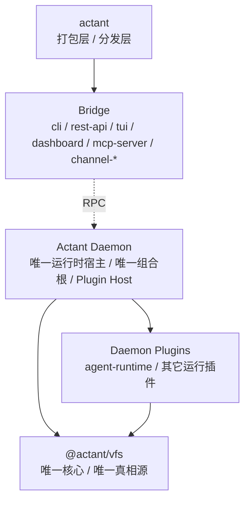
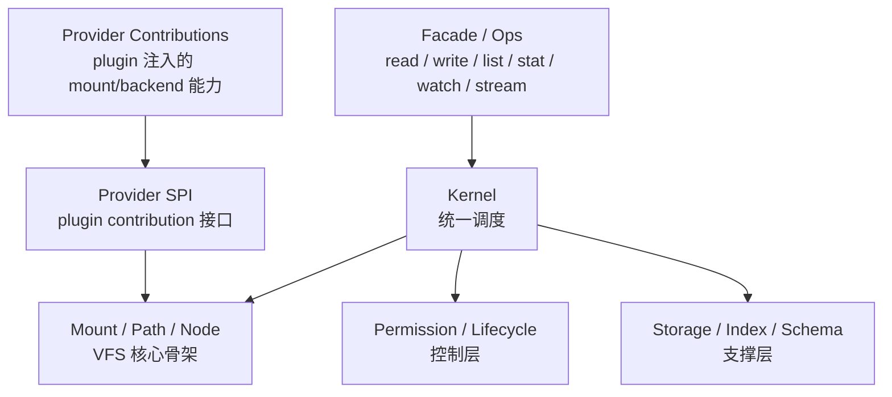

**Related Issues**: [[0318-discussion-openviking-deerflow-actant]]
**Related Files**: `packages/domain-context/src/domain/base-component-manager.ts`, `packages/catalog/src/catalog-manager.ts`, `packages/api/src/services/app-context.ts`, `packages/api/src/services/project-context.ts`

---

## 背景

当前工程正在朝 `file-first / everything-is-file` 收敛，但 `domain-context`、`catalog`、各类 manager/registry 的边界仍然混杂。

目前最关键的问题不是 `domain-context` 是否整体保留，而是：

- **VFS 是否仍然是唯一中心与唯一真相源**
- **catalog / manager 是否越过 VFS 直接形成注册中心**

如果 `catalog` 可以直接把内容注册到 manager，或者 manager 依赖 catalog / domain loader 主动灌入内容，那么系统的中心就不再是 VFS，而变成了隐式的内存注册表。这会直接破坏 file-first 方向。

## 目标

明确 `file-first` 下 `domain-context` 的最终定位，并以 **VFS 为唯一中心** 重画边界：

- `catalog` 的职责应收敛为：获取、同步、拉取、转换外部内容，并落到 VFS
- `VFS` 负责承载节点、目录、事件与统一访问语义
- 外部 `manager` 只能作为 **VFS 节点的派生视图 / 索引 / 缓存 / 语义助手** 存在
- `manager` 应主动监听 VFS node 的增删改并完成注册/反注册
- 不允许 `catalog` 或其他上层模块绕过 VFS 直接向 manager 注入内容

## 需要回答的核心问题

1. `packages/domain-context` 在最终架构中到底是什么：
   - 文件语义层 / 校验层 / 渲染辅助层
   - 还是带状态的组件注册中心

2. 哪些 manager 仍然有保留价值：
   - 仅作为运行时索引、查询加速、规则封装
   - 还是仍承担“真实注册表”职责

3. `catalog -> vfs -> manager` 的单向数据流能否成为统一约束：
   - 外部源进入系统必须先落 VFS
   - manager 只能订阅 VFS 变化生成派生状态

4. `domain-context` 里的哪些模块应被删除、降级或迁移：
   - `BaseComponentManager`
   - 各类 `*Manager`
   - 模板 registry / watcher
   - 与 `api/context/catalog` 职责重叠的桥接层

## 当前判断

倾向方向：

- **保留 `domain-context` 的语义能力**：schema、validator、permission/provider/template 规则、render helper
- **弱化甚至移除其“中心注册表”角色**：不再把 manager 作为真相源
- **把 manager 明确降级为 VFS 的观察者 / 索引器 / 物化视图**
- **限制 `catalog`**：只负责外部来源导入与落盘/落 VFS，不负责越权注册

## 范围

重点审查以下位置：

- `packages/domain-context`
- `packages/catalog`
- `packages/vfs`
- `packages/api/src/services/app-context.ts`
- `packages/api/src/services/project-context.ts`
- `packages/agent-runtime/src/vfs`
- `packages/agent-runtime/src/builder`

## 验收标准

- 明确 `domain-context` 在 file-first 下的最终定位
- 明确 `catalog`、`vfs`、`manager` 的单向依赖关系
- 列出 `domain-context` 内 keep / migrate / delete 清单
- 禁止新增任何绕过 VFS 的注册路径
- 后续包层级收口以此 issue 作为判断准绳

## 相关问题

- 与仓库整体定位讨论相关，但这是更具体的结构收口 issue
- 可作为后续 `@actant/context -> @actant/api`、`catalog` 收缩、`manager` 去中心化的前置决策

---
**Related Files**: `packages/domain-context/src/domain/base-component-manager.ts`, `packages/catalog/src/catalog-manager.ts`, `packages/api/src/services/app-context.ts`, `packages/api/src/services/project-context.ts`
**Related Issues**: #318

---

## Comments

### ### ### ### ### ### cursor-agent — 2026-03-23T09:51:08

按新的收口方向，建议把工程重画为 **三层 VFS 架构**，并彻底摒弃所有中心注册结构。

# 目标层级

## 0. 基础层（不算业务中心）

- `@actant/shared`
- 只保留通用 types / errors / logger / 平台与安全基础能力
- 不承载任何中心注册语义

## 1. VFS 核心结构层

建议最终只保留一个核心包：

- `@actant/vfs`

职责只包含：

- node / path / namespace
- mount / resolve / kernel dispatch
- read / write / list / stat / watch / stream
- permission / lifecycle / storage / index 基础设施
- provider 接入协议（例如 `IVfsSourceProvider` / `IVfsMountProvider`）

硬约束：

- VFS 是唯一真相源
- 任何内容进入系统都必须先进入 VFS
- 不允许 manager 成为真实注册表

## 2. VFS 扩展层（Provider 扩展层）

原则：**每种 provider 一个 package**，只负责把外部世界映射成 VFS node tree / watch events。

建议目标包：

- `@actant/vfs-provider-localfs`
- `@actant/vfs-provider-memory`
- `@actant/vfs-provider-process`
- `@actant/vfs-provider-vcs`
- `@actant/vfs-provider-github`
- `@actant/vfs-provider-sql`
- `@actant/vfs-provider-http`（如需要）
- `@actant/vfs-provider-agent-runtime`
- `@actant/vfs-provider-mcp-runtime`
- `@actant/vfs-provider-daemon`（如需要）

约束：

- provider 只产生节点与事件
- provider 不持有领域 manager
- provider 不直接注册 skill / prompt / template / mcp / workflow
- provider 不做业务语义解释

备注：

- 当前 `@actant/catalog` 应被拆解并降级到这一层
- `GitHubCatalog` / `LocalCatalog` 这类实现不应再通过 `CatalogManager` 灌入 manager
- `community-catalog` 若只是来源预设，应收敛为 provider preset / config，而不是中心模块

## 3. VFS 消费层

这一层只消费 VFS，不拥有中心注册结构。

### cursor-agent — 2026-03-23T09:54:24

治理 TODO（以 #322 为主线，子 issue 分治）：

## A. 架构口径治理

- [ ] 固化三层结构：`VFS 消费层 -> VFS 核心结构层 -> VFS 扩展层`
- [ ] 固化唯一真相源：所有状态以 VFS 为准
- [ ] 固化单向流：`provider -> VFS -> consumer/index`
- [ ] 禁止新增 `provider -> manager.register()` 路径
- [ ] 禁止新增 `manager -> VFS` 投影式 source

## B. 包层级治理

- [ ] 定义最终保留包清单
- [ ] 定义最终合并包清单
- [ ] 定义最终删除包清单
- [ ] 明确 `@actant/context -> @actant/api` 合并口径
- [ ] 明确 `@actant/catalog` 是拆散还是并入 `@actant/vfs`

## C. VFS 核心治理

- [ ] 统一 VFS provider 接口命名与职责边界
- [ ] 明确 mount / node / watch / stream / permission 的核心边界
- [ ] 明确哪些逻辑必须进入 `@actant/vfs`
- [ ] 明确哪些逻辑不得进入 `@actant/vfs`

## D. Provider 扩展治理

- [ ] 为每种 provider 定义单独 package 策略
- [ ] 形成 provider 包命名规范（如 `@actant/vfs-provider-*`）
- [ ] 将现有 `catalog` / `source` 实现映射到新 provider 包
- [ ] 禁止 provider 承担领域注册与业务解释职责

## E. domain-context 治理

- [ ] 列出 `domain-context` keep / migrate / delete 全清单
- [ ] 保留 parser / schema / validator / renderer / resolver
- [ ] 删除或迁出 manager / registry-first 结构
- [ ] 删除或迁出 watcher 中非 VFS 驱动部分
- [ ] 明确 provider registry 是否迁往 runtime 组装层

## F. 中心注册结构清理

- [ ] 删除 `BaseComponentManager` 作为体系中心抽象
- [ ] 删除 `CatalogManager` 的中心注册职责
- [ ] 删除 `domain-source` 这类 `manager -> VFS` 方向适配层
- [ ] 清点所有 `register/unregister` 真相源式调用点
- [ ] 将剩余 manager 降级为索引/缓存/派生视图

## G. 消费层改造治理

- [ ] `api` 改为直接消费 VFS + 解释层
- [ ] `agent-runtime` 改为直接消费 VFS + 解释层
- [ ] `cli` / `rest-api` / `dashboard` 统一通过 VFS 读状态
- [ ] 所有索引由 VFS watch 事件驱动增量更新
- [ ] 禁止消费层重新引入新的中心容器

## H. 历史残留治理

- [ ] 删除 `packages/domain`
- [ ] 删除 `packages/core`
- [ ] 清理 `dist/` / `tsbuildinfo` 等无效残留
- [ ] 修正活文档中的 `core/domain` 旧架构描述
- [ ] 对历史文档/issue/报告统一标记 legacy / archive
- [ ] 审视 `actant` 对外导出的 `./core` 别名是否保留

## I. 文档与术语治理

- [ ] 用新三层结构重写架构总览
- [ ] 统一 `source/provider/catalog` 术语
- [ ] 统一 `domain-context` 的最终定义
- [ ] 统一 `manager/index/cache/view` 的边界定义
- [ ] 为“禁止中心注册结构”补一页明确设计约束

## J. 验收治理

- [ ] 形成最终依赖方向图
- [ ] 形成最终保留/合并/删除包表
- [ ] 验证系统内不存在中心注册表真相源
- [ ] 验证所有外部内容都先进入 VFS
- [ ] 验证 `domain-context` 只负责解释文件
- [ ] 验证 provider 只负责产生节点与事件

### cursor-agent — 2026-03-23T10:05:41

采用新的统一口径：

> **daemon 是唯一运行时宿主与组合根，桥接层只负责通过 RPC 与 daemon 交互。**

这意味着：

- `VFS` 是唯一核心与唯一真相源
- `daemon` 负责装配 `VFS`、provider plugins、内部机制模块
- `cli/http/tui/mcp/...` 都只是 bridge，不再拥有自己的装配逻辑
- `actant` 只是产品入口壳，不再被视为真正的组合根

# 模块结构图

```mermaid
flowchart TB
    subgraph BASE["基础层"]
        SHARED["@actant/shared\n通用 types / errors / logger"]
    end

    subgraph CORE["核心层"]
        VFS["@actant/vfs\n唯一核心 / 唯一真相源"]
    end

    subgraph HOST["宿主层"]
        DAEMON["Actant Daemon\n唯一运行时宿主 / 唯一组合根"]
    end

    subgraph PROVIDERS["Provider 插件层"]
        P_LOCAL["@actant/vfs-provider-localfs"]
        P_MEM["@actant/vfs-provider-memory"]
        P_PROC["@actant/vfs-provider-process"]
        P_VCS["@actant/vfs-provider-vcs"]
        P_GH["@actant/vfs-provider-github"]
        P_SQL["@actant/vfs-provider-sql"]
        P_HTTP["@actant/vfs-provider-http"]
        P_AGENT["@actant/vfs-provider-agent-runtime"]
        P_MCP["@actant/vfs-provider-mcp-runtime"]
        P_DAEMON["@actant/vfs-provider-daemon"]
    end

    subgraph MODULES["Daemon 内部机制模块"]
        DOMAIN["@actant/domain-context\n文件解释 / schema / validator / resolver"]
        AR["@actant/agent-runtime\n运行机制模块"]
        API["@actant/api"]
        ACP["@actant/acp"]
        PI["@actant/pi"]
    end

    subgraph BRIDGES["桥接层"]
        CLI["@actant/cli"]
        REST["@actant/rest-api"]
        TUI["@actant/tui"]
        DASH["@actant/dashboard"]
        MCP["@actant/mcp-server"]
        CHANNEL["@actant/channel-claude"]
    end

    subgraph ENTRY["入口壳"]
        ACTANT["actant\n产品入口 / 启动器"]
    end

    SHARED --> VFS
    SHARED --> DAEMON

    P_LOCAL --> VFS
    P_MEM --> VFS
    P_PROC --> VFS
    P_VCS --> VFS
    P_GH --> VFS
    P_SQL --> VFS
    P_HTTP --> VFS
    P_AGENT --> VFS
    P_MCP --> VFS
    P_DAEMON --> VFS

    DOMAIN --> VFS
    AR --> VFS
    API --> VFS
    ACP --> VFS
    PI --> VFS

    DAEMON --> VFS
    DAEMON --> DOMAIN
    DAEMON --> AR
    DAEMON --> API
    DAEMON --> ACP
    DAEMON --> PI

    DAEMON --> P_LOCAL
    DAEMON --> P_MEM
    DAEMON --> P_PROC
    DAEMON --> P_VCS
    DAEMON --> P_GH
    DAEMON --> P_SQL
    DAEMON --> P_HTTP
    DAEMON --> P_AGENT
    DAEMON --> P_MCP
    DAEMON --> P_DAEMON

    CLI -. RPC .-> DAEMON
    REST -. RPC .-> DAEMON
    TUI -. RPC .-> DAEMON
    MCP -. RPC .-> DAEMON
    CHANNEL -. RPC .-> DAEMON
    DASH -. HTTP / RPC .-> REST

    ACTANT --> DAEMON
    ACTANT --> CLI
```

# 边界定义

## 1. VFS

职责：

- 唯一核心
- 唯一真相源
- 统一 node / mount / path / watch / stream / permission 语义

禁止：

- 依赖具体 provider 实现
- 依赖 `agent-runtime` / `api` / `domain-context`
- 内建中心注册结构

## 2. daemon

职责：

- 唯一运行时宿主
- 唯一组合根
- 装载 VFS
- 装载 provider plugins
- 装配内部机制模块
- 提供统一 RPC 能力面

禁止：

- 混入 UI 表现层逻辑
- 让 bridge 层各自拥有二次装配能力

## 3. bridge 层

职责：

- 通过 RPC 与 daemon 交互
- 做协议转换、请求转发、响应格式化、交互适配

禁止：

- 直接成为组合根
- 直接装载 provider / modules
- 直接维护系统真相源

## 4. provider plugins

职责：

- 把外部世界映射成 VFS node / mount / event
- 作为插件被 daemon 装载

禁止：

- 直接注册领域内容到 manager
- 持有系统中心状态
- 替代 VFS 成为内容真相源

## 5. domain-context

职责：

- 解释 VFS 中文件的语义
- parser / schema / validator / renderer / resolver

禁止：

- manager-first / registry-first
- 反向生成 VFS
- 成为系统状态中心

# 对治理计划的直接影响

- `actant app` 作为组合根的表述废弃，统一改为 `daemon` 是组合根
- 后续 provider plugin host 应位于 daemon，而不是 bridge 层或 app 壳
- `cli/rest/tui/mcp/channel/dashboard` 一律按 bridge 口径审查
- `agent-runtime` 仍是重要模块，但不再被抬升为架构中心；它只是 daemon 内部被装配的机制模块之一
- 后续 VFS 治理应优先聚焦：`vfs core boundary`、`provider plugin SPI`、`bridge/daemon RPC contract`

### cursor-agent — 2026-03-23T10:12:56

本轮讨论已进一步收敛为以下运行时架构口径：

> **daemon 是唯一运行时宿主与组合根，桥接层只负责通过 RPC 与 daemon 交互。**

进一步补充：

- `actant` 只是打包层 / 分发层 / 产品壳
- `domain-context`、`acp`、`pi` 作为 `agent-runtime` 的依赖
- `agent-runtime` 是 `daemon` 的重要插件之一，而不是高于 `daemon` 或高于 `VFS` 的中心
- 插件是 `daemon plugin`
- `provider` 只是 `daemon plugin` 可以注入的一类能力，不再作为系统的顶层插件模型
- `VFS` 仍然是唯一核心与唯一真相源

## 简化模块结构图

## VFS 内部结构图

## 本轮治理 TODO

### cursor-agent — 2026-03-23T10:16:12

补充完整治理 TODO（保留全量，不做压缩）：

## 1. 宿主与运行时口径治理

- [ ] 固化 `daemon` 是唯一运行时宿主
- [ ] 固化 `daemon` 是唯一组合根
- [ ] 固化 `bridge` 只负责通过 RPC 与 `daemon` 交互
- [ ] 固化 `actant` 只是打包层 / 分发层 / 产品壳
- [ ] 删除 `actant app` 作为组合根的旧叙述
- [ ] 删除 bridge 层“自带装配能力”的旧叙述
- [ ] 清理活文档中所有与上述口径冲突的表述

## 2. 模块结构治理

- [ ] 固化简化模块结构图
- [ ] 固化 VFS 内部结构图
- [ ] 明确 `daemon -> daemon plugin -> provider contribution -> VFS` 的装载方向
- [ ] 明确 `bridge -> RPC -> daemon` 的调用方向
- [ ] 明确哪些模块属于 daemon 内部模块
- [ ] 明确哪些模块属于 bridge 层
- [ ] 明确哪些模块属于打包层

## 3. 插件模型治理

- [ ] 定义 `daemon plugin` 是系统唯一有效扩展单元
- [ ] 定义 `daemon plugin` 的最小契约
- [ ] 定义 plugin 生命周期：`activate / deactivate / dispose`
- [ ] 定义 plugin 可贡献能力集合：`provider / rpc / hooks / services`
- [ ] 定义 plugin 元信息模型
- [ ] 定义 plugin 装载位置只能在 `daemon`
- [ ] 禁止 bridge 层直接装载 plugin
- [ ] 禁止 `provider` 继续被当作系统顶层插件模型

## 4. Provider contribution 治理

- [ ] 定义 `provider contribution` 的最小 SPI
- [ ] 明确 `provider` 只是 `daemon plugin` 的子能力
- [ ] 明确 `provider` 只负责向 VFS 注入 mount/backend/数据来源
- [ ] 禁止 `provider` 直接注册领域内容
- [ ] 禁止 `provider` 成为中心注册结构
- [ ] 禁止 `provider` 替代 `daemon plugin`
- [ ] 明确现有来源能力如何迁移为 provider contribution

## 5. VFS 核心治理

- [ ] 固化 `@actant/vfs` 是唯一核心
- [ ] 固化 `@actant/vfs` 是唯一真相源
- [ ] 固化 `@actant/vfs` 内部结构：`facade / kernel / mount / path / node / permission / lifecycle / storage / index / schema / SPI`
- [ ] 明确 `kernel` 只负责统一调度
- [ ] 明确 `mount / path / node` 是 VFS 核心骨架
- [ ] 明确 `permission / lifecycle / storage / index` 是支撑层
- [ ] 明确 `provider SPI` 是插件接入面，不是业务注册面
- [ ] 禁止 `domain/catalog/manager` 逻辑进入 VFS core
- [ ] 定义 `mount / watch / stream / dispose` 生命周期契约
- [ ] 定义 runtimefs 建模边界

## 6. `agent-runtime` 定位治理

- [ ] 固化 `agent-runtime` 是 daemon plugin
- [ ] 明确 `agent-runtime` 不是中心层
- [ ] 明确 `agent-runtime` 不是组合根
- [ ] 明确 `domain-context` / `acp` / `pi` 是 `agent-runtime` 依赖
- [ ] 评估是否拆出 `agent-runtime plugin adapter`
- [ ] 明确 `agent-runtime` 可向 VFS 注入哪些 provider contribution
- [ ] 明确 `agent-runtime` 只通过 VFS 读写系统状态

## 7. `domain-context` 治理

- [ ] 列出 `domain-context` keep / migrate / delete 全清单
- [ ] 保留 parser / schema / validator / renderer / resolver
- [ ] 删除 manager-first / registry-first 结构
- [ ] 删除或迁出 watcher 中非 VFS 驱动部分
- [ ] 禁止 `domain-context` 反向生成 VFS
- [ ] 禁止 `domain-context` 成为系统状态中心
- [ ] 明确哪些能力继续作为 `agent-runtime` 依赖保留

## 8. `acp` / `pi` 治理

- [ ] 明确 `acp` 是 `agent-runtime` 依赖还是 daemon plugin contribution
- [ ] 明确 `pi` 是 `agent-runtime` 依赖还是独立 plugin
- [ ] 清理 `acp` / `pi` 在文档中的层级漂移描述
- [ ] 明确它们与 VFS 的依赖关系不能绕过 `agent-runtime` / `daemon`

## 9. 去中心注册结构治理

- [ ] 删除 `CatalogManager` 的中心注册职责
- [ ] 删除 `BaseComponentManager` 中心抽象
- [ ] 删除 `domain-source` 这类 `manager -> VFS` 投影结构
- [ ] 清点所有 `register/unregister` 真相源式调用点
- [ ] 删除所有“内容先进入注册表，再投影回 VFS”的路径
- [ ] 将剩余 manager 降级为索引 / 缓存 / 派生视图
- [ ] 禁止新增任何中心注册结构

## 10. 包层级治理

- [ ] 定义最终保留包清单
- [ ] 定义最终合并包清单
- [ ] 定义最终删除包清单
- [ ] 明确 `@actant/context -> @actant/api` 合并口径
- [ ] 明确 `@actant/catalog` 是拆散为 plugin contribution 还是彻底删除
- [ ] 明确 bridge 包的最终保留清单
- [ ] 明确 daemon-hosted modules 的最终保留清单
- [ ] 明确打包层 `actant` 的最小职责边界

## 11. 历史残留治理

- [ ] 延续 `#323`，删除 `packages/domain`
- [ ] 延续 `#323`，删除 `packages/core`
- [ ] 清理 `dist/` / `tsbuildinfo` 等残留
- [ ] 修正活文档中的 `core/domain` 旧架构描述
- [ ] 审视 `actant` 对外导出的 `./core` 别名是否保留
- [ ] 对历史文档 / issue / 报告统一标记 `legacy` / `archive`

## 12. 文档与术语治理

- [ ] 更新 `.trellis/spec/index.md`
- [ ] 更新 `.trellis/spec/terminology.md`
- [ ] 更新 `.trellis/spec/backend/index.md`
- [ ] 更新 `docs/design/actant-vfs-reference-architecture.md`
- [ ] 统一 `daemon / bridge / daemon plugin / provider contribution` 术语
- [ ] 统一 `domain-context` 的最终定义
- [ ] 统一 `manager/index/cache/view` 的边界定义
- [ ] 增补“禁止中心注册结构”的明确设计约束

## 13. Bridge 层治理

- [ ] 审查 `cli` 是否纯 RPC bridge
- [ ] 审查 `rest-api` 是否纯 RPC bridge
- [ ] 审查 `tui` 是否纯 RPC bridge
- [ ] 审查 `dashboard` 是否只是 bridge 的 UI 外壳
- [ ] 审查 `mcp-server` 是否只是 bridge
- [ ] 审查 `channel-*` 是否只是 bridge / adapter
- [ ] 清理 bridge 层任何自行装载系统的能力

## 14. 验收治理

- [ ] 形成最终模块结构图
- [ ] 形成最终 VFS 内部结构图
- [ ] 形成最终依赖方向图
- [ ] 形成最终保留 / 合并 / 删除包表
- [ ] 验证 `daemon` 是唯一组合根
- [ ] 验证 bridge 只通过 RPC 与 daemon 交互
- [ ] 验证 `provider` 只是 plugin contribution
- [ ] 验证系统内不存在中心注册表真相源
- [ ] 验证所有真实状态最终收敛到 VFS
- [ ] 验证 `domain-context` 只负责解释文件
