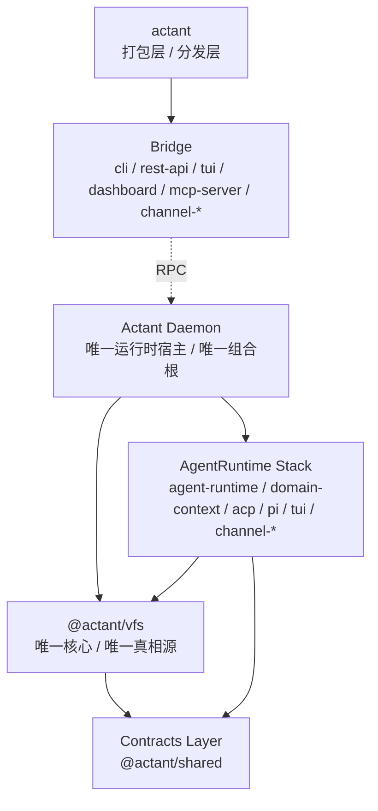
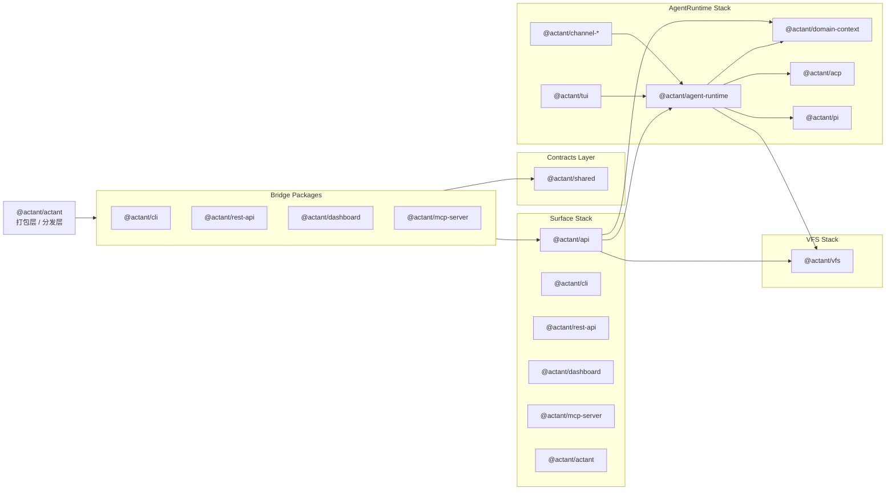

# Actant Specifications

> 核心原则：文档、契约、接口、配置先于实现。
> 当前基线：Linux 语义下的 ContextFS V1。

---

## 当前规范基线

Actant 当前只承认一套新的顶层叙述：

- 产品层：`ContextFS`
- 实现层：`VFS`
- 运行时宿主：`daemon`
- 交互入口：`bridge`
- 核心对象：`mount namespace`、`mount table`、`filesystem type`、`mount instance`、`node type`
- V1 必要 `mount type`：`root`、`direct`
- V1 必要 `filesystem type`：`hostfs`、`runtimefs`、`memfs`
- V1 必要 `node type`：`directory`、`regular`、`control`、`stream`
- V1 操作面：`read`、`write`、`list`、`stat`、`watch`、`stream`
- V1 边界：只实现当前 spec、design、roadmap 中明确列出的对象、路径约定与操作面

### 运行时基线

运行时结构统一采用以下口径：

- `daemon` 是唯一运行时宿主与唯一组合根
- `bridge` 只负责通过 RPC 与 `daemon` 交互
- `actant` 是打包层 / 分发层 / 产品壳，不是组合根
- 当前单仓按 `Contracts Layer`、`VFS Stack`、`AgentRuntime Stack`、`Surface Stack` 四层理解
- `Surface Stack` 是唯一允许同时依赖 `VFS Stack` 与 `AgentRuntime Stack` 的对外薄包装层
- `domain-context` 归属 `AgentRuntime Stack`



### 冻结后的包拓扑

当前活跃仓库只保留下面这套包层级：

| 层级 | 保留包 | 固定职责 |
| --- | --- | --- |
| `Contracts Layer` | `@actant/shared` | 共享合同、错误、最小公共基础设施；不拥有业务真相 |
| `VFS Stack` | `@actant/vfs` | 唯一文件系统内核、唯一挂载/路径/节点真相源 |
| `AgentRuntime Stack` | `@actant/agent-runtime`, `@actant/domain-context`, `@actant/acp`, `@actant/pi`, `@actant/tui`, `@actant/channel-*` | 运行时执行、解释、协议与集成能力 |
| `Surface Stack` | `@actant/api`, `@actant/cli`, `@actant/rest-api`, `@actant/dashboard`, `@actant/mcp-server`, `actant` | daemon 组合、CLI / HTTP / MCP / Dashboard / 分发壳等对外入口 |

过渡与清理结论固定如下：

| 状态 | 包 | 结论 |
| --- | --- | --- |
| `cleanup-target` | `@actant/context` | 本轮并入 `@actant/api` 并删除，不得新增任何 call site |
| `deleted` | `@actant/catalog`, `@actant/core`, `@actant/domain` | 已退出活跃边界，不得在 active docs/help/export 中复活 |



### `actant` 最小职责边界

`@actant/actant` 只允许承担以下职责：

- 打包产物入口与产品分发壳
- 对外聚合已冻结的 bridge / shell 能力
- 不得成为组合根
- 不得重新导出已删除的 `core` / `catalog` / `domain` 旧入口
- 不得持有 runtime state、mount table 或 VFS kernel

---

## 强制流程

```text
需求 -> spec/design/roadmap -> 类型/契约 -> 实现 -> 测试 -> 审查
```

当前阶段额外约束：

- 先收敛真相源，再进入实现
- 活跃文档必须使用 Linux 术语
- 历史迁移说明必须留在默认入口之外
- `daemon` 是唯一运行时组合根，bridge 层不得二次装配系统
- `agent-runtime` 只是由 `daemon` 装载的机制模块，不是中心层或组合根
- `Surface Stack` 只是组合层，不得成为新的真相源
- `packages/vfs` 的 core 骨架必须保持在 `facade / kernel / mount / path / node / permission / lifecycle / storage / index / filesystem type SPI`
- `@actant/context` 是清退目标，不得新增任何导入
- 所有 ship / merge 级交付必须先产出 changelog draft，再汇总正式 release changelog
- 活跃 planning 真相只允许留在 `docs/planning/roadmap.md` 与 `docs/planning/workspace-normalization-todo.md` 这组 owner 文件中
- `actant.namespace.json` 是默认且唯一运行时 namespace 配置入口

---

## 推荐阅读顺序

1. [Linux 术语设计文档](../../docs/design/contextfs-v1-linux-terminology.md)
2. [术语表](./terminology.md)
3. [ContextFS Architecture](../../docs/design/contextfs-architecture.md)
4. [Actant VFS Reference Architecture](../../docs/design/actant-vfs-reference-architecture.md)
5. [配置规范](./config-spec.md)
6. [接口契约](./api-contracts.md)
7. [后端指南](./backend/index.md)
8. [Product Roadmap](../../docs/planning/roadmap.md)
9. [Workspace Normalization To-Do](../../docs/planning/workspace-normalization-todo.md)

---

## 审查要求

任何后续实现或设计变更，审查时必须确认：

- 是否仍遵守 `ContextFS` / `VFS` 的层次分工
- 是否仍遵守 `Contracts Layer / VFS Stack / AgentRuntime Stack / Surface Stack` 的单仓边界
- 是否把 consumer interpretation 重新写回 VFS 核心模型
- 是否把 `agent-runtime` 或 `domain-context` 重新写成系统中心层
- 是否把旧 `Source` / `Prompt` 术语重新写成当前真相
- 是否在 spec、design、roadmap 三层同步修改
- 是否把 planning 状态只维护在当前 owner 文件中，而没有把旧 `contextfs-roadmap.md` 重新当作活跃真相
