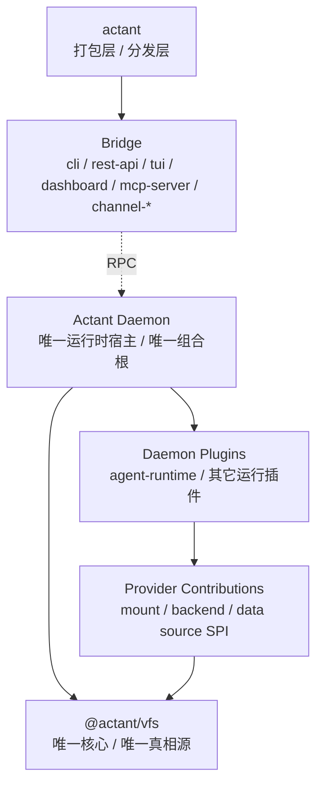

# Actant Specifications

> 核心原则：文档、契约、接口、配置先于实现。
> 当前基线：Linux 语义下的 ContextFS V1。

---

## 当前规范基线

Actant 当前只承认一套新的顶层叙述：

- 产品层：`ContextFS`
- 实现层：`VFS`
- 运行时宿主：`daemon`
- 交互入口：`bridge`
- 核心对象：`mount namespace`、`mount table`、`filesystem type`、`mount instance`、`node type`
- V1 必要 `mount type`：`root`、`direct`
- V1 必要 `filesystem type`：`hostfs`、`runtimefs`、`memfs`
- V1 必要 `node type`：`directory`、`regular`、`control`、`stream`
- V1 操作面：`read`、`write`、`list`、`stat`、`watch`、`stream`
- V1 边界：只实现当前 spec、design、roadmap 中明确列出的对象、路径约定与操作面

### 运行时基线

运行时结构统一采用以下口径：

- `daemon` 是唯一运行时宿主与唯一组合根
- `bridge` 只负责通过 RPC 与 `daemon` 交互
- `actant` 是打包层 / 分发层 / 产品壳，不是组合根
- `daemon plugin` 是系统的真实扩展单元
- `provider` 只是 `daemon plugin` 可注入的一类能力，不是插件总概念



---

## 强制流程

```text
需求 -> spec/design/roadmap -> 类型/契约 -> 实现 -> 测试 -> 审查
```

当前阶段额外约束：

- 先收敛真相源，再进入实现
- 活跃文档必须使用 Linux 术语
- 历史迁移说明必须留在默认入口之外
- `daemon` 是唯一运行时组合根，bridge 层不得二次装配系统
- `provider` 不得再被当作中心注册结构或顶层插件模型
- 所有 ship / merge 级交付必须先产出 changelog draft，再汇总正式 release changelog
- `docs/planning/contextfs-roadmap.md` 是唯一 live milestone truth file
- `actant.namespace.json` 是默认且唯一运行时 namespace 配置入口

---

## 推荐阅读顺序

1. [Linux 术语设计文档](../../docs/design/contextfs-v1-linux-terminology.md)
2. [术语表](./terminology.md)
3. [ContextFS Architecture](../../docs/design/contextfs-architecture.md)
4. [Actant VFS Reference Architecture](../../docs/design/actant-vfs-reference-architecture.md)
5. [配置规范](./config-spec.md)
6. [接口契约](./api-contracts.md)
7. [后端指南](./backend/index.md)
8. [ContextFS Roadmap](../../docs/planning/contextfs-roadmap.md)

---

## 审查要求

任何后续实现或设计变更，审查时必须确认：

- 是否仍遵守 `ContextFS` / `VFS` 的层次分工
- 是否仍遵守 `daemon host -> RPC bridge -> VFS core` 的运行时分工
- 是否把 consumer interpretation 重新写回 VFS 核心模型
- 是否把 `provider` 误提升成了独立组合根或中心注册结构
- 是否把旧 `Source` / `Prompt` 术语重新写成当前真相
- 是否在 spec、design、roadmap 三层同步修改
- 是否把 live progress 只维护在 `docs/planning/contextfs-roadmap.md`
