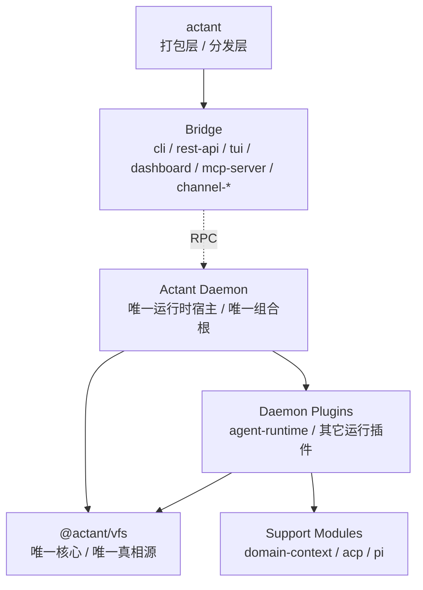
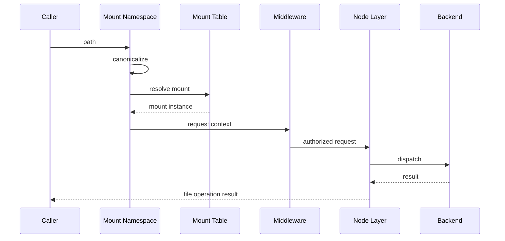

# Actant VFS Reference Architecture

> Status: Draft
> Date: 2026-03-23
> Scope: 实现层内核架构（Linux 语义）
> Related: [ContextFS V1 Linux Terminology](./contextfs-v1-linux-terminology.md), [ContextFS Architecture](./contextfs-architecture.md), [ContextFS Roadmap](../planning/contextfs-roadmap.md)

---

## 1. Role

`VFS` 是 `ContextFS` 的实现内核。

它不是业务资源分类器，也不是旧式 source router。  
它的职责是把 ContextFS 的文件系统语义落实为统一的访问内核。

核心判断：

> **Actant VFS 应被设计为 filesystem kernel，而不是资源分类路由器。**

同时，VFS 的运行时宿主口径固定为：

- `daemon` 是唯一运行时宿主与唯一组合根
- `bridge` 只负责通过 RPC 与 `daemon` 交互
- `daemon plugin` 是系统真实扩展单元
- `provider contribution` 只是 `daemon plugin` 可贡献的一类能力
- `agent-runtime` 是被 `daemon` 装载的机制模块，不是组合根
- `domain-context` 只是解释/authoring helper，不是运行时真相源
- `acp` 是协议/transport 模块
- `pi` 是 backend package，而不是宿主层

简化模块图：

### 1.1 Frozen Package Structure

当前活跃包结构按下面理解，不再引入第二套同级平台层：

| 层级 | 包 | 说明 |
| --- | --- | --- |
| `product shell` | `@actant/actant` | 打包层 / 分发层 |
| `bridge` | `@actant/cli`, `@actant/rest-api`, `@actant/dashboard`, `@actant/mcp-server` | 对外入口；默认经 RPC 进入 daemon |
| `daemon-hosted modules` | `@actant/api`, `@actant/agent-runtime` | 运行时装配、plugin 生命周期、namespace/hub/runtime service |
| `VFS core` | `@actant/vfs` | 唯一内核 |
| `support modules` | `@actant/domain-context`, `@actant/acp`, `@actant/pi`, `@actant/shared` | 文件解释、协议/transport、backend package、共享契约 |
| `adapter / UI` | `@actant/tui`, `@actant/channel-*` | UI/SDK 适配；不是 bridge host，不是 daemon |
| `transitional keep` | `@actant/context` | 仅剩 project/namespace projection helper，继续并入 `@actant/api` |

已删除包：

- `@actant/catalog`
- `@actant/core`
- `@actant/domain`

### 1.2 Bridge / Edge Audit

bridge / edge 层的冻结结论如下：

| 包 | 结论 | 边界 |
| --- | --- | --- |
| `@actant/rest-api` | pure bridge | 只做 HTTP/SSE -> RPC 转发 |
| `@actant/dashboard` | UI shell | 只包裹 `rest-api` 与前端静态资源 |
| `@actant/cli` | bridge shell with local exceptions | 允许 `init`、daemon 启动、hub standalone namespace fallback |
| `@actant/mcp-server` | bridge shell with local exceptions | 允许 standalone namespace fallback，但不能装载 plugin |
| `@actant/tui` | not bridge | 纯 UI toolkit |
| `@actant/channel-*` | not bridge | channel adapter / SDK adapter |

这里的“local exception”只表示受控的本地 namespace 读取或产品启动路径，不表示第二套系统组合根。

---

## 2. Fixed Layers

V1 的实现分层固定为：

- `mount namespace`
- `mount table`
- `middleware`
- `node / backend`
- `metadata`
- `lifecycle`
- `events`

### 2.1 Mount Namespace

负责：

- path / URI 规范化
- canonical path 生成
- 挂载视图解释
- mount-relative path 切分

### 2.2 Mount Table

负责：

- `root` / `direct` 挂载登记
- 最长前缀匹配
- 挂载生命周期挂接

### 2.3 Node / Backend

`node` 是统一对象，`backend` 是真实实现。

V1 的 `node type` 固定为：

- `directory`
- `regular`
- `control`
- `stream`

### 2.4 Metadata

负责：

- mount metadata
- node metadata
- tags
- 最小审计落点

### 2.5 Lifecycle

负责：

- daemon
- session
- process
- ttl

### 2.6 Events

负责：

- watch 所需最小事件传播
- runtime invalidate 基础语义

### 2.7 Current File Mapping

当前 `packages/vfs` 的 V1 内部文件布局应按下面理解：

- `facade`: `packages/vfs/src/vfs-facade.ts`
- `kernel`: `packages/vfs/src/core/vfs-kernel.ts`
- `mount`: `packages/vfs/src/mount/direct-mount-table.ts`
- `path / namespace`: `packages/vfs/src/vfs-path-resolver.ts`、`packages/vfs/src/namespace/canonical-path.ts`
- `node`: `packages/vfs/src/node/resolved-node-adapter.ts`
- `permission`: `packages/vfs/src/vfs-permission-manager.ts`、`packages/vfs/src/middleware/permission-middleware.ts`
- `lifecycle`: `packages/vfs/src/vfs-lifecycle-manager.ts`
- `storage`: `packages/vfs/src/storage/*`
- `index`: `packages/vfs/src/index/path-index.ts`
- `filesystem type / SPI`: `packages/vfs/src/filesystem-type-registry.ts`

相关上层边界：

- `agent-runtime`
  - daemon-hosted runtime module
  - plugin lifecycle / agent orchestration / builder integration
  - may contribute runtimefs providers through daemon plugin/provider surfaces
- `domain-context`
  - parser / schema / validator / loader / permission compilation
  - local mutable collection / watcher only
  - must not define VFS core or runtime truth
- `acp`
  - protocol / transport implementation used by daemon-hosted runtime flows
  - must not bypass daemon / agent-runtime host boundaries
- `pi`
  - backend package consumed by `agent-runtime`
  - must not be described as daemon plugin host or standalone system layer

约束：

- 上述目录和文件是当前 V1 的核心骨架
- `sources/*` 仍是过渡期 helper/factory 集合，不得反向定义 `VFS core`
- `domain` / `catalog` / `manager` 语义不得继续渗入 `kernel`、`mount`、`path`、`node`、`permission` 主骨架
- `agent-runtime` 只能通过 `daemon plugin -> provider contribution -> VFS` 接入文件系统能力
- `domain-context` 不得反向定义 `mount`、`node` 或 `filesystem type`
- `acp` 与 `pi` 的接入必须遵守 `bridge -> RPC -> daemon` 与 `daemon -> plugin -> provider -> VFS` 既有边界

---

## 3. Request Flow

---

## 4. Required Public Types

V1 当前必须在实现里稳定表达：

- `mount type`: `root | direct`
- `filesystem type`: `hostfs | runtimefs | memfs`
- `node type`: `directory | regular | control | stream`

对外出口至少要能稳定暴露：

- `mountPoint`
- `mountType`
- `filesystemType`
- `nodeType`
- `capabilities`
- `metadata`
- `tags`

## 4.1 Hosted Boundary Rules

当请求经过宿主运行时时，边界固定为：

- `bridge -> RPC -> daemon`
- `daemon -> plugin -> provider -> VFS`

解释如下：

- `bridge` 负责把 ACP / channel / MCP / CLI / API 等入口翻译到稳定 `RPC`
- `daemon` 是 hosted lifecycle 与 dispatch 所在边界
- `plugin` 是 daemon 内部装载的能力单元
- `provider` 是 plugin / backend 使用的内部连接或上游配置对象
- `VFS` 是最终执行路径解析、挂载匹配、节点操作与 capability 判定的唯一内核

限制：

- bridge 不直接触碰 plugin / provider / VFS 内部状态
- plugin / provider 不得绕过 `mount namespace`、`mount table` 与 middleware 暴露第二套访问面
- standalone / local kernel path 可以不经过 daemon，但不能因此引入第二套 runtime contract

---

## 5. Runtime Filesystem Contract

运行时树必须按 `runtimefs` 建模，而不是旁路 VFS：

- `status.json` -> `regular`
- `control/request.json` -> `control`
- `streams/*` -> `stream`

关键约束：

- 向 `control node` 写入是 effectful submission
- 从 `stream node` 读取是 ordered stream consumption
- 普通上下文读取不能被 daemon 绑死

---

## 5.1 Mount / Watch / Stream / Dispose Contract

V1 的核心生命周期契约固定如下：

- `mount`
  - 输入是完整 `mount registration`
  - `mount table` 负责登记、最长前缀匹配与 duplicate mount-point 拒绝
  - `lifecycle manager` 在挂载成功后开始追踪 `daemon / agent / session / process / ttl / manual`
- `watch`
  - 由节点 capability 暴露
  - 返回 `AsyncIterable<VfsWatchEvent>`
  - 提前结束迭代时必须调用底层 watcher disposer，不能泄漏订阅
- `stream`
  - 由节点 capability 暴露
  - 返回 ordered `AsyncIterable<VfsStreamChunk>`
  - `stream node` 可由真实 stream handler 提供，也可在受控场景下由 read fallback 生成一次性流
- `dispose`
  - mount 生命周期结束时，系统至少要完成 untrack + unmount
  - `watch` 订阅在 iterator `return()` 时释放
  - `VfsLifecycleManager.dispose()` 只负责清理 lifecycle timers，不额外保留挂载真相

实现落点：

- `mount`: `packages/vfs/src/mount/direct-mount-table.ts`
- `watch` / `stream`: `packages/vfs/src/node/resolved-node-adapter.ts`
- `dispose` / lifecycle cleanup: `packages/vfs/src/vfs-lifecycle-manager.ts`

---

## 6. Extension Rule

扩展面固定分两类：

- `daemon plugin`：由 `daemon` 装载的真实扩展单元
- `provider contribution`：plugin 注入到 `VFS` 的挂载/数据来源能力

约束：

- 不允许把 provider 本身当作系统组合根
- 不允许 bridge 层直接装载 provider 或 plugin
- 不允许内容先进入中心注册表，再投影回 VFS

最小 SPI：

- 公共基线字段：`kind`、`filesystemType`、`mountPoint`
- `runtimefs` data-source contribution：
  - `listRecords()`
  - `getRecord(name)`
  - 可选 `readStream()`
  - 可选 `stream()`
  - 可选 `writeControl()`
  - 可选 `subscribe()`

当前收敛映射：

| Path / Family | Provider Contribution | Rule |
|------|--------------------------|------|
| `/agents` | `AgentRuntimeProviderContribution` | `runtimefs` data-source，负责 agent status/control/streams |
| `/mcp/runtime` | `McpRuntimeProviderContribution` | `runtimefs` data-source，负责 runtime status/control/streams |
| `hostfs` / `memfs` | 不适用 | 由 filesystem type factory 直接实例化，不经过 provider contribution |
| `/skills` `/prompts` `/workflows` `/templates` | 不适用 | 派生内容或 manager-backed 视图，不属于 provider contribution |

何时扩展 `filesystem type`：

- 只有在“底层提供方式”变化时扩展
- 例如：宿主目录、内存视图、运行时伪文件系统

何时扩展 `node type`：

- 只有在 I/O 语义本身发生变化时扩展
- `control node` 和 `stream node` 属于这种情况

何时只扩展 metadata / tag / consumer：

- 当底层仍然只是普通文件，但用途不同
- 例如 skill、prompt、sql、config
