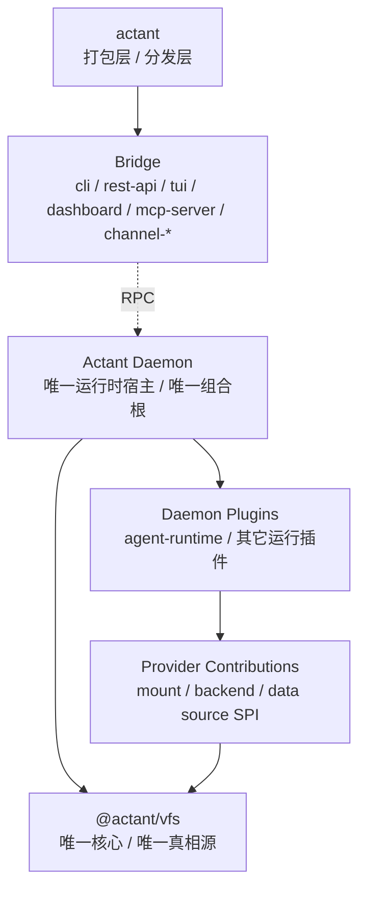
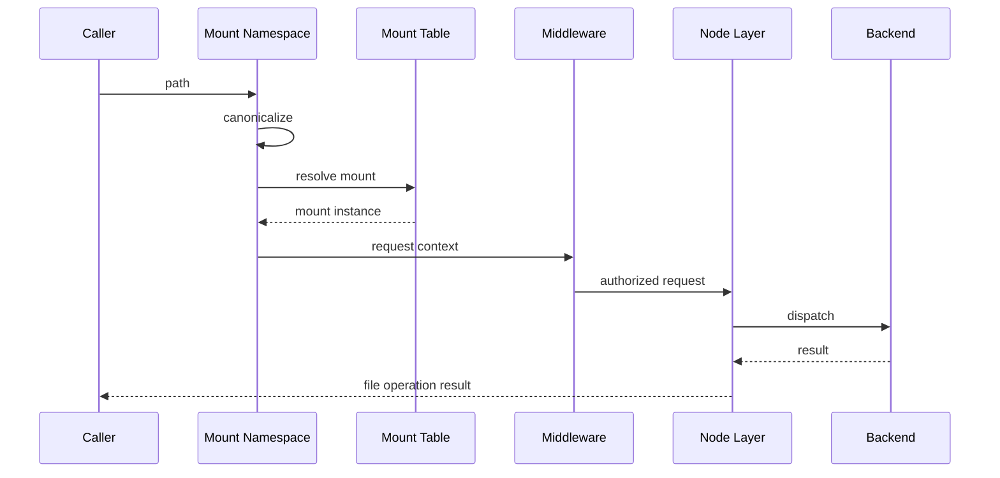

# Actant VFS Reference Architecture

> Status: Draft
> Date: 2026-03-24
> Scope: 实现层内核架构（Linux 语义）
> Related: [ContextFS V1 Linux Terminology](./contextfs-v1-linux-terminology.md), [ContextFS Architecture](./contextfs-architecture.md), [ContextFS Roadmap](../planning/contextfs-roadmap.md)

---

## 1. Role

`VFS` 是 `ContextFS` 的实现内核。

它不是业务资源分类器，也不是旧式 source router。  
它的职责是把 ContextFS 的文件系统语义落实为统一的访问内核。

核心判断：

> **Actant VFS 应被设计为 filesystem kernel，而不是资源分类路由器。**

同时，VFS 的运行时宿主口径固定为：

- `daemon` 是唯一运行时宿主与唯一组合根
- `bridge` 只负责通过 RPC 与 `daemon` 交互
- `daemon plugin` 是系统真实扩展单元
- `provider` 只是 `daemon plugin` 可贡献的一类能力

简化模块图：

模块结构治理的固定口径：

- `actant -> bridge`：打包层只负责分发入口、命令封装和产品壳，不成为运行时组合根
- `bridge -> RPC -> daemon`：桥接层只能通过 RPC/HTTP socket 等协议调用 `daemon`
- `daemon -> daemon plugin`：运行时扩展只能由 `daemon` 装载
- `daemon plugin -> provider contribution -> VFS`：插件通过 provider contribution 向 VFS 注入 mount/backend/数据来源能力
- `VFS` 不得反向依赖 `agent-runtime`、`domain-context`、`acp`、`pi` 或任意 bridge 包

当前活跃包归属快照：

| Layer | Packages / Modules | Rule |
|------|---------------------|------|
| 打包层 | `actant` | 负责分发、命令包装、入口编排；不持有运行时真相 |
| Bridge 层 | `@actant/cli`, `@actant/rest-api`, `@actant/tui`, `@actant/dashboard`, `@actant/mcp-server`, `@actant/channel-*` | 只做请求转发、协议转换、响应格式化和交互适配 |
| daemon 内部模块 | `@actant/api`, `@actant/agent-runtime`, `@actant/domain-context`, `@actant/acp`, `@actant/pi` | 作为 `daemon` 内部运行机制或被其装载的插件能力存在 |
| VFS 核心 | `@actant/vfs` | 唯一核心、唯一真相源；不接收反向业务编排依赖 |
| 共享支撑 | `@actant/shared` | 提供类型、日志、路径和桥接公共工具；不升级为架构中心 |

补充约束：

- `@actant/context`、`@actant/catalog` 属于待收敛的历史过渡包，不得作为新架构中心继续扩张
- 新增模块必须先声明自己属于打包层、bridge 层、daemon 内部模块或 `VFS` 核心中的哪一层
- 如果一个变更让 bridge 直接依赖 provider/VFS 内部实现，或让 `VFS` 反向依赖运行机制模块，该变更默认判定为越层

---

## 2. Fixed Layers

V1 的实现分层固定为：

- `mount namespace`
- `mount table`
- `middleware`
- `node / backend`
- `metadata`
- `lifecycle`
- `events`

### 2.1 Mount Namespace

负责：

- path / URI 规范化
- canonical path 生成
- 挂载视图解释
- mount-relative path 切分

### 2.2 Mount Table

负责：

- `root` / `direct` 挂载登记
- 最长前缀匹配
- 挂载生命周期挂接

### 2.3 Node / Backend

`node` 是统一对象，`backend` 是真实实现。

V1 的 `node type` 固定为：

- `directory`
- `regular`
- `control`
- `stream`

### 2.4 Metadata

负责：

- mount metadata
- node metadata
- tags
- 最小审计落点

### 2.5 Lifecycle

负责：

- daemon
- session
- process
- ttl

### 2.6 Events

负责：

- watch 所需最小事件传播
- runtime invalidate 基础语义

---

## 3. Request Flow

---

## 4. Required Public Types

V1 当前必须在实现里稳定表达：

- `mount type`: `root | direct`
- `filesystem type`: `hostfs | runtimefs | memfs`
- `node type`: `directory | regular | control | stream`

对外出口至少要能稳定暴露：

- `mountPoint`
- `mountType`
- `filesystemType`
- `nodeType`
- `capabilities`
- `metadata`
- `tags`

---

## 5. Runtime Filesystem Contract

运行时树必须按 `runtimefs` 建模，而不是旁路 VFS：

- `status.json` -> `regular`
- `control/request.json` -> `control`
- `streams/*` -> `stream`

关键约束：

- 向 `control node` 写入是 effectful submission
- 从 `stream node` 读取是 ordered stream consumption
- 普通上下文读取不能被 daemon 绑死

---

## 6. Extension Rule

扩展面固定分两类：

- `daemon plugin`：由 `daemon` 装载的真实扩展单元
- `provider contribution`：plugin 注入到 `VFS` 的挂载/数据来源能力

约束：

- 不允许把 provider 本身当作系统组合根
- 不允许 bridge 层直接装载 provider 或 plugin
- 不允许内容先进入中心注册表，再投影回 VFS

何时扩展 `filesystem type`：

- 只有在“底层提供方式”变化时扩展
- 例如：宿主目录、内存视图、运行时伪文件系统

何时扩展 `node type`：

- 只有在 I/O 语义本身发生变化时扩展
- `control node` 和 `stream node` 属于这种情况

何时只扩展 metadata / tag / consumer：

- 当底层仍然只是普通文件，但用途不同
- 例如 skill、prompt、sql、config
