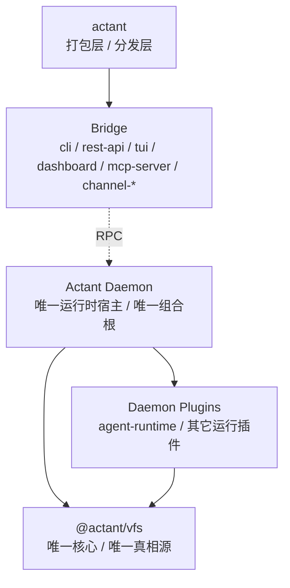
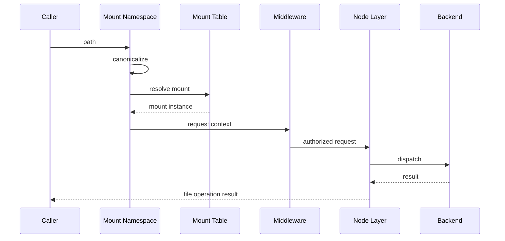

# Actant VFS Reference Architecture

> Status: Draft
> Date: 2026-03-22
> Scope: 实现层内核架构（Linux 语义）
> Related: [ContextFS V1 Linux Terminology](./contextfs-v1-linux-terminology.md), [ContextFS Architecture](./contextfs-architecture.md), [ContextFS Roadmap](../planning/contextfs-roadmap.md)

---

## 1. Role

`VFS` 是 `ContextFS` 的实现内核。

它不是业务资源分类器，也不是旧式 source router。  
它的职责是把 ContextFS 的文件系统语义落实为统一的访问内核。

核心判断：

> **Actant VFS 应被设计为 filesystem kernel，而不是资源分类路由器。**

同时，VFS 的运行时宿主口径固定为：

- `daemon` 是唯一运行时宿主与唯一组合根
- `bridge` 只负责通过 RPC 与 `daemon` 交互
- `daemon plugin` 是系统真实扩展单元
- `provider contribution` 只是 `daemon plugin` 可贡献的一类能力

简化模块图：

---

## 2. Fixed Layers

V1 的实现分层固定为：

- `mount namespace`
- `mount table`
- `middleware`
- `node / backend`
- `metadata`
- `lifecycle`
- `events`

### 2.1 Mount Namespace

负责：

- path / URI 规范化
- canonical path 生成
- 挂载视图解释
- mount-relative path 切分

### 2.2 Mount Table

负责：

- `root` / `direct` 挂载登记
- 最长前缀匹配
- 挂载生命周期挂接

### 2.3 Node / Backend

`node` 是统一对象，`backend` 是真实实现。

V1 的 `node type` 固定为：

- `directory`
- `regular`
- `control`
- `stream`

### 2.4 Metadata

负责：

- mount metadata
- node metadata
- tags
- 最小审计落点

### 2.5 Lifecycle

负责：

- daemon
- session
- process
- ttl

### 2.6 Events

负责：

- watch 所需最小事件传播
- runtime invalidate 基础语义

### 2.7 Current File Mapping

当前 `packages/vfs` 的 V1 内部文件布局应按下面理解：

- `facade`: `packages/vfs/src/vfs-facade.ts`
- `kernel`: `packages/vfs/src/core/vfs-kernel.ts`
- `mount`: `packages/vfs/src/mount/direct-mount-table.ts`
- `path / namespace`: `packages/vfs/src/vfs-path-resolver.ts`、`packages/vfs/src/namespace/canonical-path.ts`
- `node`: `packages/vfs/src/node/resolved-node-adapter.ts`
- `permission`: `packages/vfs/src/vfs-permission-manager.ts`、`packages/vfs/src/middleware/permission-middleware.ts`
- `lifecycle`: `packages/vfs/src/vfs-lifecycle-manager.ts`
- `storage`: `packages/vfs/src/storage/*`
- `index`: `packages/vfs/src/index/path-index.ts`
- `filesystem type / SPI`: `packages/vfs/src/filesystem-type-registry.ts`

约束：

- 上述目录和文件是当前 V1 的核心骨架
- `sources/*` 仍是过渡期 helper/factory 集合，不得反向定义 `VFS core`
- `domain` / `catalog` / `manager` 语义不得继续渗入 `kernel`、`mount`、`path`、`node`、`permission` 主骨架

---

## 3. Request Flow

---

## 4. Required Public Types

V1 当前必须在实现里稳定表达：

- `mount type`: `root | direct`
- `filesystem type`: `hostfs | runtimefs | memfs`
- `node type`: `directory | regular | control | stream`

对外出口至少要能稳定暴露：

- `mountPoint`
- `mountType`
- `filesystemType`
- `nodeType`
- `capabilities`
- `metadata`
- `tags`

---

## 5. Runtime Filesystem Contract

运行时树必须按 `runtimefs` 建模，而不是旁路 VFS：

- `status.json` -> `regular`
- `control/request.json` -> `control`
- `streams/*` -> `stream`

关键约束：

- 向 `control node` 写入是 effectful submission
- 从 `stream node` 读取是 ordered stream consumption
- 普通上下文读取不能被 daemon 绑死

---

## 6. Extension Rule

扩展面固定分两类：

- `daemon plugin`：由 `daemon` 装载的真实扩展单元
- `provider contribution`：plugin 注入到 `VFS` 的挂载/数据来源能力

约束：

- 不允许把 provider 本身当作系统组合根
- 不允许 bridge 层直接装载 provider 或 plugin
- 不允许内容先进入中心注册表，再投影回 VFS

最小 SPI：

- 公共基线字段：`kind`、`filesystemType`、`mountPoint`
- `runtimefs` data-source contribution：
  - `listRecords()`
  - `getRecord(name)`
  - 可选 `readStream()`
  - 可选 `stream()`
  - 可选 `writeControl()`
  - 可选 `subscribe()`

当前收敛映射：

| Path / Family | Provider Contribution | Rule |
|------|--------------------------|------|
| `/agents` | `AgentRuntimeProviderContribution` | `runtimefs` data-source，负责 agent status/control/streams |
| `/mcp/runtime` | `McpRuntimeProviderContribution` | `runtimefs` data-source，负责 runtime status/control/streams |
| `hostfs` / `memfs` | 不适用 | 由 filesystem type factory 直接实例化，不经过 provider contribution |
| `/skills` `/prompts` `/workflows` `/templates` | 不适用 | 派生内容或 manager-backed 视图，不属于 provider contribution |

何时扩展 `filesystem type`：

- 只有在“底层提供方式”变化时扩展
- 例如：宿主目录、内存视图、运行时伪文件系统

何时扩展 `node type`：

- 只有在 I/O 语义本身发生变化时扩展
- `control node` 和 `stream node` 属于这种情况

何时只扩展 metadata / tag / consumer：

- 当底层仍然只是普通文件，但用途不同
- 例如 skill、prompt、sql、config
