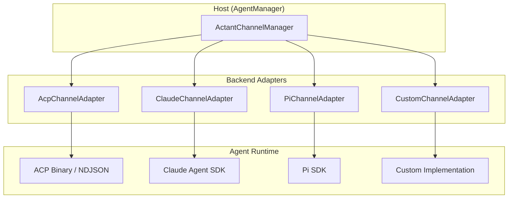

# Architecture

**副标题**：角色、Profile 与适配器架构

---

## Roles

### Host

**Host** 是协议的主控方，通常是 Actant Daemon（AgentManager）。Host 负责：

- 管理 Backend 的生命周期（connect / disconnect）
- 向 Backend 发起 prompt 请求
- 为 Backend 提供服务（文件 I/O、终端、权限审批、工具执行）
- 接收 Backend 推送的事件

### Backend

**Backend** 是 Agent 运行时的抽象，通过适配器与 Host 通信。Backend 负责：

- 执行 prompt 并返回结果
- 管理自身的 session 状态
- 向 Host 请求服务（当自身无法处理时）
- 向 Host 推送事件（进度、工具调用、状态变更）

### 与 ACP 角色的对应关系

| ACP 角色 | ACP-EX 角色 | 说明 |
|----------|-------------|------|
| Client | Host | 主控方，发起 prompt，提供 callback |
| Agent | Backend | 执行方，处理 prompt，请求服务 |

---

## Protocol Profiles

ACP-EX 协议分为三层 Profile：

```
┌─────────────────────────────────────────────────────────────┐
│  External Profile                                            │
│  面向外部客户端的子集（Gateway Bridge、REST mapping）          │
├─────────────────────────────────────────────────────────────┤
│  Extended Profile                                            │
│  Actant 特有扩展（Activity、VFS、Budget、Host Tools）         │
├─────────────────────────────────────────────────────────────┤
│  Core Profile                                                │
│  与 ACP 1:1 对等的操作集（Session、Prompt、Callbacks）        │
└─────────────────────────────────────────────────────────────┘
```

### Core Profile

与 ACP 标准保持语义一致的核心操作。任何 ACP-EX 适配器 MUST 实现 Core Profile 中的 required 部分（即 `prompt()`）。

### Extended Profile

Actant 平台特有的扩展能力。适配器按照后端能力选择性实现。

### External Profile

面向外部客户端（IDE、REST、CLI）的协议子集。定义 Actant 作为 ACP Proxy 对外暴露的接口。

---

## Adapter Architecture



### 适配器说明

| 适配器 | 说明 |
|--------|------|
| **AcpChannelAdapter** | 封装 ACP Binary 或 ACP 连接，通过 ACP/NDJSON over stdio 与 ACP Agent 通信。Core Profile 完整实现，Extended Profile 部分支持。 |
| **ClaudeChannelAdapter** | 使用 `@anthropic-ai/claude-agent-sdk` 的 `query()`，SDK 原生协议。Core Profile 完整，Extended Profile 完整（hooks、structured output、dynamic MCP）。 |
| **PiChannelAdapter** | 使用 Pi SDK，Pi 原生协议。Core Profile 部分实现，Extended Profile 部分支持。 |
| **CustomChannelAdapter** | 用户自定义实现。Core Profile 至少实现 `prompt()`，Extended Profile 可选。 |

---

## Communication Model

ACP-EX 使用 TypeScript 接口（而非 JSON-RPC 线缆协议）定义 Host 与 Backend 之间的通信契约。

- **Host 与 Backend**：Backend 适配器将 TypeScript 接口调用翻译为后端特有协议（ACP/NDJSON、Claude SDK 原生、Pi SDK、自定义）。
- **External Profile**：面向 IDE 等外部客户端时，使用 ACP 标准 JSON-RPC 协议。

```
Host (TypeScript)  ←→  ActantChannel / ChannelHostServices  ←→  Backend Adapter
                                                                      │
                                                                      ▼
                                                              Backend-specific protocol
                                                              (ACP NDJSON / SDK native / Custom)
```
