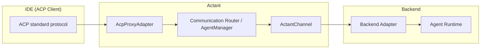

# External Profile

**副标题**：ACP Proxy 模式

---

## Overview

Actant 可作为 ACP Proxy，向外部客户端（IDE）暴露标准 ACP 协议。External Profile 定义 ACP 与 ACP-EX 之间的转换规则。任何 ACP 兼容 IDE 均可通过 Actant 与 Actant 管理的 Backend 交互。

---

## Architecture

IDE（ACP Client）→ ACP 标准协议 → AcpProxyAdapter（External Profile）→ ACP→Channel 转换 → Communication Router（AgentManager）→ ActantChannel → Backend Adapter → Agent Runtime

---

## Translation Rules: Client Operations

| ACP Operation (IDE → Actant) | Channel Operation (Actant → Backend) |
|------------------------------|--------------------------------------|
| `initialize` | `connect()` |
| `session/new` | `newSession()` 或使用 primary session |
| `session/load` | `resumeSession()` |
| `session/prompt` | `streamPrompt()` 或 `prompt()` |
| `session/cancel` | `cancel()` |
| `session/set_mode` | `configure({ mode: modeId })` |
| `session/set_config_option` | `configure({ [configId]: value })` |

---

## Translation Rules: Callbacks

| Channel Callback (Backend → Actant) | ACP Callback (Actant → IDE) |
|--------------------------------------|---------------------------|
| sessionUpdate（Core 事件） | session/update（直接转发） |
| requestPermission | session/request_permission（直接转发） |
| readTextFile / writeTextFile | fs/read_text_file / fs/write_text_file（路由到 IDE 或本地） |
| createTerminal / ... | terminal/*（路由到 IDE 或本地） |
| executeTool | N/A（由 Host 内部处理） |
| vfsRead / vfsWrite | N/A（内部） |
| activityRecord | N/A（内部） |

---

## Capability Mapping

| ACP Capability | Channel Capability |
|----------------|--------------------|
| loadSession | resume |
| promptCapabilities.image | contentTypes 包含 "image" |
| promptCapabilities.audio | contentTypes 包含 "audio" |
| mcpCapabilities.http | （若 adapter 支持则为 true） |
| clientCapabilities.fs.readTextFile | needsFileIO |
| clientCapabilities.terminal | needsTerminal |

---

## Extended Feature Handling

- ACP-EX Extended 功能 NOT 通过 External Profile 暴露
- IDE 客户端仅看到 Core Profile 能力
- Extended 功能（structured output、thinking、dynamic MCP）由 Actant 内部处理
