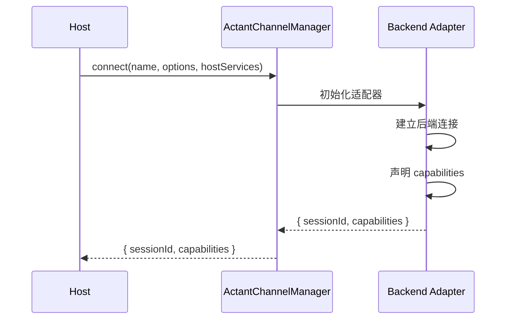

# Initialization

**副标题**：连接建立与能力协商

---

## Overview

在任何 session 操作之前，Host MUST 通过 `ActantChannelManager.connect()` 建立连接。连接成功后，Backend 返回 `sessionId` 和 `ChannelCapabilities`，Host 据此决定可调用的方法及需注入的 Host 服务。



---

## connect()

### 方法签名

```typescript
connect(
  name: string,
  options: ChannelConnectOptions,
  hostServices: ChannelHostServices,
): Promise<{ sessionId: string; capabilities: ChannelCapabilities }>;
```

### 参数说明

| 参数 | 类型 | 必填 | 描述 |
|------|------|------|------|
| name | string | Yes | 此连接的唯一标识符，用于后续 `getChannel(name)` 等操作 |
| options | ChannelConnectOptions | Yes | 连接配置，包含工作目录、环境变量、MCP 配置等 |
| hostServices | ChannelHostServices | Yes | Host 提供的回调服务，Backend 通过此接口请求 Host 能力 |

### 返回值

| 字段 | 类型 | 描述 |
|------|------|------|
| sessionId | string | 初始 session 的 ID，用于后续 `prompt()`、`streamPrompt()` 等调用 |
| capabilities | ChannelCapabilities | Backend 声明的能力集，Host MUST 据此判断可选方法是否可用 |

---

## ChannelConnectOptions

### 接口定义

```typescript
interface ChannelConnectOptions {
  cwd: string;
  env?: Record<string, string>;
  autoApprove?: boolean;
  systemContext?: string[];
  mcpServers?: McpServerSpec[];
  hostTools?: HostToolDefinition[];
  toolPolicy?: ToolPolicy;
  command?: string;          // ACP compat
  args?: string[];           // ACP compat
  resolvePackage?: string;   // ACP compat
  adapterOptions?: Record<string, unknown>;
}
```

### 字段说明

| 字段 | 类型 | 必填 | Profile | 描述 |
|------|------|------|---------|------|
| cwd | string | Yes | Core | Backend 工作目录，所有相对路径以此为基准 |
| env | Record<string, string> | No | Core | 传递给 Backend 进程的环境变量 |
| autoApprove | boolean | No | Core | 是否自动审批所有权限请求，默认 false |
| systemContext | string[] | No | Core | 注入到 Backend 的系统上下文（system message 片段） |
| mcpServers | McpServerSpec[] | No | Core | MCP 服务器配置，Host 提供，Backend 负责连接和使用 |
| hostTools | HostToolDefinition[] | No | Extended | Host 提供的工具定义，执行时通过 `executeTool` 回调 Host |
| toolPolicy | ToolPolicy | No | Extended | 工具策略（白名单、黑名单、自动审批） |
| command | string | No | ACP-compat | ACP Binary 命令，仅 AcpChannelAdapter 使用 |
| args | string[] | No | ACP-compat | ACP Binary 参数 |
| resolvePackage | string | No | ACP-compat | npm 包名，用于 binary 自动解析 |
| adapterOptions | Record<string, unknown> | No | Extended | 适配器自行解读的扩展选项，协议层不解读，直接透传 |

### adapterOptions 示例

| 适配器 | 示例字段 |
|--------|----------|
| AcpChannelAdapter | `{ connectionOptions, activityRecorder, sessionToken }` |
| ClaudeChannelAdapter | `{ model, permissionMode, hooks, agents, thinking, effort }` |
| PiChannelAdapter | `{ personality, voiceMode }` |

---

## ChannelCapabilities

### 接口定义

```typescript
interface ChannelCapabilities {
  // Core
  streaming: boolean;
  cancel: boolean;
  resume: boolean;
  multiSession: boolean;
  configurable: boolean;
  callbacks: boolean;
  // Callback needs
  needsFileIO: boolean;
  needsTerminal: boolean;
  needsPermission: boolean;
  // Extended
  structuredOutput: boolean;
  thinking: boolean;
  dynamicMcp: boolean;
  dynamicTools: boolean;
  contentTypes: string[];
  extensions: string[];
}
```

### 字段说明

| 字段 | 类型 | 默认 | Profile | 描述 |
|------|------|------|---------|------|
| streaming | boolean | false | Core | 是否支持 `streamPrompt()` 流式 prompt |
| cancel | boolean | false | Core | 是否支持 `cancel()` 取消正在进行的 prompt |
| resume | boolean | false | Core | 是否支持 `resumeSession()` 恢复已有 session |
| multiSession | boolean | false | Core | 是否支持 `newSession()` 创建子 session |
| configurable | boolean | false | Core | 是否支持 `configure()` 变更 session 配置 |
| callbacks | boolean | false | Core | 是否需要 Host 提供 callback 服务（ChannelHostServices） |
| needsFileIO | boolean | false | Core | Backend 是否需要 Host 提供文件 I/O（readTextFile、writeTextFile） |
| needsTerminal | boolean | false | Core | Backend 是否需要 Host 提供终端服务 |
| needsPermission | boolean | false | Core | Backend 是否需要 Host 审批权限（requestPermission） |
| structuredOutput | boolean | false | Extended | 是否支持结构化输出（outputFormat） |
| thinking | boolean | false | Extended | 是否支持 thinking/reasoning 控制 |
| dynamicMcp | boolean | false | Extended | 是否支持运行时 MCP 服务器管理（setMcpServers、getMcpStatus） |
| dynamicTools | boolean | false | Extended | 是否支持运行时 Host 工具管理（registerHostTools、unregisterHostTools） |
| contentTypes | string[] | [] | Extended | 支持的内容类型，如 `["text", "image", "audio", "resource"]` |
| extensions | string[] | [] | Extended | 后端特有的扩展能力标识，如 `["hooks", "agents", "effort"]` |

---

## Capability Negotiation

Host MUST 在调用 optional 方法前检查对应的 capability。若 capability 为 false 或方法不存在，Host MUST 使用 fallback 或跳过该操作。

### Checking Support

在调用 optional 方法前，Host SHOULD 使用以下模式：

```typescript
// 示例：streaming vs prompt
if (channel.capabilities.streaming && channel.streamPrompt) {
  for await (const event of channel.streamPrompt(sessionId, text, options)) {
    yield event;
  }
} else {
  const result = await channel.prompt(sessionId, text, options);
  yield {
    type: "x_result_success",
    sessionId,
    result: result.text,
    stopReason: result.stopReason,
  };
}
```

```typescript
// 示例：cancel
if (channel.capabilities.cancel && channel.cancel) {
  await channel.cancel(sessionId);
}
```

适配器在 `connect()` 完成时声明其 capabilities，Host 从返回的 `capabilities` 对象读取。

---

## Capability Matrix

| Capability | AcpChannelAdapter | ClaudeChannelAdapter | PiChannelAdapter |
|------------|:-----------------:|:--------------------:|:----------------:|
| streaming | true | true | true |
| cancel | true | true | false |
| resume | partial (loadSession) | true | false |
| multiSession | true | false | false |
| configurable | true | true | false |
| callbacks | true | false | true |
| needsFileIO | true | false | true |
| needsTerminal | true | false | true |
| needsPermission | true | true | true |
| structuredOutput | false | true | false |
| thinking | false | true | false |
| dynamicMcp | false | true | false |
| dynamicTools | false | true | false |
| extensions | [] | ["hooks","agents","effort"] | [] |
