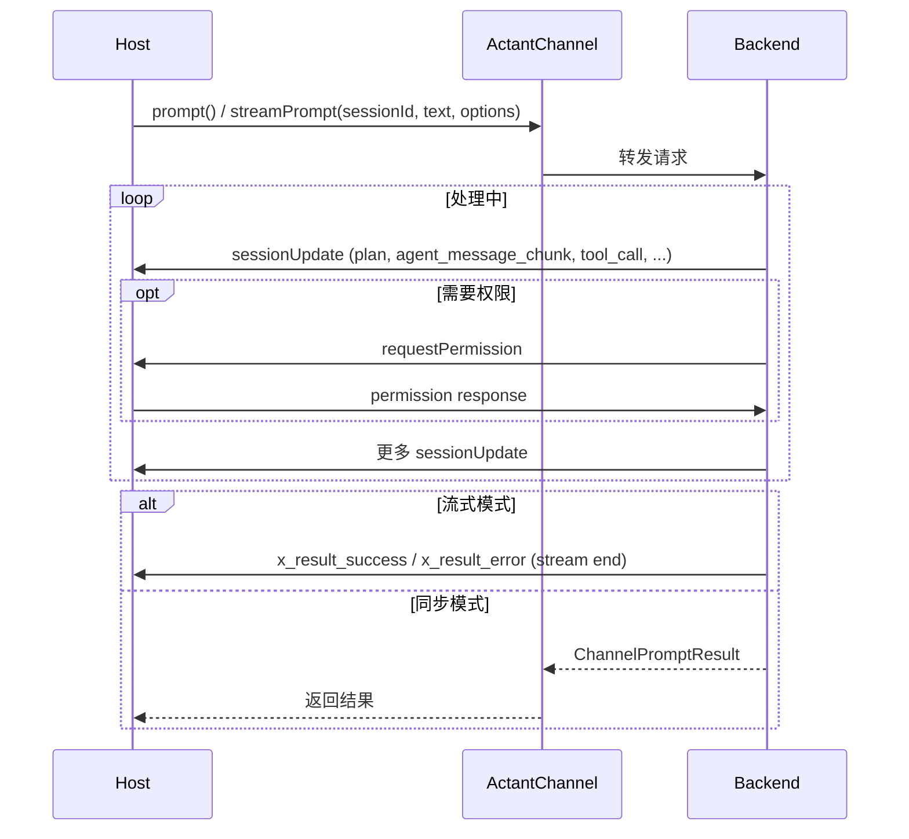

# Prompt Turn

**副标题**：Core conversation flow

---

## Overview

Prompt Turn 是 ACP-EX 的基础交互：Host 发送文本 → Backend 通过 LLM 处理 → 返回结果。`prompt()` 为同步等待完整响应；`streamPrompt()` 为流式返回事件。两者共享相同的参数和语义。



---

## ActantChannel.prompt()

> 发送 prompt 并等待完整响应。

**Profile**：Core  
**Requirement**：Required — 所有 Backend MUST 实现此方法  
**ACP Equivalent**：`session/prompt`（非流式模式）

### Signature

```typescript
prompt(
  sessionId: string,
  text: string,
  options?: PromptOptions,
): Promise<ChannelPromptResult>;
```

### Parameters

| Parameter | Type | Required | Description |
|-----------|------|----------|-------------|
| sessionId | string | Yes | 目标 session ID |
| text | string | Yes | 用户 prompt 文本 |
| options | PromptOptions | No | Prompt 配置 |

### PromptOptions

```typescript
interface PromptOptions {
  maxTurns?: number;
  model?: string;
  outputFormat?: { type: "json_schema"; schema: Record<string, unknown> };
  thinking?: { type: "adaptive" } | { type: "enabled"; budgetTokens: number } | { type: "disabled" };
  backendOptions?: Record<string, unknown>;
}
```

| Field | Type | Profile | Description |
|-------|------|---------|-------------|
| maxTurns | number | Core | 最大对话轮数。Backend SHOULD 遵守此限制。 |
| model | string | Extended | 模型选择。Backend MAY 在不可配置时忽略。 |
| outputFormat | object | Extended | 结构化输出格式。需要 `capabilities.structuredOutput = true`。 |
| thinking | object | Extended | Thinking/reasoning 控制。需要 `capabilities.thinking = true`。 |
| backendOptions | Record<string, unknown> | Extended | Backend 特有选项。协议层 MUST NOT 解读。 |

### ChannelPromptResult

```typescript
interface ChannelPromptResult {
  stopReason: string;
  text: string;
  sessionId?: string;
  usage?: ChannelUsage;
  structuredOutput?: unknown;
}
```

| Field | Type | Profile | Description |
|-------|------|---------|-------------|
| stopReason | string | Core | 结束原因。取值见 Stop Reasons 表。ACP 兼容。 |
| text | string | Core | 完整响应文本 |
| sessionId | string | Core | 可能与输入不同（如 fork 场景） |
| usage | ChannelUsage | Extended | Token 使用统计 |
| structuredOutput | unknown | Extended | 若请求了结构化输出则包含 |

### ChannelUsage

```typescript
interface ChannelUsage {
  inputTokens: number;
  outputTokens: number;
  cacheReadTokens?: number;
  cacheWriteTokens?: number;
  costUsd?: number;
}
```

### Behavior

- 此方法为 REQUIRED — 所有 Backend 适配器 MUST 实现
- Host MAY 在简单交互时使用此方法替代 `streamPrompt()`
- 执行期间，Backend MAY 调用 ChannelHostServices 回调（sessionUpdate、requestPermission 等）
- Backend MUST 返回有效的 stopReason

### Stop Reasons

| Value | Description | ACP Equivalent |
|-------|-------------|----------------|
| end_turn | LLM 完成响应 | end_turn |
| max_tokens | 达到 token 限制 | max_tokens |
| max_turns | 达到轮数限制 | max_turns |
| refusal | Agent 拒绝继续 | refusal |
| cancelled | 被 Host 取消 | cancelled |

---

## ActantChannel.streamPrompt()

> 发送 prompt 并接收流式事件。

**Profile**：Core  
**Requirement**：Optional（`capabilities.streaming = true`）  
**ACP Equivalent**：`session/prompt`（流式模式）

### Signature

```typescript
streamPrompt?(
  sessionId: string,
  text: string,
  options?: PromptOptions,
): AsyncIterable<ChannelEvent>;
```

### Parameters

与 `prompt()` 相同。

### Return Value

`AsyncIterable<ChannelEvent>` — 事件流。事件类型参见 [Session Events](./session-events.md)。

### Behavior

- 返回 async iterable，逐个 yield ChannelEvent
- 当 Backend 完成处理时流结束，最终事件 SHOULD 为 `x_result_success` 或 `x_result_error`
- 流式期间，Backend MAY 同时调用 ChannelHostServices 回调
- Host SHOULD 在事件到达时即时消费，以实现实时 UI 更新

### Checking Support

```typescript
if (!channel.capabilities.streaming || !channel.streamPrompt) {
  // Fallback to prompt()
  const result = await channel.prompt(sessionId, text, options);
  return;
}
for await (const event of channel.streamPrompt(sessionId, text, options)) {
  // 处理事件
}
```

### Example

```typescript
for await (const event of channel.streamPrompt(sessionId, text)) {
  switch (event.type) {
    case "agent_message_chunk":
      appendToUI(event.content);
      break;
    case "tool_call":
      showToolCall(event);
      break;
    case "x_result_success":
      handleComplete(event);
      break;
  }
}
```

---

## ActantChannel.cancel()

> 取消正在进行的 prompt。

**Profile**：Core  
**Requirement**：Optional（`capabilities.cancel = true`）  
**ACP Equivalent**：`session/cancel`

### Signature

```typescript
cancel?(sessionId: string): Promise<void>;
```

### Parameters

| Parameter | Type | Required | Description |
|-----------|------|----------|-------------|
| sessionId | string | Yes | 要取消的 session |

### Behavior

- Host SHOULD 调用 `cancel()` 后预期流以 stopReason `"cancelled"` 结束
- Backend MUST 尽快中止正在进行的 LLM 请求和工具执行
- Backend MAY 在完成取消前发送最终的 sessionUpdate 事件
- 取消后，session 仍有效，可继续发起新的 prompt

### Checking Support

```typescript
if (!channel.capabilities.cancel || !channel.cancel) {
  // 此 Backend 不支持取消
  return;
}
await channel.cancel(sessionId);
```
