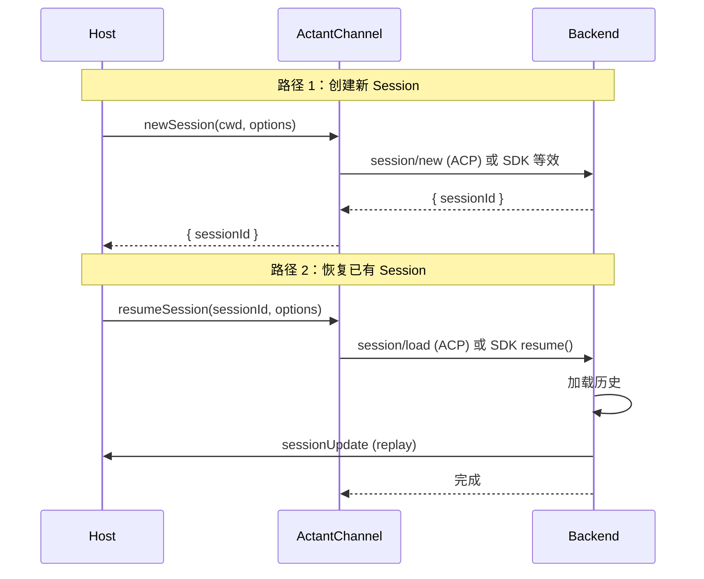
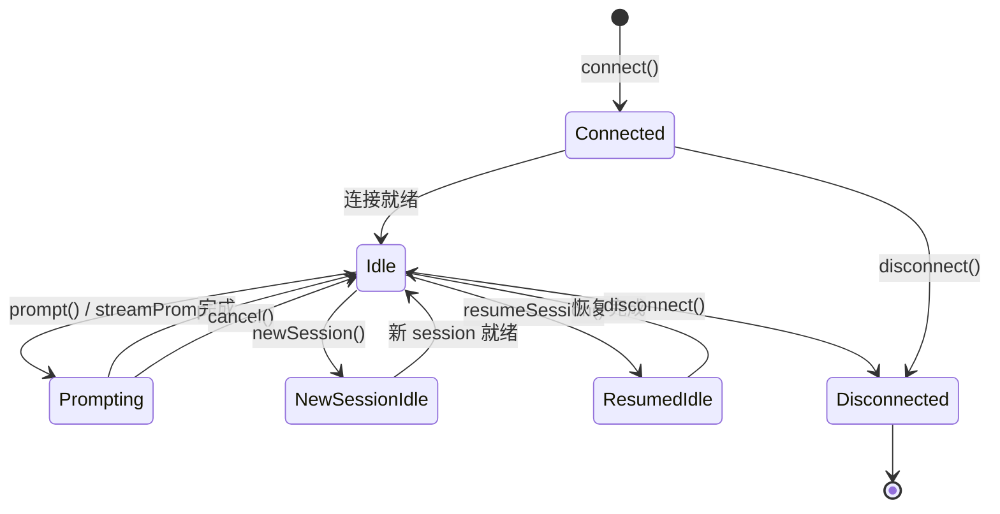

# Session Setup

**副标题**：Creating and resuming sessions

---

## Overview

连接建立后（参见 [Initialization](./initialization.md)），Host 可以创建新 session 或恢复已有 session。`newSession()` 用于在同一连接下创建子 session；`resumeSession()` 用于加载并恢复之前创建的 session。



---

## ActantChannel.newSession()

> 在已有连接下创建新的子 session。

**Profile**：Core  
**Requirement**：Optional（`capabilities.multiSession = true`）  
**ACP Equivalent**：`session/new`

### Signature

```typescript
newSession?(cwd: string, options?: SessionOptions): Promise<{ sessionId: string }>;
```

### Parameters

| Parameter | Type | Required | Description |
|-----------|------|----------|-------------|
| cwd | string | Yes | 新 session 的工作目录。MUST 为绝对路径。 |
| options | SessionOptions | No | 额外 session 选项 |

### SessionOptions

```typescript
interface SessionOptions {
  mcpServers?: McpServerSpec[];
  systemContext?: string[];
  adapterOptions?: Record<string, unknown>;
}
```

| Field | Type | Description |
|-------|------|-------------|
| mcpServers | McpServerSpec[] | MCP 服务器配置 |
| systemContext | string[] | 系统上下文片段 |
| adapterOptions | Record<string, unknown> | 适配器特有选项，协议层不解读 |

### Return Value

`{ sessionId: string }` — 新 session 的唯一标识符

### Behavior

- 不支持 multi-session 的 Backend 适配器 MUST NOT 暴露此方法
- Host MUST 在调用前检查 `capabilities.multiSession`
- 新 session 共享同一连接，但拥有独立的对话历史
- AcpChannelAdapter 将此调用映射为 ACP `session/new`

### Checking Support

```typescript
if (!channel.capabilities.multiSession || !channel.newSession) {
  // 此 Backend 不支持多 session，使用 connect() 返回的 sessionId
  return;
}
const { sessionId } = await channel.newSession(cwd, options);
```

---

## ActantChannel.resumeSession()

> 恢复之前创建的 session。

**Profile**：Core  
**Requirement**：Optional（`capabilities.resume = true`）  
**ACP Equivalent**：`session/load`

### Signature

```typescript
resumeSession?(sessionId: string, options?: ResumeOptions): Promise<void>;
```

### Parameters

| Parameter | Type | Required | Description |
|-----------|------|----------|-------------|
| sessionId | string | Yes | 要恢复的 session ID |
| options | ResumeOptions | No | 恢复选项 |

### ResumeOptions

```typescript
interface ResumeOptions {
  cwd?: string;
  mcpServers?: McpServerSpec[];
  adapterOptions?: Record<string, unknown>;
}
```

| Field | Type | Description |
|-------|------|-------------|
| cwd | string | 恢复时的工作目录 |
| mcpServers | McpServerSpec[] | MCP 服务器配置 |
| adapterOptions | Record<string, unknown> | 适配器特有选项 |

### Behavior

- Backend MUST 通过 `sessionUpdate` 事件回放对话历史
- Host MUST 处理回放的事件以重建 UI 状态
- AcpChannelAdapter 映射为 ACP `session/load`
- ClaudeChannelAdapter 映射为 SDK `resume()` 方法

### Checking Support

```typescript
if (!channel.capabilities.resume || !channel.resumeSession) {
  // 此 Backend 不支持 session 恢复
  return;
}
await channel.resumeSession(sessionId, options);
```

---

## Session ID

Session ID 是由 `connect()` 或 `newSession()` 返回的唯一字符串标识符。用于所有后续操作：`prompt()`、`streamPrompt()`、`cancel()`、`configure()`。格式由适配器决定，协议层不规定具体格式。

---

## Session Lifecycle


