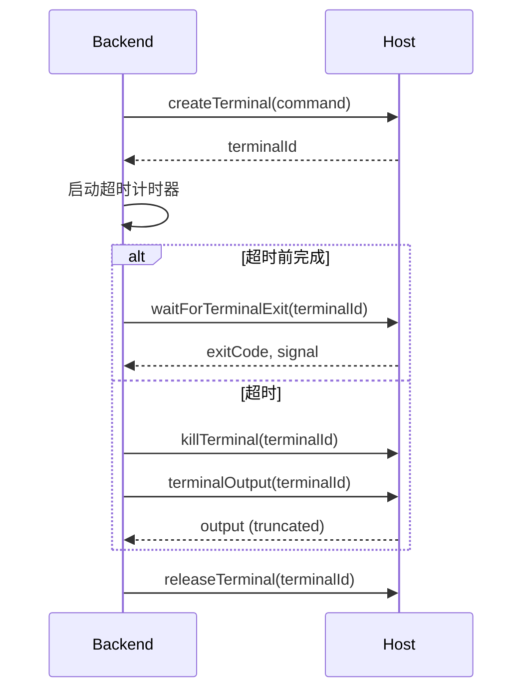

# Terminals

**副标题**：Host terminal services

---

## Overview

终端方法允许 Backend 在 Host 环境中执行 shell 命令。能够直接执行命令的 Backend（例如 Claude SDK 的 bash tool）不需要这些服务。与 ACP 的 terminal/* 方法一一对应。

---

## Checking Support

- Backend 声明 `capabilities.needsTerminal = true` 时表示需要终端服务
- 若为 false，Host 无需提供终端相关方法

---

## ChannelHostServices.createTerminal()

> 在新终端中启动命令。

**Profile**：Core  
**ACP Equivalent**：`terminal/create`

### Signature

```typescript
createTerminal?(params: CreateTerminalRequest): Promise<CreateTerminalResponse>;
```

### CreateTerminalRequest

```typescript
interface CreateTerminalRequest {
  sessionId: string;
  command: string;
  args?: string[];
  env?: Array<{ name: string; value: string }>;
  cwd?: string;
  outputByteLimit?: number;
}
```

| 字段 | 类型 | 必填 | 描述 |
|------|------|------|------|
| sessionId | string | Yes | Session ID |
| command | string | Yes | 要执行的命令 |
| args | string[] | No | 命令行参数 |
| env | Array<{name,value}> | No | 环境变量 |
| cwd | string | No | 工作目录 |
| outputByteLimit | number | No | 输出字节限制 |

### CreateTerminalResponse

```typescript
interface CreateTerminalResponse {
  terminalId: string;
}
```

| 字段 | 类型 | 描述 |
|------|------|------|
| terminalId | string | 终端唯一标识，用于后续操作 |

### Behavior

- Host 启动命令但不等待完成
- Backend 使用 terminalId 进行后续操作

---

## ChannelHostServices.terminalOutput()

> 获取当前终端输出。

**Profile**：Core  
**ACP Equivalent**：`terminal/output`

### Signature

```typescript
terminalOutput?(params: TerminalOutputRequest): Promise<TerminalOutputResponse>;
```

### TerminalOutputRequest

```typescript
interface TerminalOutputRequest {
  sessionId: string;
  terminalId: string;
}
```

| 字段 | 类型 | 描述 |
|------|------|------|
| sessionId | string | Session ID |
| terminalId | string | 终端 ID |

### TerminalOutputResponse

```typescript
interface TerminalOutputResponse {
  output: string;
  truncated: boolean;
  exitStatus?: { exitCode: number | null; signal: string | null };
}
```

| 字段 | 类型 | 描述 |
|------|------|------|
| output | string | 当前终端输出内容 |
| truncated | boolean | 是否因 outputByteLimit 被截断 |
| exitStatus | object | 可选，退出状态（exitCode 或 signal） |

---

## ChannelHostServices.waitForTerminalExit()

> 等待终端命令完成。

**Profile**：Core  
**ACP Equivalent**：`terminal/wait_for_exit`

### Signature

```typescript
waitForTerminalExit?(
  params: WaitForTerminalExitRequest,
): Promise<WaitForTerminalExitResponse>;
```

### WaitForTerminalExitRequest

```typescript
interface WaitForTerminalExitRequest {
  sessionId: string;
  terminalId: string;
}
```

### WaitForTerminalExitResponse

```typescript
interface WaitForTerminalExitResponse {
  exitCode: number | null;
  signal: string | null;
}
```

| 字段 | 类型 | 描述 |
|------|------|------|
| exitCode | number \| null | 退出码，null 表示被信号终止 |
| signal | string | null | 终止信号（如 "SIGKILL"） |

---

## ChannelHostServices.killTerminal()

> 终止终端命令但不释放资源。

**Profile**：Core  
**ACP Equivalent**：`terminal/kill`

### Signature

```typescript
killTerminal?(params: KillTerminalCommandRequest): Promise<KillTerminalCommandResponse>;
```

### KillTerminalCommandRequest

```typescript
interface KillTerminalCommandRequest {
  sessionId: string;
  terminalId: string;
}
```

### Behavior

- 终止后终端仍有效，可继续调用 terminalOutput 获取输出
- terminalId 在 release 之前保持有效

---

## ChannelHostServices.releaseTerminal()

> 终止（若在运行）并释放所有终端资源。

**Profile**：Core  
**ACP Equivalent**：`terminal/release`

### Signature

```typescript
releaseTerminal?(params: ReleaseTerminalRequest): Promise<ReleaseTerminalResponse>;
```

### ReleaseTerminalRequest

```typescript
interface ReleaseTerminalRequest {
  sessionId: string;
  terminalId: string;
}
```

### Behavior

- 释放后 terminalId 失效，Host 不再接受对该 terminalId 的后续操作

---

## Timeout Pattern

Backend 可通过组合 createTerminal + waitForTerminalExit + killTerminal 实现超时模式，与 ACP 相同：


