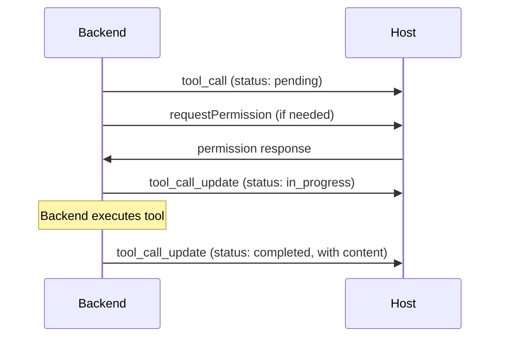

# Tool Calls

**副标题**：Tool call reporting and permission requests

---

## Overview

工具调用（Tool Call）表示 LLM 在 prompt 轮次中请求执行的操作。Backend 通过 `tool_call` 和 `tool_call_update` 事件向 Host 上报工具调用（参见 [Session Events](./session-events.md)）。在执行某些工具之前，Backend MAY 向 Host 请求权限。

---

## Tool Call Lifecycle



---

## Tool Call Kinds

| Kind | Description | ACP Equivalent |
|------|-------------|----------------|
| bash | Shell 命令执行 | execute |
| file_edit | 文件修改 | edit |
| read | 文件/数据读取 | read |
| search | 搜索操作 | search |
| mcp_tool | MCP 服务器工具 | other |
| host_tool | Host 提供的工具 | other |
| think | 内部推理 | think |
| other | 其他操作 | other |

---

## Tool Call Status

| Status | Description |
|--------|-------------|
| pending | 未开始，输入可能仍在流式传输或等待审批 |
| in_progress | 正在执行 |
| completed | 成功完成 |
| failed | 执行失败 |

---

## Tool Call Content

```typescript
type ToolCallContent =
  | { type: "content"; content: ChannelContent }
  | { type: "diff"; path: string; oldText?: string; newText?: string }
  | { type: "terminal"; terminalId: string; output?: string };
```

### content 变体

| 字段 | 类型 | 描述 |
|------|------|------|
| type | "content" | 判别符 |
| content | ChannelContent | 可展示内容块，参见 [Content](./content.md) |

### diff 变体

| 字段 | 类型 | 描述 |
|------|------|------|
| type | "diff" | 判别符 |
| path | string | 文件绝对路径 |
| oldText | string | 可选，修改前的文本 |
| newText | string | 可选，修改后的文本 |

### terminal 变体

| 字段 | 类型 | 描述 |
|------|------|------|
| type | "terminal" | 判别符 |
| terminalId | string | 终端 ID |
| output | string | 可选，终端输出内容 |

---

## Requesting Permission

### ChannelHostServices.requestPermission()

> Backend 在执行工具前请求用户授权。

**Profile**：Core  
**ACP Equivalent**：`session/request_permission`

#### Signature

```typescript
requestPermission?(request: PermissionRequest): Promise<PermissionResponse>;
```

#### PermissionRequest

```typescript
interface PermissionRequest {
  sessionId: string;
  toolCall: {
    toolCallId: string;
    title?: string;
    kind?: string;
    status?: string;
    content?: ToolCallContent[];
  };
  options: PermissionOption[];
}

interface PermissionOption {
  optionId: string;
  name: string;
  kind: "allow_once" | "allow_always" | "reject_once" | "reject_always";
}
```

| 字段 | 类型 | 必填 | 描述 |
|------|------|------|------|
| sessionId | string | Yes | Session ID |
| toolCall | object | Yes | 待审批的工具调用信息 |
| toolCall.toolCallId | string | Yes | 工具调用唯一 ID |
| toolCall.title | string | No | 可选的展示标题 |
| toolCall.kind | string | No | 工具类型 |
| toolCall.status | string | No | 当前状态 |
| toolCall.content | ToolCallContent[] | No | 工具调用内容 |
| options | PermissionOption[] | Yes | 用户可选的权限选项 |

| 字段 | 类型 | 必填 | 描述 |
|------|------|------|------|
| optionId | string | Yes | 选项唯一 ID |
| name | string | Yes | 选项展示名称 |
| kind | string | Yes | 选项类型：allow_once / allow_always / reject_once / reject_always |

#### PermissionResponse

```typescript
interface PermissionResponse {
  outcome:
    | { outcome: "selected"; optionId: string }
    | { outcome: "cancelled" };
}
```

| 变体 | 字段 | 描述 |
|------|------|------|
| selected | outcome: "selected"; optionId: string | 用户选择了某选项 |
| cancelled | outcome: "cancelled" | 用户取消操作 |

#### Behavior

- Host MUST 响应所有权限请求
- 若 prompt 被取消，Host MUST 返回 `{ outcome: "cancelled" }`
- Host MAY 根据 toolPolicy 或 autoApprove 设置自动批准
- Backend MUST NOT 在获得权限前执行工具

---

## Checking Support

- Backend 声明 `capabilities.needsPermission = true` 时，Host MUST 提供 `requestPermission` 回调
- 若 `autoApprove` 为 true，Host MAY 不展示权限 UI，直接返回允许
- 若工具在 `toolPolicy.autoApproved` 中，Host SHOULD 自动批准，跳过 requestPermission
