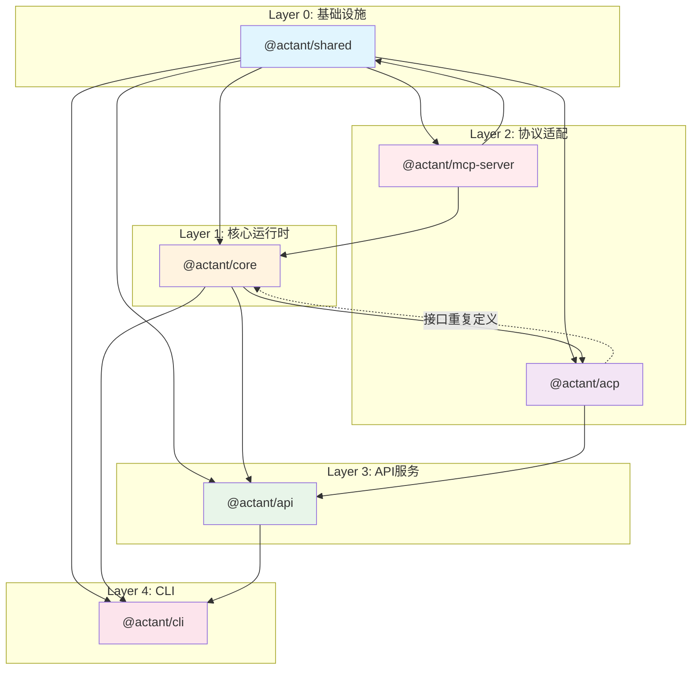
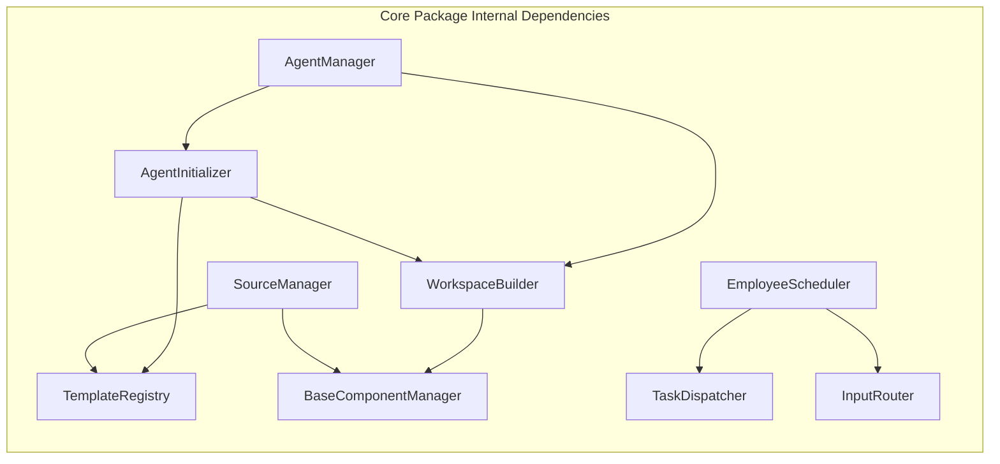
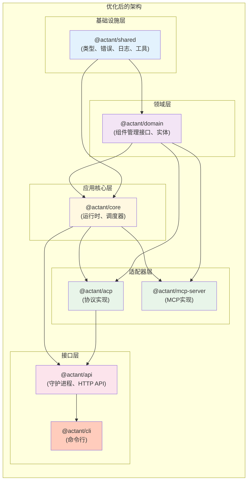

# Actant 代码审查与模块依赖分析报告

> 分析日期: 2026-02-22
> 版本: v0.1.0
> 范围: 全代码库逐文件 review + 模块依赖设计

---

## 目录

1. [总体架构概览](#1-总体架构概览)
2. [逐包代码设计分析](#2-逐包代码设计分析)
3. [设计不合理之处](#3-设计不合理之处)
4. [模块依赖关系图](#4-模块依赖关系图)
5. [改进建议](#5-改进建议)

---

## 1. 总体架构概览

```
┌─────────────────────────────────────────────────────────────────────────────┐
│                              Actant 架构分层                                 │
├─────────────────────────────────────────────────────────────────────────────┤
│  Layer 4: CLI 层 (@actant/cli)                                              │
│  ┌─────────────┬─────────────┬─────────────┬─────────────────────────────┐ │
│  │ 命令解析     │ RPC Client  │  REPL交互   │      输出格式化              │ │
│  └─────────────┴─────────────┴─────────────┴─────────────────────────────┘ │
├─────────────────────────────────────────────────────────────────────────────┤
│  Layer 3: API 层 (@actant/api)                                              │
│  ┌─────────────┬─────────────┬─────────────┬─────────────────────────────┐ │
│  │ Daemon守护进程│ SocketServer│ HandlerRegistry│    AppContext            │ │
│  └─────────────┴─────────────┴─────────────┴─────────────────────────────┘ │
├─────────────────────────────────────────────────────────────────────────────┤
│  Layer 2: 核心运行时 (@actant/core)                                          │
│  ┌─────────────┬─────────────┬─────────────┬─────────────┬────────────────┐ │
│  │ AgentManager│   Builder   │   Scheduler │   Domain    │     State      │ │
│  │  (生命周期)  │  (构建器)    │  (调度器)    │ (领域组件)   │   (状态管理)    │ │
│  └─────────────┴─────────────┴─────────────┴─────────────┴────────────────┘ │
├─────────────────────────────────────────────────────────────────────────────┤
│  Layer 1: 基础共享层 (@actant/shared)                                        │
│  ┌────────────────┬─────────────┬─────────────┬───────────────────────────┐ │
│  │    Types类型定义 │   Errors    │   Logger    │      Platform工具         │ │
│  └────────────────┴─────────────┴─────────────┴───────────────────────────┘ │
├─────────────────────────────────────────────────────────────────────────────┤
│  Layer 0: 协议适配层 (@actant/acp, @actant/mcp-server)                       │
│  ┌─────────────────────────────┬──────────────────────────────────────────┐ │
│  │   ACP (Agent Client Protocol)│         MCP Server                       │ │
│  └─────────────────────────────┴──────────────────────────────────────────┘ │
└─────────────────────────────────────────────────────────────────────────────┘
```

---

## 2. 逐包代码设计分析

### 2.1 @actant/shared (基础共享包)

#### 文件结构
```
packages/shared/src/
├── index.ts                    # 统一导出入口
├── types/
│   ├── index.ts               # 类型定义聚合导出
│   ├── agent.types.ts         # Agent 元数据、状态类型
│   ├── template.types.ts      # 模板、后端配置类型
│   ├── domain-context.types.ts # 领域上下文类型
│   ├── domain-component.types.ts # 组件定义类型 (Skill, Prompt等)
│   ├── source.types.ts        # 源配置类型
│   └── rpc.types.ts           # RPC 协议类型 (200+ 类型定义)
├── errors/
│   ├── index.ts               # 错误类统一导出
│   ├── base-error.ts          # 基础错误类
│   ├── config-errors.ts       # 配置相关错误
│   └── lifecycle-errors.ts    # 生命周期错误
├── logger/
│   └── logger.ts              # Pino 日志封装
└── platform/
    └── platform.ts            # 平台相关工具 (IPC路径等)
```

#### 设计评价

| 方面 | 评价 | 说明 |
|------|------|------|
| **单一职责** | ✅ 良好 | 仅包含类型定义和基础工具，无业务逻辑 |
| **类型定义** | ⚠️ 一般 | `rpc.types.ts` 文件过大 (200+ 导出)，可考虑按 domain 拆分 |
| **错误体系** | ✅ 良好 | 有层次化的错误类设计 |
| **日志封装** | ✅ 良好 | 统一的 Logger 工厂函数 |

#### 问题点
1. **rpc.types.ts 膨胀**: 包含所有 RPC 方法参数/返回类型，可按 domain 拆分为多个文件
2. **循环依赖风险**: `types/index.ts` 集中导出，任何类型修改都会影响所有依赖包

---

### 2.2 @actant/core (核心运行时包)

#### 文件结构
```
packages/core/src/
├── index.ts                   # 统一导出
├── manager/                   # Agent 生命周期管理
│   ├── agent-manager.ts       # 核心类 (568行)
│   ├── launcher/              # 进程启动器
│   │   ├── agent-launcher.ts
│   │   ├── process-launcher.ts
│   │   ├── process-watcher.ts
│   │   ├── backend-resolver.ts
│   │   └── create-launcher.ts
│   ├── launch-mode-handler.ts
│   └── restart-tracker.ts
├── builder/                   # 工作区构建
│   ├── workspace-builder.ts   # 6步构建流水线 (153行)
│   ├── backend-builder.ts     # 构建器接口
│   ├── component-type-handler.ts
│   ├── claude-code-builder.ts
│   ├── cursor-builder.ts
│   └── handlers/              # 各组件类型处理器
│       ├── skills-handler.ts
│       ├── prompts-handler.ts
│       ├── mcp-servers-handler.ts
│       ├── workflow-handler.ts
│       └── plugins-handler.ts
├── domain/                    # 领域组件管理
│   ├── base-component-manager.ts  # 通用 CRUD 抽象基类 (294行)
│   ├── skill/skill-manager.ts
│   ├── prompt/prompt-manager.ts
│   ├── mcp/mcp-config-manager.ts
│   ├── workflow/workflow-manager.ts
│   └── plugin/plugin-manager.ts
├── scheduler/                 # 任务调度系统
│   ├── employee-scheduler.ts  # 调度器协调类
│   ├── task-queue.ts          # 任务队列
│   ├── task-dispatcher.ts     # 任务分发器
│   ├── execution-log.ts       # 执行日志
│   ├── schedule-config.ts     # 配置 Schema
│   └── inputs/                # 输入源实现
│       ├── input-router.ts
│       ├── cron-input.ts
│       ├── heartbeat-input.ts
│       └── hook-input.ts
├── template/                  # 模板系统
│   ├── loader/template-loader.ts
│   ├── registry/template-registry.ts
│   └── schema/template-schema.ts
├── source/                    # 组件源管理
│   ├── source-manager.ts      # 源管理器 (428行)
│   ├── component-source.ts    # 源接口
│   ├── github-source.ts
│   └── local-source.ts
├── state/                     # 状态管理
│   ├── instance-meta-io.ts    # 元数据 IO
│   ├── instance-registry.ts   # 实例注册表
│   └── instance-meta-schema.ts
├── communicator/              # Agent 通信
│   ├── create-communicator.ts # 工厂函数
│   ├── agent-communicator.ts  # 通信接口
│   ├── claude-code-communicator.ts
│   └── cursor-communicator.ts
├── session/                   # 会话管理
│   └── session-registry.ts
└── initializer/               # 初始化器
    └── agent-initializer.ts
```

#### 核心类详细分析

##### 2.2.1 AgentManager (`manager/agent-manager.ts`)

**职责**: Agent 生命周期管理 (创建、启动、停止、销毁、附加、分离)

```typescript
// 关键设计点
class AgentManager {
  private cache = new Map<string, AgentInstanceMeta>();      // 元数据缓存
  private processes = new Map<string, AgentProcess>();       // 进程句柄缓存
  private readonly watcher: ProcessWatcher;                  // 进程监控
  private readonly restartTracker: RestartTracker;           // 重启策略
  private readonly acpManager?: AcpConnectionManagerLike;    // ACP 连接管理
}
```

**设计亮点**:
- ✅ 状态机设计清晰 (stopped → starting → running → stopping)
- ✅ 进程退出自动恢复机制 (通过 `handleProcessExit`)
- ✅ LaunchMode 策略模式 (persistent/one-shot/ephemeral)

**设计问题**:
1. **类过大** (568行): 职责过多，可拆分为 `AgentLifecycleManager` + `AgentConnectionManager`
2. **双重通信接口**: `runPrompt` 和 `promptAgent` 方法职责重叠
   - `runPrompt`: 支持 ACP 或 CLI pipe 模式
   - `promptAgent`: 仅支持 ACP，但抛出 Error 而非特定错误类型
3. **AcpConnectionManagerLike 接口重复定义**: 第 30-52 行定义了与 `@actant/acp` 重复的接口，仅为了避免循环依赖

##### 2.2.2 WorkspaceBuilder (`builder/workspace-builder.ts`)

**职责**: 6 步构建流水线 (Resolve → Validate → Scaffold → Materialize → Inject → Verify)

```typescript
class WorkspaceBuilder {
  private readonly builders: Map<AgentBackendType, BackendBuilder>;
  private readonly handlers: ComponentTypeHandler[] = [];
}
```

**设计亮点**:
- ✅ 清晰的流水线步骤
- ✅ 可扩展的 Handler 注册机制
- ✅ 支持自定义 BackendBuilder

**设计问题**:
1. **DomainManagers 接口冗余**: 与 `SourceManagerDeps` 重复定义类似结构
2. **extensions 处理逻辑重复**: 第 125-138 行与第 110-123 行代码重复
3. **硬编码回退**: Cursor 作为默认后端，但 `builders.get("cursor")` 可能为 undefined

##### 2.2.3 BaseComponentManager (`domain/base-component-manager.ts`)

**职责**: 领域组件的通用 CRUD、持久化、导入/导出抽象基类

```typescript
abstract class BaseComponentManager<T extends NamedComponent> {
  protected readonly components = new Map<string, T>();
  protected abstract readonly componentType: string;
  protected persistDir?: string;
  abstract validate(data: unknown, source: string): T;
}
```

**设计亮点**:
- ✅ 模板方法模式使用得当
- ✅ 统一的目录加载逻辑 (支持 manifest.json 和扁平 JSON)
- ✅ 支持 @-前缀命名空间递归加载

**设计问题**:
1. **泛型约束过松**: `validate` 方法使用 `unknown` 而非更具体的类型
2. **持久化与注册耦合**: `add` 方法同时处理内存注册和文件持久化
3. **内容文件解析逻辑 hacky**: `resolveContentFile` 方法通过检测换行符判断是否为文件路径

##### 2.2.4 SourceManager (`source/source-manager.ts`)

**职责**: 管理组件源 (GitHub/Local)，处理组件注入和命名空间

```typescript
class SourceManager {
  private readonly sources = new Map<string, ComponentSource>();
  private readonly presets = new Map<string, PresetDefinition>();
  private readonly managers: SourceManagerDeps;
}
```

**设计亮点**:
- ✅ `package@name` 命名空间机制
- ✅ 同步报告生成 (新增/更新/删除/变更检测)
- ✅ 版本变更检测 (主版本变更识别为破坏性变更)

**设计问题**:
1. **强耦合于具体 Manager 类型**: `injectComponents` 硬编码 5 种组件类型
2. **Preset 处理逻辑不完善**: `applyPreset` 方法中 MCP 服务器引用处理过于简化
3. **类型转换过多**: 多处使用 `as SkillDefinition` 等类型断言

##### 2.2.5 EmployeeScheduler (`scheduler/employee-scheduler.ts`)

**职责**: Agent 任务调度协调器

```typescript
class EmployeeScheduler {
  private readonly queue: TaskQueue;
  private readonly dispatcher: TaskDispatcher;
  private readonly log: ExecutionLog;
  private readonly router: InputRouter;
  private readonly eventBus: EventEmitter;
}
```

**设计亮点**:
- ✅ 组合模式：将多个子系统组合 (Queue + Dispatcher + Router)
- ✅ 支持多种输入源 (Cron、Heartbeat、Hook)

**设计问题**:
1. **EventEmitter 类型安全**: 使用原生 EventEmitter 而非类型安全的事件总线
2. **scheduler 存储在 AppContext 的 Map 中**: 缺乏统一的 Scheduler 生命周期管理

---

### 2.3 @actant/api (API 服务包)

#### 文件结构
```
packages/api/src/
├── index.ts                   # 导出 Daemon 和 AppContext
├── daemon/
│   ├── daemon.ts              # 守护进程主类 (111行)
│   ├── socket-server.ts       # Unix Socket 服务器
│   ├── acp-relay-server.ts    # ACP 中继服务器
│   └── pid-file.ts            # PID 文件管理
├── handlers/                  # RPC 处理器
│   ├── handler-registry.ts    # 处理器注册表 (24行)
│   ├── template-handlers.ts
│   ├── agent-handlers.ts      # (245行)  largest handler
│   ├── domain-handlers.ts
│   ├── session-handlers.ts
│   ├── source-handlers.ts
│   ├── preset-handlers.ts
│   ├── schedule-handlers.ts
│   ├── daemon-handlers.ts
│   └── proxy-handlers.ts
└── services/
    └── app-context.ts         # 应用上下文 (174行)
```

#### 核心类分析

##### 2.3.1 AppContext (`services/app-context.ts`)

**职责**: 依赖注入容器，管理所有核心组件的生命周期

```typescript
class AppContext {
  // 路径配置 (9个路径属性)
  readonly homeDir, configsDir, sourcesDir, ...

  // 核心组件 (13个组件)
  readonly instanceRegistry, templateRegistry, ...
  readonly skillManager, promptManager, ...
  readonly agentManager, acpConnectionManager, ...
  readonly schedulers: Map<string, EmployeeScheduler>;
}
```

**设计问题**:
1. **上帝类 (God Class)**: 包含 22 个属性，是核心依赖容器
2. **构造器初始化过重**: 构造函数中创建 13 个组件实例
3. **循环依赖风险**: `SourceManagerDeps` 依赖 `TemplateRegistry`，但 `TemplateRegistry` 也通过 `SourceManager` 被创建
4. **schedulers 缺乏管理**: 只是 Map，没有启动/停止/清理逻辑

##### 2.3.2 Daemon (`daemon/daemon.ts`)

**职责**: 守护进程主控

**设计问题**:
1. **停止逻辑硬编码**: 直接遍历所有 Agent 停止，应在 AgentManager 中提供 `stopAll()`
2. **处理器注册重复**: 9 个 `registerXxxHandlers` 调用，可考虑自动发现

##### 2.3.3 HandlerRegistry (`handlers/handler-registry.ts`)

**设计问题**:
1. **过于简单**: 只是 Map 的包装，缺乏中间件、拦截器、错误处理机制
2. **缺乏请求验证**: 没有参数验证，直接传递给 handler

---

### 2.4 @actant/cli (CLI 包)

#### 文件结构
```
packages/cli/src/
├── index.ts                   # 导出 RPC Client 和 Program
├── bin/actant.ts              # CLI 入口点
├── program.ts                 # Commander 程序配置 (86行)
├── client/
│   └── rpc-client.ts          # RPC 客户端
├── repl/
│   └── repl.ts                # 交互式 REPL
├── output/
│   ├── printer.ts
│   ├── formatter.ts
│   └── error-presenter.ts
└── commands/                  # 命令实现 (60+ 个命令文件)
    ├── index.ts
    ├── help.ts
    ├── self-update.ts
    ├── proxy.ts
    ├── agent/                 # (13个命令)
    │   ├── index.ts
    │   ├── create.ts, start.ts, stop.ts, destroy.ts
    │   ├── attach.ts, detach.ts, adopt.ts
    │   ├── run.ts, prompt.ts, chat.ts
    │   ├── list.ts, status.ts, logs.ts
    │   ├── dispatch.ts, tasks.ts, resolve.ts
    ├── template/              # (6个命令)
    ├── skill/                 # (4个命令)
    ├── prompt/                # (4个命令)
    ├── mcp/                   # (4个命令)
    ├── workflow/              # (4个命令)
    ├── plugin/                # (4个命令)
    ├── source/                # (4个命令)
    ├── preset/                # (3个命令)
    ├── schedule/              # (2个命令)
    └── daemon/                # (3个命令)
```

#### 设计问题

1. **命令文件过多**: 60+ 个命令文件，目录结构深
2. **命令与 API 耦合**: 每个命令直接映射到 RPC 调用，缺乏业务逻辑层
3. **REPL 模式特殊处理**: `program.ts` 第 54-70 行的 REPL 启动逻辑与命令解析混在一起

---

### 2.5 @actant/acp (Agent Client Protocol 包)

#### 文件结构
```
packages/acp/src/
├── index.ts                   # 统一导出
├── connection.ts              # ACP 连接
├── connection-manager.ts      # 连接管理器
├── communicator.ts            # ACP 通信器
├── gateway.ts                 # ACP 网关
├── callback-router.ts         # 回调路由
├── terminal-manager.ts        # 终端管理
└── server/                    # 服务器实现
```

#### 设计问题

1. **包层级问题**: ACP 依赖于 `@actant/core`，但 `AgentManager` 需要 `AcpConnectionManagerLike` 接口
2. **重复类型定义**: `AgentManager` 中定义的 `AcpConnectionManagerLike` 与实际的 `AcpConnectionManager` 应保持一致

---

## 3. 设计不合理之处

### 3.1 架构层面问题

#### 3.1.1 循环依赖风险

```
┌─────────────────────────────────────────────────────────┐
│  当前依赖关系 (存在循环风险)                               │
├─────────────────────────────────────────────────────────┤
│  @actant/core ──需要──→ AcpConnectionManagerLike         │
│       ↑                      │                          │
│       └──────────────────────┘                          │
│  (通过接口重复定义避免循环，但破坏了单一真相源)              │
└─────────────────────────────────────────────────────────┘

建议：
┌─────────────────────────────────────────────────────────┐
│  期望依赖关系                                            │
├─────────────────────────────────────────────────────────┤
│  @actant/shared: 定义 AcpConnectionManager 接口          │
│       ↑                                                 │
│  @actant/core: 使用接口                                  │
│       ↑                                                 │
│  @actant/acp: 实现接口                                   │
└─────────────────────────────────────────────────────────┘
```

#### 3.1.2 AppContext 上帝类

**当前设计**:
```typescript
class AppContext {
  // 22个属性，13个核心组件
  readonly instanceRegistry, templateLoader, templateRegistry;
  readonly skillManager, promptManager, mcpConfigManager, ...;
  readonly agentInitializer, acpConnectionManager, agentManager;
  readonly schedulers: Map<string, EmployeeScheduler>;
}
```

**问题**:
- 构造器创建 13 个组件，初始化过重
- 所有组件在同一层级，缺乏分层组织
- 无法单独测试某个子系统

**建议重构**:
```typescript
class AppContext {
  readonly storage: StorageContext;      // 状态、注册表
  readonly domain: DomainContext;        // 领域组件管理
  readonly runtime: RuntimeContext;      // Agent、调度器
  readonly network: NetworkContext;      // ACP、Socket
}
```

#### 3.1.3 缺乏领域事件机制

当前各模块直接调用，缺乏解耦的事件机制：

```typescript
// 当前：直接调用
await this.agentManager.startAgent(name);
// 需要同时更新 scheduler、session、registry...

// 建议：事件驱动
this.eventBus.emit('agent:started', { name, meta });
// scheduler、session 等订阅事件并处理
```

### 3.2 代码层面问题

#### 3.2.1 重复代码模式

| 位置 | 重复内容 | 建议 |
|------|---------|------|
| `SourceManager.injectComponents` | 5 次相似的 register 调用 | 使用迭代器 + 配置数组 |
| `SourceManager.removeNamespacedComponents` | 4 次相似的 unregister 循环 | 提取通用方法 |
| `WorkspaceBuilder.build` | extensions 处理重复逻辑 | 合并循环 |

#### 3.2.2 类型安全问题

```typescript
// 问题：多处使用类型断言
this.managers.skillManager.register(ns(skill) as SkillDefinition);

// 问题：any/unknown 过度使用
abstract validate(data: unknown, source: string): T;

// 问题：可选属性导致运行时错误
this.acpManager?.getConnection(name) // 可能 undefined 但后续没有检查
```

#### 3.2.3 错误处理不一致

```typescript
// 方式1: 抛出特定错误
throw new AgentNotFoundError(name);

// 方式2: 抛出通用 Error
throw new Error(`Source "${name}" not found`);

// 方式3: 返回 boolean
return this.components.delete(name);

// 方式4: 静默忽略
try { ... } catch { /* skip */ }
```

### 3.3 模块依赖问题

```
当前依赖图 (简化):

@actant/shared
    ↑
    ├── @actant/core ─────────┐
    │    ↑                      │
    ├── @actant/api ────────────┤ (直接依赖)
    │    ↑                      │
    ├── @actant/acp ────────────┘
    │    ↑
    └── @actant/cli (依赖所有)

问题:
1. @actant/core 和 @actant/acp 之间存在隐式循环依赖
2. @actant/cli 依赖所有包，导致构建顺序严格
3. @actant/mcp-server 是空壳，缺乏实现
```

---

## 4. 模块依赖关系图

### 4.1 完整依赖关系



### 4.2 包内模块依赖图

#### @actant/core 内部依赖



### 4.3 依赖矩阵表

| 依赖方 \ 被依赖方 | shared | core | api | acp | cli | mcp-server |
|------------------|--------|------|-----|-----|-----|-----------|
| **shared**       | -      | ❌   | ❌  | ❌  | ❌  | ❌        |
| **core**         | ✅     | -    | ❌  | ✅  | ❌  | ❌        |
| **api**          | ✅     | ✅   | -   | ✅  | ❌  | ❌        |
| **acp**          | ✅     | ❌   | ❌  | -   | ❌  | ❌        |
| **cli**          | ✅     | ✅   | ✅  | ✅  | -   | ❌        |
| **mcp-server**   | ✅     | ✅   | ❌  | ❌  | ❌  | -         |

### 4.4 建议的优化依赖结构



---

## 5. 改进建议

### 5.1 短期改进 (可快速实施)

1. **拆分 rpc.types.ts**
   ```
   types/rpc/
   ├── index.ts           # 统一导出
   ├── agent.rpc.ts       # Agent 相关
   ├── template.rpc.ts    # 模板相关
   ├── domain.rpc.ts      # 领域组件相关
   └── common.rpc.ts      # 通用类型
   ```

2. **统一错误处理**
   - 所有 Manager 使用统一的 `Result<T, E>` 模式或抛出特定错误
   - 建立错误码体系

3. **提取重复代码**
   - `SourceManager` 中的组件操作提取为 `ComponentInjector`
   - `BaseComponentManager` 中的文件操作提取为 `ComponentPersistence`

### 5.2 中期改进 (架构调整)

1. **引入领域事件总线**
   ```typescript
   interface DomainEventBus {
     emit<T>(event: DomainEvent<T>): void;
     on<T>(type: string, handler: EventHandler<T>): void;
   }
   ```

2. **重构 AppContext**
   ```typescript
   class AppContext {
     readonly modules: {
       storage: StorageModule;
       domain: DomainModule;
       runtime: RuntimeModule;
       network: NetworkModule;
     };
   }
   ```

3. **分离 ACP 接口定义**
   - 将 `AcpConnectionManager` 接口定义移到 `@actant/shared`
   - `@actant/acp` 提供实现
   - `@actant/core` 仅依赖接口

### 5.3 长期改进 (架构演进)

1. **引入插件架构**
   - 将 Skill、Prompt、MCP、Workflow、Plugin 作为核心扩展点
   - 定义标准插件接口
   - 支持动态加载插件

2. **状态管理重构**
   - 将 `InstanceMeta` 的 IO 操作抽象为 `StateStore` 接口
   - 支持多种存储后端 (文件、SQLite、Redis)

3. **引入 CQRS 模式**
   - 命令与查询分离
   - Agent 生命周期操作为 Command
   - Agent 状态查询为 Query

4. **配置管理重构**
   - 统一的配置验证层 (Zod schema)
   - 配置热重载机制
   - 环境变量与配置文件合并策略

---

## 附录：关键文件复杂度统计

| 文件 | 行数 | 复杂度 | 主要问题 |
|------|------|--------|----------|
| `agent-manager.ts` | 568 | 高 | 类过大，职责过多 |
| `source-manager.ts` | 428 | 高 | 硬编码组件类型 |
| `agent-handlers.ts` | 245 | 中 | 处理逻辑过多 |
| `base-component-manager.ts` | 294 | 中 | 泛型约束过松 |
| `app-context.ts` | 174 | 高 | 上帝类 |
| `rpc.types.ts` | 200+ | 中 | 文件过大 |

---

*报告生成时间: 2026-02-22*
*分析工具: Claude Code*
*版本: Actant v0.1.0*
