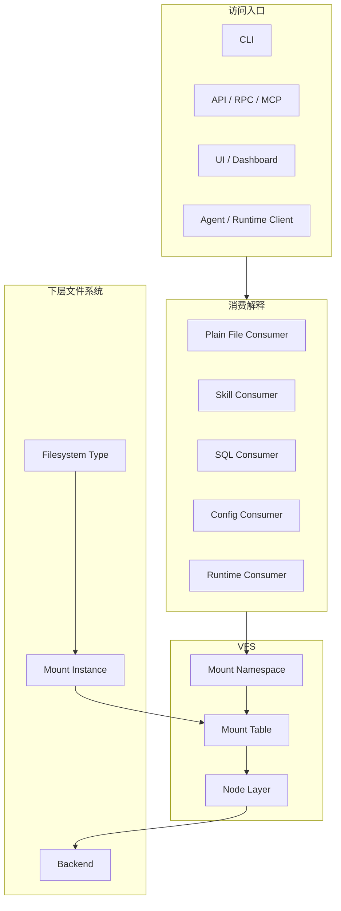

# ContextFS Architecture

> Status: Draft
> Date: 2026-03-22
> Scope: 产品层对象模型（Linux 语义）
> Related: [ContextFS V1 Linux Terminology](./contextfs-v1-linux-terminology.md), [Actant VFS Reference Architecture](./actant-vfs-reference-architecture.md), [ContextFS Roadmap](../planning/contextfs-roadmap.md)

---

## 1. Positioning

Actant 的核心不是“管理资源分类的系统”，而是“为 agent 提供统一上下文访问的文件系统”。

在当前基线里：

- `ContextFS` 是产品层名称
- `VFS` 是其实现内核
- 默认配置入口是 `actant.namespace.json`
- 文件用途由 `consumer interpretation` 决定，而不是由内核对象模型决定

一句话概括：

> **Actant = 面向 agent 的上下文文件系统。**

---

## 2. Four Layers

关键结论：

- 访问入口不是解释层
- 解释层在 VFS 外部
- `mount namespace` 负责解释路径
- `filesystem type` 决定一棵子树如何被提供
- `node type` 决定对象最终是什么

---

## 3. Core Claims

### 3.1 VFS 只解决路径、挂载、节点与操作

VFS 负责：

- 路径规范化
- 挂载点匹配
- 节点分发
- capability 检查
- permission 挂接

VFS 不负责：

- 把 `.md` 判成 skill 还是 prompt
- 把普通文件判成 SQL 还是 config
- 内容嗅探

### 3.2 文件用途由 consumer 决定

同一个 `regular node` 可以同时被不同 consumer 解释为：

- 普通文档
- skill 文档
- SQL 模板
- 配置模板

这属于 consumer interpretation，不属于内核对象模型。

### 3.3 Runtime 是伪文件系统，不是独立平台宇宙

`runtimefs` 用统一 VFS 语义暴露运行时树。

运行时子树至少包含：

- `regular node`: `status.json`
- `control node`: `control/request.json`
- `stream node`: `streams/*`

---

## 4. V1 Required Objects

V1 当前必须固定的对象如下：

- `mount namespace`
- `mount table`
- `filesystem type`
- `mount instance`
- `node`
- `node type`

V1 当前必须固定的 `filesystem type`：

- `hostfs`
- `runtimefs`
- `memfs`

V1 当前必须固定的 `node type`：

- `directory`
- `regular`
- `control`
- `stream`

---

## 5. Compatibility Policy

旧术语允许保留兼容输入，但不再作为当前真相：

- 旧配置迁移只通过显式 migrate 流程处理，不进入默认运行时加载路径
- 旧 `SourceType` / `Source` / `Trait` 只允许出现在映射说明里
- `Prompt` 不再是一级核心对象
