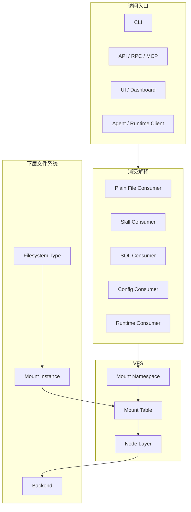

# ContextFS Architecture

> Status: Draft
> Date: 2026-03-23
> Scope: 产品层对象模型（Linux 语义）
> Related: [ContextFS V1 Linux Terminology](./contextfs-v1-linux-terminology.md), [Actant VFS Reference Architecture](./actant-vfs-reference-architecture.md), [Product Roadmap](../planning/roadmap.md), [Workspace Normalization To-Do](../planning/workspace-normalization-todo.md)

---

## 1. Positioning

Actant 的核心不是“管理资源分类的系统”，而是“为 agent 提供统一上下文访问的文件系统”。

在当前基线里：

- `ContextFS` 是产品层名称
- `VFS` 是其实现内核
- 默认配置入口是 `actant.namespace.json`
- 文件用途由 `consumer interpretation` 决定，而不是由内核对象模型决定

一句话概括：

> **Actant = 面向 agent 的上下文文件系统。**

---

## 2. Four Layers

关键结论：

- 访问入口不是解释层
- 解释层在 VFS 外部
- `mount namespace` 负责解释路径
- `filesystem type` 决定一棵子树如何被提供
- `node type` 决定对象最终是什么

---

## 3. Core Claims

### 3.1 VFS 只解决路径、挂载、节点与操作

VFS 负责：

- 路径规范化
- 挂载点匹配
- 节点分发
- capability 检查
- permission 挂接

VFS 不负责：

- 把 `.md` 判成 skill 还是 prompt
- 把普通文件判成 SQL 还是 config
- 内容嗅探

### 3.2 统一寻址分为路径层与标识层

当前主线已经有统一寻址，但它首先是**路径层统一**：

- `mount namespace` 负责解释路径
- 所有输入归一到同一 `canonical path`
- VFS 基于 `canonical path` 完成解析与操作分发

在这个基础上，可以引入独立的**对象标识层**，例如未来的 `ac://` 协议：

- `ac://` 用来表示对象的稳定身份，而不是替代当前路径模型
- `ac://` 解析后应落到某个 `mount namespace` 中的 `canonical path` 或稳定节点身份
- URI 更适合跨进程、跨协议、跨 session、跨审计链路传递对象引用
- 本地 VFS 读写、挂载解析、节点操作仍以路径模型为主

因此，Actant 的长期统一寻址应理解为两层：

- 路径层：面向 VFS 内核，负责访问与操作
- 标识层：面向系统边界，负责引用、传递、缓存和审计

当前 V1 不要求 `ac://` 成为必选公共对象，也不要求所有调用面放弃路径；它的合理定位是未来可选的统一对象标识协议。

### 3.3 文件用途由 consumer 决定

同一个 `regular node` 可以同时被不同 consumer 解释为：

- 普通文档
- skill 文档
- SQL 模板
- 配置模板

这属于 consumer interpretation，不属于内核对象模型。

### 3.4 Runtime 是伪文件系统，不是独立平台宇宙

`runtimefs` 用统一 VFS 语义暴露运行时树。

运行时子树至少包含：

- `regular node`: `status.json`
- `control node`: `control/request.json`
- `stream node`: `streams/*`

### 3.5 Hosted Boundary Freeze: `bridge -> RPC -> daemon`

当调用路径经过宿主运行时时，当前边界固定为：

- `bridge`: 把 ACP / channel / MCP / CLI / API 等外部入口翻译成 Actant 可接受的稳定调用面
- `RPC`: bridge 进入宿主进程的唯一稳定协议边界
- `daemon`: 持有 runtime lifecycle、namespace state 与 hosted request dispatch

约束：

- bridge 不直接操作 runtime 内部装配或 VFS 内部状态
- hosted 调用先过 `RPC` 再进入 daemon，而不是为不同入口复制第二套 runtime contract
- 无 daemon 的本地路径可以直接进入 `VFS`，但这属于本地 kernel 使用，不改变 hosted 边界定义

### 3.6 Hosted Implementation Freeze: `daemon -> runtime integration -> VFS`

当 daemon 承接运行时路径时，内部实现链固定为：

- `daemon`: 运行时宿主、生命周期持有者、命令分派者
- `runtime integration`: daemon 内部的执行与集成能力层，例如 `agent-runtime`、`acp`、`pi`
- `VFS`: 唯一文件系统内核，负责路径、挂载、节点与 capability 语义

这条链的含义是“实现依赖方向”，不是第二套产品对象模型。对用户暴露的稳定对象仍然只有 `ContextFS` / `VFS` 与 Linux 语义对象。

### 3.7 Final Roles For `domain-context` And `manager`

当前基线里，这两个角色不再允许与 `ContextFS` / `VFS` 竞争顶层叙述：

- `domain-context`: agent 侧模板、组件定义、校验与解析所在层；它服务于 runtime / builder，但不是 ContextFS 聚合中心，也不定义 mount/node 语义
- `manager`: session / process / backend lifecycle orchestration 所在层；它消费 `domain-context` 产物，驱动 daemon / backend / channel，但不定义 `filesystem type`、`mount table` 或 `node type`

任何后续设计如果让 `domain-context` 或 `manager` 回到“核心对象模型中心”，都应视为对当前 freeze 基线的偏离。

---

## 4. V1 Required Objects

V1 当前必须固定的对象如下：

- `mount namespace`
- `mount table`
- `filesystem type`
- `mount instance`
- `node`
- `node type`

V1 当前必须固定的 `filesystem type`：

- `hostfs`
- `runtimefs`

V1 当前必须固定的 `node type`：

- `directory`
- `regular`
- `control`
- `stream`

---

## 5. Compatibility Policy

旧术语允许保留兼容输入，但不再作为当前真相：

- 旧 `actant.project.json` 不再进入默认运行时加载路径；仓库升级通过人工改写 `actant.namespace.json` 完成
- 旧 `SourceType` / `Source` / `Trait` 只允许出现在映射说明里
- `Prompt` 不再是一级核心对象
