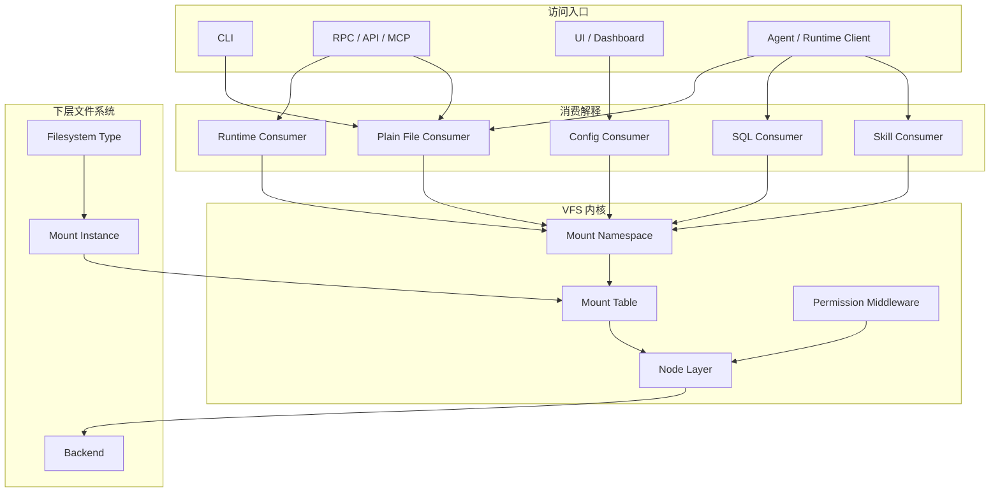
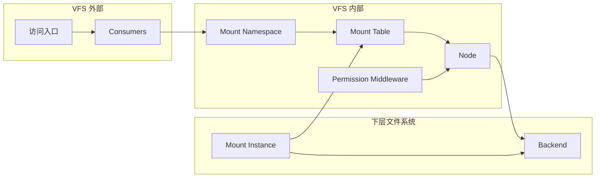
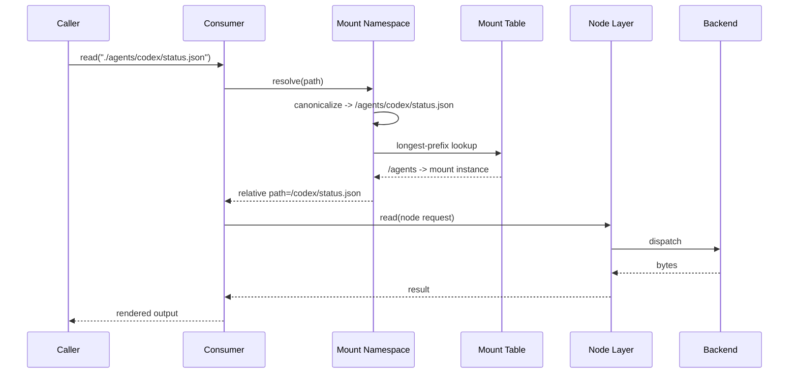
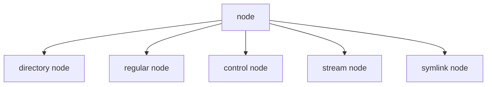
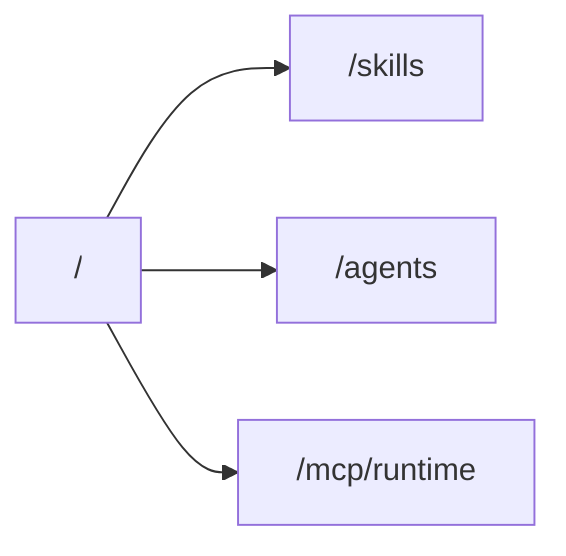
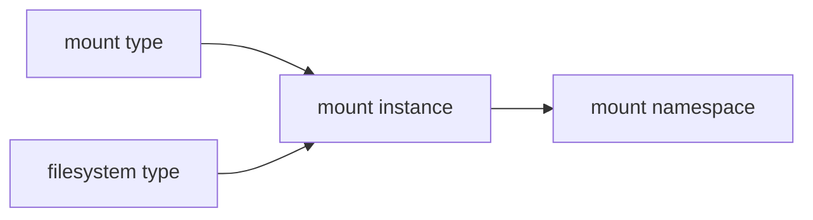
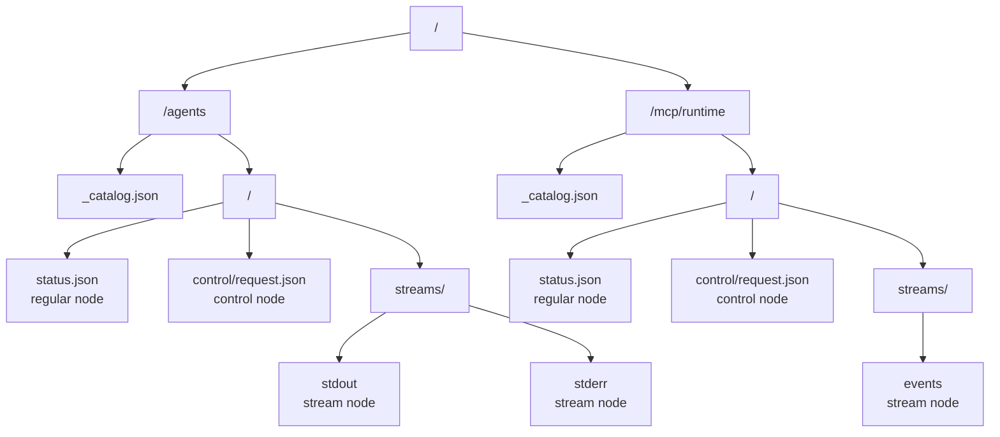

# ContextFS V1 技术设计文档（Linux 术语版）

> Status: Draft
> Date: 2026-03-22
> Scope: Linux 语义统一版对象模型、挂载模型与节点模型
> Related: [ContextFS Architecture](./contextfs-architecture.md), [Actant VFS Reference Architecture](./actant-vfs-reference-architecture.md), [ContextFS Roadmap](../planning/contextfs-roadmap.md)

---

## 1. 摘要

本版设计完全采用 Linux 风格术语，并把内核模型收敛到三个核心问题：

- 路径如何被解释：`mount namespace`
- 子树如何被接入：`mount type` 与 `filesystem type`
- 对象最终是什么：`node type`

同时固定一条总原则：

> VFS 只负责路径、挂载、节点和操作；文件的用途由外部 consumer 决定。

---

## 2. 总体分层



### 核心结论

- `CLI / RPC / UI` 是访问入口，不是解释层。
- `consumer` 在 VFS 之外，决定一个节点“被当成什么用”。
- `mount namespace` 负责解释路径。
- `mount table` 负责挂载归属。
- `node layer` 负责统一对象语义。
- `filesystem type` 决定一棵子树如何被提供出来。

---

## 3. 术语表

### 3.1 核心术语

| 术语 | 定义 |
|---|---|
| `ContextFS` | 面向 agent 的上下文文件系统产品模型 |
| `VFS` | 执行路径解析、挂载解析、节点分发、权限挂接的内核实现 |
| `mount namespace` | 当前上下文可见的完整路径视图 |
| `mount table` | 挂载点到挂载实例的映射表 |
| `filesystem type` | 一类文件系统实现的定义，决定实例化方式、能力上界、生命周期语义 |
| `mount instance` | 某个文件系统类型的具体实例，向命名空间暴露一棵子树 |
| `mount point` | 挂载实例接入命名空间的路径前缀 |
| `node` | VFS 中可被寻址和操作的统一对象 |
| `node type` | 节点的语义种类，例如目录、普通文件、控制节点、流节点 |
| `backend` | 节点背后的真实实现 |
| `provider` | 为 backend 或挂载实例提供连接、句柄或数据源的内部对象 |
| `capability` | 某节点支持的操作面，例如 `read/write/list/stat/watch/stream` |
| `permission` | 当前调用方是否允许执行某操作 |
| `metadata` | 节点的扩展描述信息，类似 xattr |
| `tag` | 面向 consumer 的轻量用途标记 |
| `consumer` | 把节点解释成上层用途的外部程序或组件 |

### 3.2 节点术语

| 术语 | 定义 | 最小操作面 |
|---|---|---|
| `directory node` | 可列举子节点的目录对象 | `list`, `stat` |
| `regular node` | 表示稳定快照内容的普通文件对象 | `read`, `stat` |
| `control node` | 写入会触发控制或执行语义的特殊节点 | `write`, `stat` |
| `stream node` | 由生产者持续输出有序 chunk 的特殊节点 | `stream`, `stat` |
| `symlink node` | 指向其他路径的引用节点 | `readlink`, `stat` |

---

## 4. 对象边界



### VFS 内部只负责

- 路径规范化
- 挂载点解析
- 节点定位
- capability 分发
- permission 挂接

### VFS 外部负责

- 一个节点在上层是什么意思
- 一个普通文件是 skill、SQL、配置还是普通文档
- 如何把多个节点拼装成上层行为

### 下层文件系统负责

- 如何真正读到内容
- 如何真正写入
- 如何产生流
- 如何维护运行时状态

---

## 5. `mount namespace` 的正式定义

### 5.1 定义

`mount namespace` 只解决一个问题：

> 给定一个路径，当前上下文下它属于哪一个挂载实例中的哪一个节点。

它不负责：

- 判断文件是不是 skill、SQL、配置或模板
- 解析内容 schema
- 执行业务逻辑
- 直接读写真实后端

### 5.2 职责分解

#### 路径规范化

输入：

- `skills/a.md`
- `./skills/a.md`
- `/skills/a.md`

输出：

- 统一 canonical path，例如 `/skills/a.md`

#### 挂载点匹配

按照最长前缀匹配找到对应挂载点。

#### 挂载内相对路径切分

例如：

```text
/agents/codex/status.json
= mount point: /agents
= mount-relative path: /codex/status.json
```

#### 视图隔离

不同命名空间可以看到不同挂载集合，即便它们复用同一个下层 backend。

### 5.3 请求流



### 5.4 为什么必须单独有这一层

如果没有 `mount namespace`，这些职责会混在一起：

- 相对路径解析
- canonical path 生成
- 挂载点解析
- 视图隔离
- 兼容路径处理

最终挂载系统会变成解析器、路由器和兼容层的混合体，边界会迅速脏掉。

因此这里固定为：

- `mount namespace`：解释路径
- `mount table`：记录挂载归属
- `node layer`：暴露统一对象
- `backend`：提供真实实现

---

## 6. `node type` 设计

### 6.1 分类图



### 6.2 V1 必要实现的 `node type`

#### `directory node`

用途：

- 目录枚举
- 子树组织
- runtime 子树入口

必须支持：

- `list`
- `stat`

可选支持：

- `watch`

#### `regular node`

用途：

- 文档
- Markdown
- JSON
- SQL
- 配置
- 快照状态文件
- 普通二进制

必须支持：

- `read`
- `stat`

可选支持：

- `write`
- `watch`

这是默认节点种类；绝大多数静态资源都应落到这里。

#### `control node`

用途：

- 提交控制请求
- 提交执行请求
- 提交 runtime 操作

必须支持：

- `write`
- `stat`

可选支持：

- `read`
- `watch`

语义约束：

- `write` 的含义是 effectful submission，不是内容覆盖
- 输出不要求从同一节点返回
- 结果通常通过相邻 `regular node` 与 `stream node` 体现

典型路径：

- `/agents/<name>/control/request.json`
- `/mcp/runtime/<name>/control/request.json`

#### `stream node`

用途：

- stdout
- stderr
- runtime events
- 其他 producer-owned ordered stream

必须支持：

- `stream`
- `stat`

可选支持：

- `read`
- `watch`

语义约束：

- 主操作是 `stream`
- 可选 `read` 只表示快照读取，不改变其主语义
- 一般不允许普通调用方 `write`

典型路径：

- `/agents/<name>/streams/stdout`
- `/agents/<name>/streams/stderr`
- `/mcp/runtime/<name>/streams/events`

### 6.3 V1 保留但不强制实现的 `node type`

#### `symlink node`

用途：

- 别名路径
- 兼容路径
- 快捷入口

不建议在 V1 首批实现中优先推进，除非兼容路径需求明显；可先在类型层保留，在行为层延后。

### 6.4 为什么不再增加更多节点种类

以下都不应成为新的 `node type`：

- skill
- SQL
- config
- template
- prompt

原因：

- 它们的底层 I/O 语义没有脱离 `regular node`
- 它们是 consumer interpretation，不是内核对象类型

---

## 7. `mount type` 设计

`mount type` 回答的问题是：

> 这棵子树以什么方式接入命名空间。

它和 `filesystem type` 不同：

- `mount type` 讲“怎么挂”
- `filesystem type` 讲“挂上来的是什么实现”

### 7.1 V1 必要实现的 `mount type`

#### `direct mount`

定义：

- 将一个挂载实例直接接到某个路径前缀

示意：



能力：

- 最长前缀匹配
- 稳定路径归属
- 简单、可审计、可预测

这是 V1 唯一必须实现的挂载方式。

#### `root mount`

定义：

- 命名空间根自身的系统挂载
- 用于承载 `/`、`/_catalog.json`、根级元信息或聚合入口

说明：

- 可实现为内核内置特殊挂载
- 不一定作为独立用户声明类型暴露
- 但设计上必须承认它存在

### 7.2 V1 只保留概念、不进入交付承诺的 `mount type`

#### `bind mount`

用途：

- 将已有子树重新暴露到另一条路径

#### `overlay mount`

用途：

- 多棵子树叠加出统一视图

#### `fallback mount`

用途：

- 主挂载 miss 后回退到另一挂载

#### `union mount`

用途：

- 合并多个目录视图

这些都不进入 V1，以保证挂载语义保持最小闭环。

---

## 8. `filesystem type system` 设计

`filesystem type` 回答的问题是：

> 这棵子树由哪类实现提供，它的默认能力边界和生命周期是什么。

### 8.1 V1 必要实现的 `filesystem type`

#### `hostfs`

定义：

- 由宿主机目录或文件提供内容的文件系统类型

适用场景：

- 工作目录内的 Markdown、JSON、SQL、配置文件
- 本地静态资源目录

默认节点分布：

- `directory node`
- `regular node`

可选节点分布：

- `symlink node`

不负责：

- 主动产生 `control node`
- 主动产生 `stream node`

#### `runtimefs`

定义：

- 由活动 runtime 提供内容的伪文件系统类型

适用场景：

- agent runtime
- runtime event bus
- 进程或会话状态树

默认节点分布：

- `directory node`
- `regular node`
- `control node`
- `stream node`

这是运行时子树的核心文件系统类型。

#### `memfs`

定义：

- 纯内存、短生命周期、无宿主持久化依赖的文件系统类型

适用场景：

- 临时生成树
- 测试命名空间
- 会话级缓存树

默认节点分布：

- `directory node`
- `regular node`

可选节点分布：

- `stream node`

V1 如果希望在不依赖宿主文件系统和常驻进程的前提下完成最小自举，建议保留并实现。

### 8.2 V1 后续扩展的 `filesystem type`

#### `gitfs`

定义：

- 由 Git 仓库工作树或 revision 视图提供内容

#### `dbfs`

定义：

- 由数据库中的逻辑树视图提供内容

#### `procfs-like fs`

定义：

- 更细粒度的运行时状态伪文件系统

这三类不进入 V1 首批交付，但接口必须为它们预留扩展位。

### 8.3 `mount type` 与 `filesystem type` 的关系



规则固定为：

- 一个挂载实例同时由一个 `mount type` 和一个 `filesystem type` 决定
- `mount type` 决定接入方式
- `filesystem type` 决定节点提供方式
- 两者正交，不互相替代

---

## 9. 运行时伪文件系统



### 固定结论

- 运行时树本质上是 `runtimefs` 挂出来的伪文件系统
- 它不是独立平台宇宙
- 它和普通文件树共用同一 VFS 语义，只是节点种类不同

---

## 10. 文件描述与用途解释

### 10.1 描述层只承认三类信息

- 后缀或 content type
- tag
- metadata

### 10.2 解释优先级

1. metadata
2. tag
3. 路径约定
4. 后缀
5. 内容嗅探

约束：

- VFS 不做内容嗅探
- VFS 不决定用途
- consumer 自己决定如何解释

### 10.3 设计后果

同一个 `.md` 文件可以同时被：

- 当作普通 Markdown 读取
- 当作 skill 文档解释
- 从中提取 SQL 模板
- 当作配置模板消费

而 VFS 模型不需要变化。

---

## 11. 公共接口约束

### 11.1 必须暴露的公共字段

所有 `stat` / `describe` 类接口必须返回：

- canonical path
- mount point
- filesystem label
- node type
- capabilities
- metadata
- tags

### 11.2 `node type` 枚举

V1 固定：

- `directory`
- `regular`
- `control`
- `stream`

保留值：

- `symlink`

### 11.3 `mount table` 结构

最低要求：

- `mount point`
- `mount type`
- `filesystem type`
- `mount instance id`
- `read-only / read-write`
- `lifecycle class`
- `metadata`

### 11.4 权限顺序

执行顺序固定为：

1. `mount namespace` 解析路径
2. `mount table` 确定归属
3. `permission` 判断调用方是否允许操作
4. `node layer` 判断节点是否支持该 capability
5. `backend` 执行真实操作

---

## 12. 全工作目录迭代 To-Do List

### 12.1 P0 真相源重写

1. 新建并冻结一份 Linux 术语版主设计文档，作为唯一真相源。
2. 活跃设计文档全部切换到以下核心词汇：
   - `mount namespace`
   - `mount table`
   - `filesystem type`
   - `mount instance`
   - `node type`
3. 文档中显式写明：
   - `control node` 与 `stream node` 是节点种类
   - consumer interpretation 不进入 VFS

### 12.2 P1 配置面重写

1. 把当前挂载声明重写为 `mount table declaration`。
2. 明确区分：
   - `mount type`
   - `filesystem type`
   - `mount instance`
3. 固定根配置文件的命名与结构，建议命名为：
   - `actant.namespace.json`
4. 在配置里只声明挂载，不声明业务用途分类。

### 12.3 P2 类型层重写

1. 增加 `node type` 类型定义并贯通所有核心接口。
2. 增加 `mount type` 类型定义：
   - `root`
   - `direct`
3. 增加 `filesystem type` 类型定义：
   - `hostfs`
   - `runtimefs`
   - `memfs`
4. 为扩展预留：
   - `gitfs`
   - `dbfs`

### 12.4 P3 VFS 实现收敛

1. 单独抽出 `mount namespace` 解析层。
2. 单独抽出 `mount table` 匹配层。
3. 为 `control node` 和 `stream node` 建立稳定 contract。
4. 保证 `regular node` 仍是默认资源承载种类。
5. 保证普通读取不依赖常驻进程。

### 12.5 P4 运行时文件系统收敛

1. 把 runtime 树明确实现为 `runtimefs`。
2. 统一 runtime 子树结构：
   - `status.json`
   - `control/request.json`
   - `streams/*`
3. 保证所有运行时入口都复用同一 VFS 读写路径，不再旁路。

### 12.6 P5 用户可见文案清理

1. README、站点、指南、CLI、RPC 文档全部改成 Linux 语义口径。
2. 删除活跃文档中所有旧命名。
3. 运行时与静态文件统一叙事为：
   - mounted subtree
   - node types
   - consumer interpretation

### 12.7 P6 门禁与回归

1. 增加 grep 门禁，禁止旧术语回流。
2. 增加类型门禁，确保 `node type` 在 stat/describe 路径中不可缺失。
3. 增加行为回归：
   - direct mount 正常
   - runtimefs 正常
   - control node 正常
   - stream node 正常
   - 无常驻进程读取正常

---

## 13. 测试场景

1. 路径规范化：
   - `./skills/a.md`
   - `skills/a.md`
   - `/skills/a.md`
   必须解析到同一 canonical path。
2. 挂载解析：
   - 最长前缀匹配稳定正确。
3. 节点识别：
   - `status.json` = `regular`
   - `control/request.json` = `control`
   - `streams/stdout` = `stream`
4. 文件系统类型边界：
   - `hostfs` 只暴露普通文件树
   - `runtimefs` 暴露控制与流节点
   - `memfs` 可在无宿主目录依赖下工作
5. 无常驻进程读取：
   - 直连 `hostfs` / `memfs` 可读取上下文
6. 运行时行为：
   - 写入 `control node` 触发 effectful request
   - 订阅 `stream node` 获得有序 chunk

---

## 14. 已选定默认策略

- 核心术语完全切到 Linux 语义。
- V1 必须实现的 `node type`：
  - `directory`
  - `regular`
  - `control`
  - `stream`
- V1 保留但不强制实现的 `node type`：
  - `symlink`
- V1 必须实现的 `mount type`：
  - `root`
  - `direct`
- V1 必须实现的 `filesystem type`：
  - `hostfs`
  - `runtimefs`
  - `memfs`
- V1 预留扩展的 `filesystem type`：
  - `gitfs`
  - `dbfs`
- consumer interpretation 永远在 VFS 外部。
- 常驻进程永远不是上下文可读性的前提。
