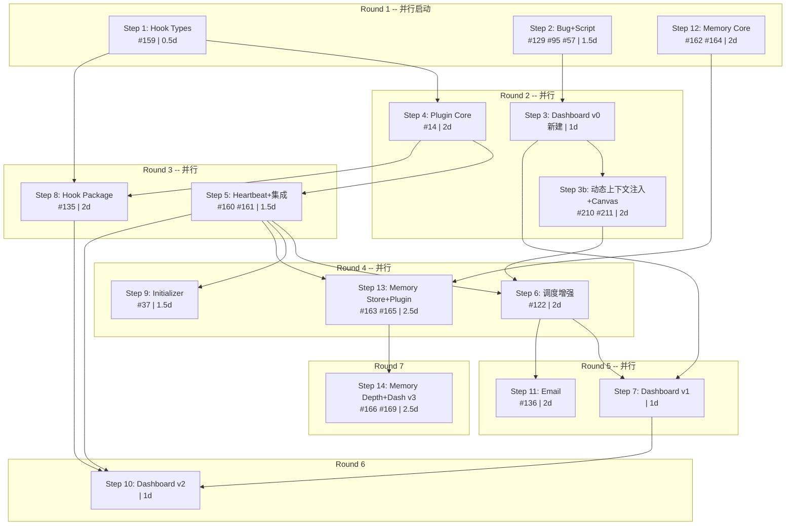

# Phase 4 雇员自治能力扩展 — 步骤化推进计划

> **状态: ACTIVE**
> 更新日期: 2026-02-26
> 关联 Epic: #173 (GitHub)
> 前置文档: `docs/planning/phase4-plan.md` (旧版评估，保留参考)

---

## 设计理念

> Employee 不是独立类型，而是 "acp-service + plugins" 的能力组合。
> Phase 4 的目标是围绕雇员型 Agent，逐步赋予六大自治能力:
> 调度增强 / 事件自动化 / 自主初始化 / 跨 Agent 协作 / 经验记忆 / 运行监控

全部 15 Step（含 3b），每步是一个可独立交付的小版本。串行总计 ~24 天，最大并行化关键路径 ~14 天。

---

## 并行调度总览

15 个 Step（含 3b）按依赖关系分为 7 个 Round，同一 Round 内的步骤可并行推进。



| Round | 可并行步骤 | 前置条件 | 并行耗时 |
|-------|-----------|---------|---------|
| R1 | Step 1 + Step 2 + Step 12 | 无 | ~2 天 |
| R2 | Step 3 + Step 3b + Step 4 | Step 1, Step 2 | ~2 天 |
| R3 | Step 5 + Step 8 | Step 4 | ~2 天 |
| R4 | Step 6 + Step 9 + Step 13 | Step 5 + Step 3b, Step 12 | ~2.5 天 |
| R5 | Step 7 + Step 11 | Step 3, Step 6 | ~2 天 |
| R6 | Step 10 | Step 7, Step 8 | ~1 天 |
| R7 | Step 14 | Step 13 | ~2.5 天 |
| | | **关键路径合计** | **~14 天** |

---

## 已有基础

| 已完成 | 代码位置 | 说明 |
|--------|---------|------|
| EmployeeScheduler | `packages/core/src/scheduler/employee-scheduler.ts` | TaskQueue + TaskDispatcher + InputRouter |
| InputSource 管道 | `packages/core/src/scheduler/` (9 文件) | HeartbeatInput / CronInput / HookInput |
| HookEventBus | `packages/core/src/hooks/hook-event-bus.ts` | 事件发布/订阅，已有测试 |
| HookRegistry | `packages/core/src/hooks/hook-registry.ts` | Workflow 注册，但引用未定义的类型 |
| ActionRunner | `packages/core/src/hooks/action-runner.ts` | shell / builtin / agent 三种动作 |
| 模板 schedule 配置 | Phase 3c #47 交付 | 配置驱动调度（模式 1）已实现 |

缺失项: Hook 类型未定义 (#159)、Plugin 接口未实现 (#14)、调度器仅支持模式 1

---

## Step 1: Hook 类型补全

| 字段 | 值 |
|------|------|
| 关联 Issue | #159 |
| 预估 | 0.5 天 |
| 依赖 | 无 |
| 阻塞 | Step 4 (#14), Step 8 (#135) |
| 并行 | **Round 1** — 可与 Step 2, Step 12 同时启动 |

**背景**: `packages/core/src/hooks/` 下的 `hook-event-bus.ts`, `hook-registry.ts`, `action-runner.ts` 引用了 `HookEventName` / `HookDeclaration` / `HookAction` 三个类型，但它们在 `@actant/shared` 中从未定义。这是所有后续 Plugin 和 Hook 工作的类型基础。

**交付物**:
- 新建 `packages/shared/src/types/hook.types.ts`，定义上述三个类型并从 index 导出
- 修正 `packages/core/src/hooks/` 下三个文件的 import 路径
- TypeScript 全量编译通过

**验收**: `pnpm typecheck` 无 hook 相关错误

**人类验收**:
1. 打开 `packages/shared/src/types/hook.types.ts`，确认 `HookEventName`、`HookDeclaration`、`HookAction` 三个类型均已导出
2. 在 IDE 中打开 `packages/core/src/hooks/hook-event-bus.ts`，确认无红色类型错误下划线
3. 在终端执行 `pnpm build`，确认零类型错误完成
4. 在 IDE 中输入 `const e: HookEventName = '`，确认有自动补全提示（验证类型已正确集成）

---

## Step 2: Bug 清理 + 脚本修复

| 字段 | 值 |
|------|------|
| 关联 Issue | #129, #95, #57 |
| 预估 | 1-1.5 天 |
| 依赖 | 无 |
| 并行 | **Round 1** — 可与 Step 1, Step 12 同时启动 |

**内容**:

| 事项 | Issue | 说明 |
|------|-------|------|
| npm 发布验证 | #129 | 检查 @actant/* 包 0.2.1 在 npm 的发布状态，修复 IPC path 问题 |
| ACP Gateway terminal stub | #95 | TerminalHandle 映射方案落地，解决 IDE terminal 面板不可用 |
| Windows daemon fork | #57 | 评估可修复性；若短期无法修复，文档化 `--foreground` workaround 并关闭 |
| Trellis 脚本 CRLF | - | `.trellis/scripts/*.sh` 全部转换为 LF 行尾，确保 Windows Git Bash 可执行 |

**验收**: 各 Bug Issue 可关闭或标记 workaround；`bash .trellis/scripts/get-context.sh` 在 Windows 可正常执行

**人类验收**:
1. **npm 发布**: 执行 `npm view @actant/cli version`，确认 0.2.1+ 已在 npm 上可见
2. **Windows daemon**: 在 Windows PowerShell 中执行 `actant daemon start`，确认 daemon 成功启动（或 `--foreground` 模式可用且文档化）
3. **CRLF**: 在 Windows Git Bash 中执行 `bash .trellis/scripts/get-context.sh`，确认无 `$'\r': command not found` 错误
4. **Issue 状态**: 在 GitHub 上确认 #129、#95、#57 均已 closed 或标记了明确的 workaround comment

---

## Step 3: Dashboard v0 — 全局总览

| 字段 | 值 |
|------|------|
| 关联 Issue | 新建 Dashboard Issue |
| 预估 | 1 天 |
| 依赖 | Step 2 (Daemon 需可正常运行) |
| 并行 | **Round 2** — 可与 Step 4 同时推进 |

**背景**: 雇员型 Agent 长时间后台运行，需要持续可视化监控。从最小可用版本开始，后续随能力增长逐步增强。

**交付物**:
- `actant dashboard [--port 7890]` CLI 命令
- 轻量 HTTP Server (Node 内置 `http`)，通过 RPC Client 桥接 Daemon
- SSE (Server-Sent Events) 实时推送状态变更
- 单文件 HTML 页面 (Tailwind CDN + vanilla JS)

**v0 可视化内容**:
- 顶部状态条: Daemon 版本、运行时长、Agent 总数
- Agent 卡片列表: 名称、状态 (彩色标记)、LaunchMode、PID、运行时长
- 2 秒自动刷新，状态变更时卡片高亮闪烁
- 启动后自动打开浏览器

**复用的 RPC**: `daemon.ping` + `agent.list` (已有，无需新增后端代码)

**验收**: 启动 Daemon + 若干 Agent 后，`actant dashboard` 可在浏览器看到所有 Agent 实时状态

**人类验收**:
1. 执行 `actant daemon start && actant agent start my-agent`
2. 执行 `actant dashboard`，确认浏览器自动打开并显示页面
3. **视觉检查**: 页面顶部显示 Daemon 版本和运行时长；下方有 `my-agent` 卡片，状态为绿色 "running"
4. 执行 `actant agent stop my-agent`，观察页面在 2 秒内自动更新卡片状态变为灰色 "stopped"
5. 关闭浏览器标签页，再次执行 `actant dashboard --port 8080`，确认可指定端口并正常打开

---

## Step 3b: 动态上下文注入 + Canvas

| 字段 | 值 |
|------|------|
| 关联 Issue | #210, #211 |
| 预估 | 2 天 |
| 依赖 | Step 3 (Dashboard v0 基础) |
| 阻塞 | Step 6 (#122 调度增强 — MCP 工具注入依赖此步) |
| 并行 | **Round 2** — 可与 Step 4 同时推进 |

**背景**: 雇员型 Agent 需要系统级工具能力（Canvas 状态面板、未来的调度工具等），这些工具通过内置 MCP Server 提供，在 ACP session 创建时自动注入。需要一个可扩展的动态上下文注入模块作为统一基础设施。

**交付物**:

- **SessionContextInjector 模块** (`packages/core/src/context-injector/`)
  - `ContextProvider` 接口：任何子系统可注册为 provider
  - `prepare(agentName, meta)` 收集所有 MCP servers + 系统上下文，去重同名 server
  - EventBus 可扩展：`session:preparing` / `session:context-ready` 事件
- **内置 Actant MCP Server 激活** (`packages/mcp-server/`)
  - `@modelcontextprotocol/sdk` + `zod` 依赖
  - `actant_canvas_update(html, title?)` / `actant_canvas_clear()` 工具
  - 通过 `ACTANT_SOCKET` 环境变量连接回 Daemon RPC
- **ACP 管道打通**
  - `ConnectOptions` + `AcpConnectionManagerLike` 新增 `mcpServers`
  - `AgentManager.startAgent()` 调用 `injector.prepare()` 收集上下文
  - `newSession(cwd, mcpServers)` 传参
- **Canvas 数据流**
  - `CanvasStore` 内存存储 + `canvas.*` RPC handlers
  - Dashboard SSE 广播 canvas 数据 + REST 端点
- **Dashboard Live Canvas**
  - Transport 抽象层 (Tauri 桌面化预留)
  - `use-realtime.tsx` 替代 `use-sse.tsx`（向后兼容）
  - iframe sandbox 渲染 Agent HTML 内容
- **canvas-manager Skill** (`.agents/skills/canvas-manager/SKILL.md`)

**对现有 Step 的影响**:

- Step 6 (#122) 的 `actant_schedule_*` MCP 工具改为依赖 Step 3b（在已激活的 MCP Server 上添加工具，而非从零实现）
- 依赖图变更: `Step 5 + Step 3b → Step 6`

**验收**: Agent 启动后自动获得 `actant_canvas_update` 工具；Agent 调用该工具后，Dashboard Live Canvas 页面 iframe 渲染出 HTML 内容

---

## Step 4: Plugin 体系核心

| 字段 | 值 |
|------|------|
| 关联 Issue | #14 |
| 预估 | 2 天 |
| 依赖 | Step 1 (#159 Hook 类型) |
| 并行 | **Round 2** — 可与 Step 3 同时推进 |

**背景**: Plugin 是雇员所有高级能力 (调度、事件、记忆) 的载体。实现统一三插口架构，让一个 Plugin 可同时具备 domainContext (物化到 workspace) + runtime (生命周期) + hooks (事件) 三种能力。

**交付物**:
- `packages/shared/src/types/plugin.types.ts` — ActantPlugin 接口、PluginRef、PluginContext、PluginScope 等类型
- `packages/core/src/plugin/plugin-host.ts` — PluginHost 实现
  - actant / instance 双层作用域
  - 三插口分流: domainContext 交给 BackendBuilder、runtime 管理生命周期、hooks 注册到 EventBus
  - `init -> start -> tick -> stop -> dispose` 五阶段生命周期
  - tick() try/catch 隔离 + running guard 防重入
  - 依赖拓扑排序
- `packages/core/src/plugin/legacy-adapter.ts` — `adaptLegacyPlugin()` 将旧 PluginDefinition 适配为纯 domainContext 插件
- 单元测试覆盖 PluginHost 核心流程

**验收**: PluginHost 可加载 Plugin、执行完整生命周期、隔离异常；旧 PluginDefinition 可自动适配

**人类验收**:
1. 执行 `pnpm test --filter @actant/core -- plugin`，确认 PluginHost 相关测试全部 pass
2. 查看测试用例列表，确认覆盖以下场景:
   - 正常生命周期 (init → start → tick → stop → dispose)
   - Plugin init 抛异常时被隔离（不影响其他 Plugin）
   - tick() 重入保护（连续调用不会叠加执行）
   - 旧 PluginDefinition 通过 `adaptLegacyPlugin()` 转换为 ActantPlugin
3. 查看 `packages/shared/src/types/plugin.types.ts`，确认 `ActantPlugin`、`PluginContext`、`PluginScope` 类型定义清晰可读

---

## Step 5: HeartbeatPlugin + Plugin 系统集成

| 字段 | 值 |
|------|------|
| 关联 Issue | #160, #161 |
| 预估 | 1.5 天 |
| 依赖 | Step 4 (#14 PluginHost) |
| 并行 | **Round 3** — 可与 Step 8 同时推进 |

**交付物 (上半: #160)**:
- `packages/core/src/plugin/builtins/heartbeat-plugin.ts` — 首个内置 Plugin
  - `init`: 读取 config (intervalMs, timeoutMs)
  - `tick`: 检查进程心跳，发射 `plugin:heartbeat:healthy` / `plugin:heartbeat:unhealthy` 事件
  - 验证 PluginHost 的 init/start/tick/stop 全链路

**交付物 (下半: #161)**:
- AppContext 中初始化 PluginHost，在 `start()` / `stop()` 中接入生命周期
- AgentManager 在 agent start/stop 时触发 instance-scope plugin 启停
- RPC: `plugin.list` / `plugin.status` (返回各 Plugin 名称、状态、最近 tick)
- CLI: `actant plugin list` / `actant plugin status`
- 单元测试

**验收**: 启动一个配置了 HeartbeatPlugin 的 Agent，`actant plugin status` 显示其运行中；停止 Agent 后 Plugin 正确销毁

**人类验收**:
1. 创建一个 Agent Template，配置启用 HeartbeatPlugin（示例 JSON 配置应在文档中提供）
2. 执行 `actant agent create test-hb --template <template>` 并 `actant agent start test-hb`
3. 执行 `actant plugin list`，确认输出表格中包含 `heartbeat` 行，状态为 `running`
4. 执行 `actant plugin status heartbeat`，确认显示: scope、最近 tick 时间、consecutiveFailures = 0
5. 执行 `actant agent stop test-hb`，再执行 `actant plugin list`，确认 HeartbeatPlugin 不再显示或状态为 `stopped`
6. **故障模拟**: 手动 kill Agent 进程 (非正常关闭)，观察 `actant plugin status` 是否报告 unhealthy

---

## Step 6: 调度器四模式增强

| 字段 | 值 |
|------|------|
| 关联 Issue | #122 |
| 预估 | 2 天 |
| 依赖 | Step 5 (#161 Plugin 集成) + Step 3b (#210 SessionContextInjector — MCP 工具注入基础) |
| 并行 | **Round 4** — 可与 Step 9, Step 13 同时推进 |

**背景**: 当前调度器仅支持模式 1 (配置驱动)。增强后 Agent 可以自主安排工作节奏 (模式 2)、Plugin 可扩展调度能力 (模式 3)、支持一次性延迟触发 (模式 4)。

**交付物**:
- `packages/core/src/scheduler/delay-input.ts` — 模式 4，一次性定时 InputSource
- `packages/core/src/scheduler/input-source-registry.ts` — 模式 3，Plugin 注册自定义 InputSource 的接口
- `packages/mcp-server/src/tools/schedule-tools.ts` — 模式 2，MCP Tools:
  - `actant_schedule_wait`: Agent 自己调用，等待 N ms 后自唤醒
  - `actant_schedule_cron`: Agent 注册临时 cron 调度
  - `actant_schedule_cancel`: Agent 取消待执行的调度
- EmployeeScheduler 扩展以支持动态注册/注销 InputSource
- 单元测试 + E-SCHED 耐久测试基础场景

**验收**: Agent 通过 MCP Tool 调用 `actant_schedule_wait(30000, "check PR")` 后，30 秒后被自动唤醒并收到 prompt

**人类验收**:
1. 启动一个雇员 Agent，通过 `actant agent dispatch` 给它一个包含 `actant_schedule_wait` 调用的 prompt
2. 执行 `actant schedule list <agent>`，确认出现一个 `delay` 类型的 InputSource 且状态为 `active`
3. 等待指定时间后，执行 `actant agent logs <agent>`，确认出现被 delay 触发的执行记录
4. 测试 `actant_schedule_cron`: 给 Agent 一个注册 cron 的 prompt，执行 `schedule list` 确认出现 cron 源
5. 测试 `actant_schedule_cancel`: 取消上述 cron，`schedule list` 确认已移除
6. **边界测试**: 尝试 `actant_schedule_wait` 设置小于 1000ms 的延迟，确认被拒绝（有合理错误提示）

---

## Step 7: Dashboard v1 — 单 Agent 钻取 + 调度面板

| 字段 | 值 |
|------|------|
| 关联 Issue | 同 Step 3 Dashboard Issue |
| 预估 | 1 天 |
| 依赖 | Step 3 (v0 基础) + Step 6 (调度数据可查) |
| 并行 | **Round 5** — 可与 Step 11 同时推进 |

**在 v0 基础上新增**:
- 点击 Agent 卡片进入单 Agent 详情页: 完整元数据、进程状态、Session 列表
- 调度器面板: InputSource 列表 (类型/活跃状态/下次触发时间)、任务队列实时深度条
- 执行历史时间线: 最近 50 条 ExecutionRecord，pass/fail 颜色标记、耗时可视化
- 进程日志尾部实时滚动 (最近 100 行)

**复用的 RPC**: `agent.status`, `agent.tasks`, `agent.logs`, `schedule.list`, `session.list`, `agent.processLogs` (全部已有)

**验收**: 在 Dashboard 中可以点入某个雇员 Agent，看到其调度源、任务队列、执行历史的实时状态

**人类验收**:
1. 打开 Dashboard，点击某个正在运行的雇员 Agent 卡片
2. **详情页检查**: 确认显示 Agent 的完整元数据（模板名、LaunchMode、PID、workspace 路径）
3. **调度面板**: 确认看到 InputSource 列表（如 heartbeat、cron），每个条目显示类型和活跃状态
4. **任务队列**: 通过 `actant agent dispatch` 手动推送几个任务，确认队列深度条实时增长
5. **执行历史**: 等待任务处理完毕，确认时间线上出现新的条目，pass 为绿色、fail 为红色
6. **日志滚动**: 确认页面底部有进程日志区域，实时显示最新输出
7. **导航**: 点击"返回"能回到全局总览页

---

## Step 8: Hook Package — 事件驱动自动化

| 字段 | 值 |
|------|------|
| 关联 Issue | #135 |
| 预估 | 2 天 |
| 依赖 | Step 1 (#159 Hook 类型) + Step 4 (#14 PluginHost) |
| 并行 | **Round 3** — 可与 Step 5 同时推进 |

**背景**: 将 Workflow 从模糊的 markdown 文本重新定义为 Hook Package — 事件驱动的自动化配置。已有 `HookEventBus` / `HookRegistry` / `ActionRunner` 代码基础，需要对齐类型并与 PluginHost hooks 插口集成。

**交付物**:
- `WorkflowDefinition` 类型扩展: 新增 `hooks: HookDeclaration[]`、`level: "actant" | "instance"`、`enabled: boolean`
- HookRegistry 重构: 正确使用 #159 定义的 `HookEventName` / `HookDeclaration` / `HookAction` 类型
- 三层事件架构落地:
  - Layer 1 (Actant 系统层): `actant:start/stop`, `agent:created/destroyed`, `source:updated`, `cron:*`
  - Layer 2 (Instance 作用域): Workflow 绑定到特定 Instance
  - Layer 3 (运行时): `process:start/stop/crash`, `session:start/end`, `prompt:before/after`
- PluginHost hooks 插口集成: Plugin 可声明 hooks，PluginHost 自动注册到 EventBus
- Workflow 配置格式: JSON，声明 `on: <event>` + `actions: [shell/builtin/agent]`
- 单元测试

**验收**: 配置一个 Workflow，当 `agent:created` 事件触发时自动执行 shell 命令；当 `session:end` 触发时通知另一个 Agent

**人类验收**:
1. 创建一个 Workflow JSON 文件:
   ```json
   {
     "name": "test-hook",
     "level": "actant",
     "hooks": [
       { "on": "agent:created", "actions": [{ "type": "shell", "run": "echo HOOK_FIRED >> /tmp/hook-test.log" }] }
     ]
   }
   ```
2. 加载该 Workflow 到 Actant
3. 执行 `actant agent create hook-test-agent --template <any>`
4. 检查 `/tmp/hook-test.log`（或 Windows 等效路径），确认文件中出现 `HOOK_FIRED`
5. **Layer 3 测试**: 配置 `session:end` 事件触发 agent action，启动 Agent A 并完成一次 session，确认 Agent B 收到了 prompt
6. **错误隔离**: 配置一个 action 为必定失败的 shell 命令，确认事件系统继续运行、不崩溃

---

## Step 9: Extensible Initializer — 声明式初始化

| 字段 | 值 |
|------|------|
| 关联 Issue | #37 |
| 预估 | 1.5 天 |
| 依赖 | Step 5 (#161 AppContext 集成) |
| 并行 | **Round 4** — 可与 Step 6, Step 13 同时推进 |

**背景**: 雇员首次启动时需要自动完成环境准备 (克隆代码、安装依赖、初始化配置)。当前 `AgentInitializer` 只做基础物化，模板中声明的 `InitializerStep` 未被执行。

**交付物**:
- `InitializerStepExecutor` 基类: validate -> execute -> rollback
- 内置步骤:
  - `git-clone`: 克隆代码仓库
  - `npm-install`: 安装 Node 依赖
  - `file-copy` / `file-template`: 复制/渲染模板文件
  - `exec`: 执行任意 shell 命令
  - `mkdir`: 创建目录结构
- 执行引擎: 顺序执行、失败回滚、步骤间状态共享 (`StepContext.state`)
- `AgentInitializer` 集成: `agent create` 时执行模板声明的 steps
- 单元测试

**验收**: 模板声明 `steps: [{ type: "git-clone", config: { repo: "..." } }, { type: "npm-install" }]`，`agent create` 自动执行

**人类验收**:
1. 准备一个模板 JSON，在 `initializer.steps` 中声明:
   ```json
   [
     { "type": "mkdir", "config": { "path": "src" } },
     { "type": "exec", "config": { "command": "echo hello > src/init-marker.txt" } }
   ]
   ```
2. 执行 `actant agent create init-test --template <template>`
3. 检查 Agent workspace 目录，确认 `src/` 目录存在且 `src/init-marker.txt` 内容为 `hello`
4. **失败回滚**: 创建一个模板，中间步骤会失败（如 git-clone 一个不存在的 repo），确认:
   - 创建过程报告错误并列出失败步骤
   - 之前成功的步骤被回滚（已创建的目录被清理）
5. **幂等性**: 对同一个已创建的 Agent 再次 create（或 re-init），确认已有文件不被覆盖/破坏

---

## Step 10: Dashboard v2 — 实时事件流 + Plugin 面板

| 字段 | 值 |
|------|------|
| 关联 Issue | 同 Step 3 Dashboard Issue |
| 预估 | 1 天 |
| 依赖 | Step 7 (v1 基础) + Step 5 (Plugin 可查) + Step 8 (Hook 事件可观测) |
| 并行 | **Round 6** — 无并行 (汇合点) |

**在 v1 基础上新增**:
- 实时事件流面板: Hook 事件时间线，彩色标签按 Layer 分组 (系统事件蓝色 / 运行时绿色 / 错误红色)
- Plugin 状态面板: 各 Plugin 名称、scope、状态 (running/error/stopped)、最近 tick 时间、连续失败次数
- 需新增 RPC: `events.recent` (返回最近 N 条 HookEventBus 事件) + `plugin.status` 增强
- E-PLUG 耐久测试: Plugin 加载/卸载/崩溃恢复 + Hook 高频事件发射

**验收**: Dashboard 中可实时看到 Hook 事件流滚动更新，Plugin 面板显示各插件健康状态

**人类验收**:
1. 打开 Dashboard，导航到全局页面
2. **事件流面板**: 执行 `actant agent create event-test --template <any>`，观察 Dashboard 事件流面板出现 `agent:created` 事件条目（蓝色标签）
3. 启动 Agent，观察出现 `process:start` 事件（绿色标签）
4. **Plugin 面板**: 导航到启用了 Plugin 的 Agent 详情页，确认 Plugin 面板显示:
   - Plugin 名称、scope (actant/instance)
   - 状态标签（running 绿色 / error 红色 / stopped 灰色）
   - 最近 tick 时间（应在几秒前）
   - consecutiveFailures 数字
5. **实时性**: 在另一个终端执行操作（如 stop Agent），Dashboard 面板在几秒内反映变化
6. **耐久测试**: 执行 `pnpm test:endurance -- plugin`，确认 E-PLUG 场景 pass

---

## Step 11: Agent-to-Agent Email 通信

| 字段 | 值 |
|------|------|
| 关联 Issue | #136 |
| 预估 | 2 天 |
| 依赖 | Step 6 (#122 调度管道，EmailInput 走 TaskQueue) |
| 并行 | **Round 5** — 可与 Step 7 同时推进 |

**背景**: 雇员间需要异步通信能力——分派子任务、汇报结果、协作处理。Email 范式简单直观，CLI/RPC 优先，无硬性外部依赖。

**交付物**:
- `packages/core/src/email/email-hub.ts` — 消息路由 + 投递 + JSON 文件持久化
- `packages/core/src/scheduler/email-input.ts` — EmailInput (InputSource)，新消息自动进入 TaskQueue
- RPC: `email.send` / `email.inbox` / `email.reply` / `email.threads`
- CLI: `actant email send <to> --subject "..." --body "..."` / `actant email inbox <agent>` / `actant email reply <id>`
- 雇员 Agent 收到 Email: EmailInput -> TaskQueue -> 调度管道 -> prompt Agent
- 普通 Agent 收到 Email: 新 session 处理 -> 自动回复
- E-EMAIL 耐久测试: 多 Agent 并发通信、消息投递可靠性

**验收**: Agent A 执行 `actant email send agent-b --subject "review PR#42"` 后，Agent B 被自动唤醒处理该消息

**人类验收**:
1. 启动两个雇员 Agent: `agent-sender` 和 `agent-receiver`
2. 执行 `actant email send agent-receiver --from agent-sender --subject "请审查 PR#42" --body "PR 链接: https://..."`
3. 执行 `actant email inbox agent-receiver`，确认显示收到的邮件（subject、from、时间）
4. 检查 `actant agent logs agent-receiver`，确认 agent-receiver 被自动唤醒并处理了该消息
5. **回复链**: 执行 `actant email reply <message-id> --body "已审查"`，检查 agent-sender 的 inbox 是否收到回复
6. **线程查看**: 执行 `actant email threads agent-receiver`，确认消息按会话分组
7. **离线投递**: 停止 agent-receiver，再发送一封邮件，然后重新启动 agent-receiver，确认启动后自动收到离线邮件
8. **错误处理**: 向不存在的 Agent 发送邮件，确认返回明确错误信息

---

## Step 12: Memory 核心 — core + embedding

| 字段 | 值 |
|------|------|
| 关联 Issue | #162, #164 |
| 预估 | 2 天 |
| 依赖 | 无 (独立于 Actant) |
| 并行 | **Round 1** — 可与 Step 1, Step 2 同时启动 (零依赖) |

**背景**: 记忆系统拆为三个独立包，零 Actant 依赖。本步完成数据模型和 Embedding 客户端。

**交付物 (上半: #162 @agent-memory/core)**:
- `packages/agent-memory/core/` — 新包
- `MemoryRecord` 数据模型: L0/L1/L2 分层、`ac://` URI 寻址、vector 维度常量 (1024)
- `MemoryStore` 接口: recall (语义检索) / navigate (URI 定位) / browse (树状浏览)
- URI 工具: 校验 (`ac://` only, reject `..`)、解析、构建
- `InMemoryMemoryStore`: 测试用内存实现
- 单元测试

**交付物 (下半: #164 @agent-memory/embedding)**:
- `packages/agent-memory/embedding/` — 新包
- `EmbeddingClient` 接口 + `embedBatch()` 批量 API
- 降级链实现: OpenAI -> ONNX -> 零向量 fallback
- 每 session embedding 上限配置 (`maxEmbeddingsPerSession`)
- ONNX 作为 optional peerDependency
- 单元测试

**验收**: `@agent-memory/core` 和 `@agent-memory/embedding` 独立可测试，`pnpm test` 通过

**人类验收**:
1. 进入 `packages/agent-memory/core/` 目录，执行 `pnpm test`，确认所有测试 pass
2. 进入 `packages/agent-memory/embedding/` 目录，执行 `pnpm test`，确认所有测试 pass
3. **零依赖验证**: 检查 `packages/agent-memory/core/package.json` 的 `dependencies`，确认为空或仅含 dev 依赖
4. **InMemoryStore 手动验证**: 编写一个简单的 TS 脚本:
   ```typescript
   import { InMemoryMemoryStore } from '@agent-memory/core';
   const store = new InMemoryMemoryStore();
   // 写入几条记录 → recall → navigate → browse → 打印结果
   ```
   执行后确认三种查询模式均返回正确结果
5. **URI 安全**: 尝试 `navigate('ac://../../etc/passwd')`，确认被拒绝并报告校验错误
6. **Embedding 降级**: 在未安装 ONNX 的环境下测试 embedding，确认自动降级到零向量 fallback 且无 crash

---

## Step 13: Memory 存储 + MemoryPlugin 接入

| 字段 | 值 |
|------|------|
| 关联 Issue | #163, #165 |
| 预估 | 2.5 天 |
| 依赖 | Step 5 (#161 PluginHost) + Step 12 (core + embedding) |
| 并行 | **Round 4** — 可与 Step 6, Step 9 同时推进 |

**交付物 (上半: #163 @agent-memory/store-lancedb)**:
- `packages/agent-memory/store-lancedb/` — 新包
- LanceDB 实现 `MemoryStore` 接口: recall / navigate / browse
- `@lancedb/lancedb` pin 精确版本
- SQL 参数化查询，避免 URI 注入
- 单元测试 (用 tmpdir 隔离)

**交付物 (下半: #165 MemoryPlugin)**:
- `packages/core/src/plugin/builtins/memory-plugin.ts` — 以 ActantPlugin 形式接入 Daemon
- `session:end` 事件自动触发记忆提取
- `materialize()`: Agent 启动时注入记忆到 AGENTS.md (超时 5s + 降级启动)
- MCP Tools: `memory_recall` / `memory_navigate` / `memory_browse`
- 无 `.memory/` 目录时行为与当前完全一致 (向后兼容)
- E-MEM 耐久测试: 跨 session 持久化 + recall 准确性

**验收**: 启动 Agent，对话产生内容，停止后重新启动，Agent 的 AGENTS.md 中包含上次 session 的记忆摘要

**人类验收**:
1. 创建并启动一个启用了 MemoryPlugin 的 Agent
2. 通过 `actant agent dispatch` 给它一些有实质内容的任务（如"总结以下设计文档..."）
3. 等待任务完成，执行 `actant agent stop <agent>`
4. 检查 Agent workspace 下是否出现 `.memory/` 目录，里面是否有记忆文件
5. 执行 `actant agent start <agent>`，打开 Agent workspace 的 `AGENTS.md`
6. **关键检查**: `AGENTS.md` 中是否出现 `<!-- MEMORY:START -->` ... `<!-- MEMORY:END -->` 标记包裹的"Instance Insights"段落，内容是否与上次 session 的工作相关
7. **向后兼容**: 创建一个**未启用** MemoryPlugin 的 Agent，确认 `agent create` 和 `agent start` 行为与之前完全一致（无 `.memory/` 目录，AGENTS.md 无 memory section）
8. **降级测试**: 模拟 memory 加载超时（如临时移走 `.memory/` 目录中的数据文件），启动 Agent，确认仍能正常启动且日志中有 warn 级别提示

---

## Step 14: 记忆纵深 — Template/Actant Layer + Dashboard v3

| 字段 | 值 |
|------|------|
| 关联 Issue | #166, #169 |
| 预估 | 2.5 天 |
| 依赖 | Step 13 (#165 MemoryPlugin) |
| 并行 | **Round 7** — 无并行 (最终收尾) |

**交付物 (上半: #166)**:
- Template Layer: Instance 精华记忆 Promote 到 Template 级共享
- 自审查机制: 基于 confidence + contentHash 自动去重
- Promote 幂等: 相同内容不重复提升

**交付物 (中: #169)**:
- Actant Layer: 全局记忆，跨 Template 共享
- Memory Curator Agent: 审查 Template -> Actant 的 Promote 请求
- `actant memory stats` CLI: 各层记录数、存储大小、最近访问分布

**交付物 (下半: Dashboard v3)**:
- 记忆面板: 各层记忆条数、Promote 活动、recall 热度
- (可选) Email 收发统计面板

**验收**: 同一 Template 下多个 Instance 的精华记忆可 Promote 到 Template 层；新 Instance 启动时继承 Template 记忆

**人类验收**:
1. **Promote 流程**: 使用同一 Template 创建 Agent A 和 Agent B
2. 让 Agent A 工作几个 session，积累一些高 confidence 记忆
3. 检查 `ACTANT_HOME/memory/template/<template-name>/` 目录，确认出现了从 Agent A promote 上来的记忆文件
4. 创建 Agent C（同一 Template），启动后检查其 `AGENTS.md`，确认包含从 Template 层继承的记忆
5. **去重验证**: 让 Agent A 再次产生相同内容的记忆，执行 promote，检查 Template 层记忆没有重复条目
6. **CLI 统计**: 执行 `actant memory stats`，确认输出:
   - 各层记录数（Instance / Template / Actant）
   - 存储占用大小
   - 最近 promote 活动
7. **Dashboard v3**: 打开 Dashboard，确认:
   - 有 Memory 面板显示各层记忆条数
   - Promote 活动有时间线展示
8. **Curator Agent（若实现）**: 检查 Actant 层 promote 是否经过 Curator Agent 审查（查看相关日志或 email 通信）

---

## 总览表

| Step | 关联 Issue | 能力线 | 预估 | Round | 可并行于 |
|------|-----------|--------|------|-------|---------|
| 1 | #159 | 基础设施 | 0.5d | R1 | Step 2, 12 |
| 2 | #129, #95, #57 | 工程稳定性 | 1.5d | R1 | Step 1, 12 |
| 3 | 新建 | 运行监控 | 1d | R2 | Step 3b, 4 |
| 3b | #210, #211 | 基础设施/运行监控 | 2d | R2 | Step 3, 4 |
| 4 | #14 | 基础设施 | 2d | R2 | Step 3, 3b |
| 5 | #160, #161 | 基础设施 | 1.5d | R3 | Step 8 |
| 6 | #122 | 调度增强 | 2d | R4 | Step 9, 13 |
| 7 | 同 Step 3 | 运行监控 | 1d | R5 | Step 11 |
| 8 | #135 | 事件自动化 | 2d | R3 | Step 5 |
| 9 | #37 | 自主初始化 | 1.5d | R4 | Step 6, 13 |
| 10 | 同 Step 3 | 运行监控 | 1d | R6 | (汇合点) |
| 11 | #136 | 跨 Agent 协作 | 2d | R5 | Step 7 |
| 12 | #162, #164 | 经验记忆 | 2d | R1 | Step 1, 2 |
| 13 | #163, #165 | 经验记忆 | 2.5d | R4 | Step 6, 9 |
| 14 | #166, #169 | 经验记忆 | 2.5d | R7 | (收尾) |
| **合计** | | | **串行 ~24d / 并行 ~14d** | | |
