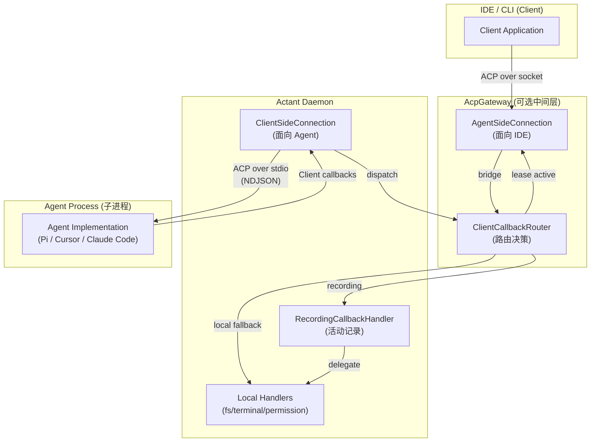
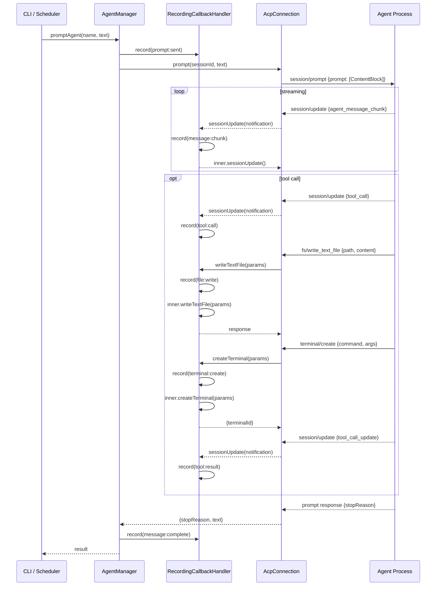

# ACP (Agent Client Protocol) 全接口参考

> **权威来源**: 一切 ACP 协议相关信息以官方文档为准 — [https://agentclientprotocol.com/get-started/introduction](http://agentclientprotocol.com/llms.txt)
> 阅读本文档前，请先查阅官方文档以获取最新定义。完整文档索引: [https://agentclientprotocol.com/llms.txt](https://agentclientprotocol.com/llms.txt)
>
> 基于 `@agentclientprotocol/sdk@0.14.1` + `@actant/acp` 自定义扩展
> 生成时间: 2026-02-26

---

## 架构总览




---

## 1. 协议方法常量

### Agent Methods (Client → Agent)

```typescript
const AGENT_METHODS = {
  authenticate:              "authenticate",
  initialize:                "initialize",
  session_cancel:            "session/cancel",
  session_fork:              "session/fork",        // unstable
  session_list:              "session/list",         // unstable
  session_load:              "session/load",
  session_new:               "session/new",
  session_prompt:            "session/prompt",
  session_resume:            "session/resume",       // unstable
  session_set_config_option: "session/set_config_option",
  session_set_mode:          "session/set_mode",
  session_set_model:         "session/set_model",    // unstable
} as const;
```

### Client Methods (Agent → Client)

```typescript
const CLIENT_METHODS = {
  fs_read_text_file:          "fs/read_text_file",
  fs_write_text_file:         "fs/write_text_file",
  session_request_permission: "session/request_permission",
  session_update:             "session/update",
  terminal_create:            "terminal/create",
  terminal_kill:              "terminal/kill",
  terminal_output:            "terminal/output",
  terminal_release:           "terminal/release",
  terminal_wait_for_exit:     "terminal/wait_for_exit",
} as const;
```

---

## 2. Agent Interface (SDK)

Client 可调用 Agent 的所有方法:

```typescript
interface Agent {
  initialize(params: InitializeRequest): Promise<InitializeResponse>;
  newSession(params: NewSessionRequest): Promise<NewSessionResponse>;
  loadSession?(params: LoadSessionRequest): Promise<LoadSessionResponse>;
  setSessionMode?(params: SetSessionModeRequest): Promise<SetSessionModeResponse>;
  setSessionConfigOption?(params: SetSessionConfigOptionRequest): Promise<SetSessionConfigOptionResponse>;
  authenticate(params: AuthenticateRequest): Promise<AuthenticateResponse>;
  prompt(params: PromptRequest): Promise<PromptResponse>;
  cancel(params: CancelNotification): Promise<void>;
  // unstable
  unstable_forkSession?(params: ForkSessionRequest): Promise<ForkSessionResponse>;
  unstable_listSessions?(params: ListSessionsRequest): Promise<ListSessionsResponse>;
  unstable_resumeSession?(params: ResumeSessionRequest): Promise<ResumeSessionResponse>;
  unstable_setSessionModel?(params: SetSessionModelRequest): Promise<SetSessionModelResponse>;
  // extensions
  extMethod?(method: string, params: Record<string, unknown>): Promise<unknown>;
  extNotification?(method: string, params: Record<string, unknown>): Promise<void>;
}
```

---

## 3. Client Interface (SDK)

Agent 可调用 Client 的所有回调方法:

```typescript
interface Client {
  // 必须
  requestPermission(params: RequestPermissionRequest): Promise<RequestPermissionResponse>;
  sessionUpdate(params: SessionNotification): Promise<void>;
  // 可选 (按 ClientCapabilities 声明)
  readTextFile?(params: ReadTextFileRequest): Promise<ReadTextFileResponse>;
  writeTextFile?(params: WriteTextFileRequest): Promise<WriteTextFileResponse>;
  createTerminal?(params: CreateTerminalRequest): Promise<CreateTerminalResponse>;
  terminalOutput?(params: TerminalOutputRequest): Promise<TerminalOutputResponse>;
  waitForTerminalExit?(params: WaitForTerminalExitRequest): Promise<WaitForTerminalExitResponse>;
  killTerminal?(params: KillTerminalCommandRequest): Promise<KillTerminalCommandResponse>;
  releaseTerminal?(params: ReleaseTerminalRequest): Promise<ReleaseTerminalResponse>;
  // extensions
  extMethod?(method: string, params: Record<string, unknown>): Promise<unknown>;
  extNotification?(method: string, params: Record<string, unknown>): Promise<void>;
}
```

---

## 4. Request / Response 类型 (SDK)

### 4.1 Initialize

```typescript
type InitializeRequest = {
  protocolVersion: number;
  clientCapabilities?: ClientCapabilities;
  clientInfo?: Implementation | null;
};

type InitializeResponse = {
  protocolVersion: number;
  agentCapabilities?: AgentCapabilities;
  agentInfo?: Implementation | null;
  authMethods?: AuthMethod[] | null;
};

type ClientCapabilities = {
  fs?: { readTextFile?: boolean; writeTextFile?: boolean };
  terminal?: boolean;
};

type AgentCapabilities = {
  loadSession?: boolean;
  mcpCapabilities?: McpCapabilities;
  promptCapabilities?: PromptCapabilities;
  sessionCapabilities?: SessionCapabilities;
};

type McpCapabilities = {
  http?: boolean;   // 支持 McpServer::Http
  sse?: boolean;    // 支持 McpServer::Sse (已被 MCP spec 废弃)
};

type PromptCapabilities = {
  audio?: boolean;           // 支持 ContentBlock::Audio
  embeddedContext?: boolean;  // 支持 ContentBlock::Resource
  image?: boolean;           // 支持 ContentBlock::Image
};

type SessionCapabilities = {
  // 预留，未来扩展
};

type Implementation = {
  name: string;
  title?: string;
  version?: string;
};
```

### 4.2 Session Management

```typescript
// session/new
type NewSessionRequest = {
  cwd: string;
  mcpServers: McpServer[];
};
type NewSessionResponse = {
  sessionId: string;
  configOptions?: SessionConfigOption[] | null;
  modes?: SessionModeState | null;
  // NOTE: models 已被 configOptions (category: "model") 取代，官方 schema 不含此字段
};

// session/load
type LoadSessionRequest = {
  sessionId: string;
  cwd: string;
  mcpServers: McpServer[];
};
type LoadSessionResponse = {
  configOptions?: SessionConfigOption[] | null;
  modes?: SessionModeState | null;
  // NOTE: models 已被 configOptions (category: "model") 取代，官方 schema 不含此字段
};

// session/set_mode
type SetSessionModeRequest = {
  sessionId: string;
  modeId: string;
};
type SetSessionModeResponse = {};

// session/set_config_option
type SetSessionConfigOptionRequest = {
  sessionId: string;
  configId: string;
  value: string;
};
type SetSessionConfigOptionResponse = {
  configOptions: SessionConfigOption[];
};

// authenticate
type AuthenticateRequest = { methodId: string };
type AuthenticateResponse = {};
```

### 4.3 Prompt / Cancel

```typescript
type PromptRequest = {
  sessionId: string;
  prompt: ContentBlock[];
};
type PromptResponse = {
  stopReason: StopReason;
  // NOTE: usage 不在官方 schema PromptResponse 中；用量通过 session/update (usage_update) 推送
};

type CancelNotification = {
  sessionId: string;
};

type StopReason = "end_turn" | "max_tokens" | "max_requests" | "refusal" | "cancelled" | string;

type Usage = {
  inputTokens?: number;
  outputTokens?: number;
};
```

### 4.4 Permission

```typescript
type RequestPermissionRequest = {
  sessionId: string;
  options: PermissionOption[];
  toolCall: ToolCallUpdate;
};
type RequestPermissionResponse = {
  outcome: RequestPermissionOutcome;
};

type RequestPermissionOutcome =
  | { outcome: "cancelled" }
  | { outcome: "selected"; optionId: string };

type PermissionOption = {
  optionId: string;
  kind: "allow_once" | "allow_always" | "reject_once" | "reject_always" | string;
  name?: string;
};
```

### 4.5 File System

```typescript
// fs/read_text_file
type ReadTextFileRequest = {
  sessionId: string;
  path: string;
  line?: number | null;    // 起始行 (1-based)
  limit?: number | null;   // 最多读取行数
};
type ReadTextFileResponse = {
  content: string;
};

// fs/write_text_file
type WriteTextFileRequest = {
  sessionId: string;
  path: string;
  content: string;
};
type WriteTextFileResponse = {};
```

### 4.6 Terminal

```typescript
// terminal/create
type CreateTerminalRequest = {
  sessionId: string;
  command: string;
  args?: string[];
  cwd?: string | null;
  env?: EnvVariable[];
  outputByteLimit?: number | null;
};
type CreateTerminalResponse = {
  terminalId: string;
};

// terminal/output
type TerminalOutputRequest = {
  sessionId: string;
  terminalId: string;
};
type TerminalOutputResponse = {
  output: string;
  truncated: boolean;
  exitStatus?: TerminalExitStatus | null;
};

// terminal/wait_for_exit
type WaitForTerminalExitRequest = {
  sessionId: string;
  terminalId: string;
};
type WaitForTerminalExitResponse = {
  exitCode?: number | null;
  signal?: string | null;
};

// terminal/kill
type KillTerminalCommandRequest = {
  sessionId: string;
  terminalId: string;
};
type KillTerminalCommandResponse = {};

// terminal/release
type ReleaseTerminalRequest = {
  sessionId: string;
  terminalId: string;
};
type ReleaseTerminalResponse = {};

type TerminalExitStatus = {
  exitCode?: number | null;
  signal?: string | null;
};

type EnvVariable = {
  name: string;
  value: string;
};
```

### 4.7 Referenced Types

```typescript
// MCP Server 连接配置 (Union: stdio / http / sse)
type McpServer =
  | McpServerStdio
  | McpServerHttp
  | McpServerSse;

type McpServerStdio = {
  name: string;
  command: string;
  args: string[];
  env: EnvVariable[];
};
type McpServerHttp = {
  type: "http";
  name: string;
  url: string;
  headers: HttpHeader[];
};
type McpServerSse = {
  type: "sse";
  name: string;
  url: string;
  headers: HttpHeader[];
};
type HttpHeader = {
  name: string;
  value: string;
};

// 认证方法
type AuthMethod = {
  id: string;
  name: string;
  description?: string;
};

// Session 模式状态
type SessionModeState = {
  currentModeId: string;
  availableModes: SessionMode[];
};
type SessionMode = {
  id: string;
  name: string;
  description?: string;
};

// Session 配置选项 (当前仅 select 类型)
type SessionConfigOption = {
  id: string;
  name: string;
  description?: string;
  category?: "mode" | "model" | "thought_level" | string;
  type: "select";
  currentValue: string;
  options: SessionConfigSelectOption[] | SessionConfigSelectGroup[];
};
type SessionConfigSelectOption = {
  value: string;
  name: string;
  description?: string;
};
type SessionConfigSelectGroup = {
  id: string;
  name?: string;
  options: SessionConfigSelectOption[];
};

// Annotations (来自 MCP spec)
type Annotations = {
  audience?: ("user" | "assistant")[];
};

// 嵌入资源内容 (text 或 blob)
type EmbeddedResourceResource =
  | { uri: string; text: string; mimeType?: string }
  | { uri: string; blob: string; mimeType?: string };
```

---

## 5. SessionNotification + SessionUpdate (SDK)

Agent 通过 `session/update` 回调向 Client 推送实时状态:

```typescript
type SessionNotification = {
  sessionId: string;
  update: SessionUpdate;
};
```

### SessionUpdate 联合类型

```typescript
type SessionUpdate =
  | { sessionUpdate: "user_message_chunk";       content: ContentBlock }
  | { sessionUpdate: "agent_message_chunk";      content: ContentBlock }
  | { sessionUpdate: "agent_thought_chunk";      content: ContentBlock }
  | { sessionUpdate: "tool_call";                ...ToolCall }
  | { sessionUpdate: "tool_call_update";         ...ToolCallUpdate }
  | { sessionUpdate: "plan";                     ...Plan }
  | { sessionUpdate: "available_commands_update"; ...AvailableCommandsUpdate }
  | { sessionUpdate: "current_mode_update";      ...CurrentModeUpdate }
  | { sessionUpdate: "config_options_update";    ...ConfigOptionUpdate }
  // 以下为 RFD 提案，SDK 已实现但尚未正式纳入 spec
  | { sessionUpdate: "session_info_update";      ...SessionInfoUpdate }   // RFD
  | { sessionUpdate: "usage_update";             ...UsageUpdate };        // RFD
```

### 各 update 类型详情

```typescript
// 消息块 (text / image / audio / resource_link / resource)
type ContentBlock =
  | { type: "text"; text: string; annotations?: Annotations }
  | { type: "image"; data: string; mimeType: string; uri?: string; annotations?: Annotations }
  | { type: "audio"; data: string; mimeType: string; annotations?: Annotations }
  | { type: "resource_link"; uri: string; name: string; mimeType?: string; title?: string; description?: string; size?: number; annotations?: Annotations }
  | { type: "resource"; resource: EmbeddedResourceResource; annotations?: Annotations };

// 工具调用
type ToolCall = {
  toolCallId: string;        // 唯一 ID
  title?: string;            // 显示名称
  kind?: ToolKind;           // 工具类别
  status?: ToolCallStatus;   // 执行状态
  input?: string;            // 原始输入参数
  output?: string;           // 原始输出
  content?: ToolCallContent[];  // 产出内容
  locations?: ToolCallLocation[];  // 影响的文件位置
};

// 工具调用更新 (仅 toolCallId 必须, 其余按需)
type ToolCallUpdate = {
  toolCallId: string;
  title?: string;
  kind?: ToolKind | null;
  status?: ToolCallStatus | null;
  input?: string;
  output?: string;
  content?: ToolCallContent[] | null;
  locations?: ToolCallLocation[] | null;
};

type ToolKind = "read" | "edit" | "delete" | "move" | "search" | "execute" | "think" | "fetch" | "switch_mode" | "other" | string;
type ToolCallStatus = "pending" | "in_progress" | "completed" | "failed";

// 工具调用产出内容 (可为普通内容、diff 或终端)
type ToolCallContent =
  | { type: "content"; content: ContentBlock }
  | { type: "diff"; path: string; oldText: string | null; newText: string }
  | { type: "terminal"; terminalId: string };

// 工具调用影响的文件位置
type ToolCallLocation = {
  path: string;
  line?: number;
};

// 执行计划
type Plan = {
  entries: PlanEntry[];
};
type PlanEntry = {
  content: string;
  priority: "high" | "medium" | "low";
  status: "pending" | "in_progress" | "completed";
};

// 可用命令更新
type AvailableCommandsUpdate = {
  availableCommands: AvailableCommand[];
};
type AvailableCommand = {
  name: string;
  description?: string;
  input?: AvailableCommandInput | null;
};
type AvailableCommandInput = {
  hint?: string;   // 未提供输入时的占位提示
};

// 当前模式
type CurrentModeUpdate = {
  modeId: string;
};

// 配置选项变更
type ConfigOptionUpdate = {
  configOptions: SessionConfigOption[];
};

// Session 信息
type SessionInfoUpdate = {
  title?: string;
};

// Token 用量
type UsageUpdate = {
  usage: Usage;
};
```

---

## 6. Actant 自定义接口 (@actant/acp)

### 6.1 ClientCallbackHandler

**文件**: `packages/acp/src/connection.ts`

Actant 自定义的回调处理接口，对齐 SDK `Client` 但所有 fs/terminal 方法必须实现:

```typescript
interface ClientCallbackHandler {
  requestPermission(params: RequestPermissionRequest): Promise<RequestPermissionResponse>;
  sessionUpdate(params: SessionNotification): Promise<void>;
  readTextFile(params: ReadTextFileRequest): Promise<ReadTextFileResponse>;
  writeTextFile(params: WriteTextFileRequest): Promise<WriteTextFileResponse>;
  createTerminal?(params: CreateTerminalRequest): Promise<CreateTerminalResponse>;
  terminalOutput?(params: TerminalOutputRequest): Promise<TerminalOutputResponse>;
  waitForTerminalExit?(params: WaitForTerminalExitRequest): Promise<WaitForTerminalExitResponse>;
  killTerminal?(params: KillTerminalCommandRequest): Promise<KillTerminalCommandResponse>;
  releaseTerminal?(params: ReleaseTerminalRequest): Promise<ReleaseTerminalResponse>;
}
```

### 6.2 AcpConnectionOptions

**文件**: `packages/acp/src/connection.ts`

```typescript
interface AcpConnectionOptions {
  autoApprove?: boolean;
  permissionPolicy?: PermissionsConfig;
  instanceName?: string;
  onSessionUpdate?: (notification: SessionNotification) => void;
  env?: Record<string, string>;
  callbackHandler?: ClientCallbackHandler;   // ← RecordingCallbackHandler 注入点
}
```

### 6.3 AcpSessionInfo

**文件**: `packages/acp/src/connection.ts`

```typescript
interface AcpSessionInfo {
  sessionId: string;
  modes?: NewSessionResponse["modes"];
  configOptions?: NewSessionResponse["configOptions"];
}
```

### 6.4 ConnectOptions

**文件**: `packages/acp/src/connection-manager.ts`

```typescript
interface ConnectOptions {
  command: string;
  args: string[];
  cwd: string;
  connectionOptions?: AcpConnectionOptions;
  resolvePackage?: string;
}
```

### 6.5 UpstreamHandler

**文件**: `packages/acp/src/callback-router.ts`

IDE 端回调转发接口 (Gateway lease 模式):

```typescript
interface UpstreamHandler {
  requestPermission(params: RequestPermissionRequest): Promise<RequestPermissionResponse>;
  sessionUpdate(params: SessionNotification): Promise<void>;
  readTextFile(params: ReadTextFileRequest): Promise<ReadTextFileResponse>;
  writeTextFile(params: WriteTextFileRequest): Promise<WriteTextFileResponse>;
  createTerminal(params: CreateTerminalRequest): Promise<CreateTerminalResponse>;
  terminalOutput(params: TerminalOutputRequest): Promise<TerminalOutputResponse>;
  waitForTerminalExit(params: WaitForTerminalExitRequest): Promise<WaitForTerminalExitResponse>;
  killTerminal(params: KillTerminalCommandRequest): Promise<KillTerminalCommandResponse>;
  releaseTerminal(params: ReleaseTerminalRequest): Promise<ReleaseTerminalResponse>;
}
```

### 6.6 GatewayOptions

**文件**: `packages/acp/src/gateway.ts`

```typescript
interface GatewayOptions {
  downstream: AcpConnection;
  callbackRouter: ClientCallbackRouter;
}
```

### 6.7 ResolvedAcpBinary

**文件**: `packages/acp/src/binary-resolver.ts`

```typescript
interface ResolvedAcpBinary {
  command: string;
  prependArgs: string[];
}
```

---

## 7. 连接类 (@actant/acp)

### 7.1 AcpConnection

**文件**: `packages/acp/src/connection.ts`

```typescript
class AcpConnection {
  constructor(options?: AcpConnectionOptions);

  // Properties
  readonly isConnected: boolean;
  readonly agentCapabilities: InitializeResponse | null;
  readonly rawConnection: ClientSideConnection | null;

  // Lifecycle
  spawn(command: string, args: string[], cwd: string, resolvePackage?: string): Promise<void>;
  initialize(): Promise<InitializeResponse>;
  close(): Promise<void>;

  // Session
  newSession(cwd: string, mcpServers?: unknown[]): Promise<AcpSessionInfo>;
  loadSession(sessionId: string, cwd: string): Promise<void>;
  setSessionMode(sessionId: string, modeId: string): Promise<void>;
  setSessionConfigOption(sessionId: string, configId: string, value: string): Promise<unknown>;
  authenticate(methodId: string): Promise<void>;
  getSession(sessionId: string): AcpSessionInfo | undefined;
  listSessions(): string[];

  // Prompt
  prompt(sessionId: string, content: string | ContentBlock[]): Promise<{ stopReason: string; text: string }>;
  streamPrompt(sessionId: string, content: string | ContentBlock[]): AsyncIterable<SessionNotification>;
  cancel(sessionId: string): Promise<void>;

  // Permission
  updatePermissionPolicy(config: PermissionsConfig): void;

  // Listeners
  addUpdateListener(sessionId: string, listener: (n: SessionNotification) => void): void;
  removeUpdateListener(sessionId: string, listener: (n: SessionNotification) => void): void;
}
```

### 7.2 AcpConnectionManager

**文件**: `packages/acp/src/connection-manager.ts`

```typescript
class AcpConnectionManager {
  connect(name: string, options: ConnectOptions): Promise<AcpSessionInfo>;
  acceptLeaseSocket(name: string, socket: Socket): void;
  disconnectLease(name: string): void;
  getConnection(name: string): AcpConnection | undefined;
  getGateway(name: string): AcpGateway | undefined;
  getRouter(name: string): ClientCallbackRouter | undefined;
  getPrimarySessionId(name: string): string | undefined;
  has(name: string): boolean;
  disconnect(name: string): Promise<void>;
  disposeAll(): Promise<void>;
  updatePermissionPolicy(name: string, config: PermissionsConfig): void;
}
```

### 7.3 ClientCallbackRouter

**文件**: `packages/acp/src/callback-router.ts`

```typescript
class ClientCallbackRouter implements ClientCallbackHandler {
  constructor(local: ClientCallbackHandler);

  readonly isLeaseActive: boolean;

  setEnforcer(enforcer: PermissionPolicyEnforcer | null): void;
  attachUpstream(handler: UpstreamHandler, capabilities: ClientCapabilities): void;
  detachUpstream(): void;

  // ClientCallbackHandler 实现 (路由到 upstream 或 local)
  requestPermission(params): Promise<RequestPermissionResponse>;
  sessionUpdate(params): Promise<void>;      // 同时通知 local + upstream
  readTextFile(params): Promise<ReadTextFileResponse>;
  writeTextFile(params): Promise<WriteTextFileResponse>;
  createTerminal(params): Promise<CreateTerminalResponse>;
  terminalOutput(params): Promise<TerminalOutputResponse>;
  waitForTerminalExit(params): Promise<WaitForTerminalExitResponse>;
  killTerminal(params): Promise<KillTerminalCommandResponse>;
  releaseTerminal(params): Promise<ReleaseTerminalResponse>;
}
```

### 7.4 AcpGateway

**文件**: `packages/acp/src/gateway.ts`

```typescript
class AcpGateway {
  constructor(options: GatewayOptions);

  readonly isUpstreamConnected: boolean;

  acceptSocket(socket: Socket): void;
  disconnectUpstream(): void;
}
```

---

## 8. 数据流图 -- 完整 Prompt 生命周期




---

## 9. RecordingCallbackHandler 拦截矩阵


| ACP 回调                                  | ActivityEventType    | 记录内容                    | 条件      |
| --------------------------------------- | -------------------- | ----------------------- | ------- |
| `sessionUpdate` → `agent_message_chunk` | `message:chunk`      | text content            | managed |
| `sessionUpdate` → `agent_thought_chunk` | `thought:chunk`      | text content            | managed |
| `sessionUpdate` → `tool_call`           | `tool:call`          | name, args, id          | managed |
| `sessionUpdate` → `tool_call_update`    | `tool:result`        | content, status         | managed |
| `sessionUpdate` → `plan`                | `plan:update`        | entries[]               | managed |
| `sessionUpdate` → `current_mode_update` | `mode:change`        | modeId                  | managed |
| `sessionUpdate` → `usage_update`        | (统计)                 | tokens                  | managed |
| `writeTextFile`                         | `file:write`         | path + full content     | managed |
| `readTextFile`                          | `file:read`          | path + content length   | managed |
| `requestPermission`                     | `permission:request` | toolCall info + options | managed |
| (permission result)                     | `permission:result`  | outcome                 | managed |
| `createTerminal`                        | `terminal:create`    | command, args, cwd      | managed |
| `terminalOutput`                        | `terminal:output`    | output text, truncated  | managed |
| `waitForTerminalExit`                   | `terminal:exit`      | exitCode, signal        | managed |
| `killTerminal`                          | `terminal:kill`      | terminalId              | managed |
| (prompt 前注入)                            | `prompt:sent`        | prompt content          | managed |
| (prompt 后注入)                            | `message:complete`   | full response text      | managed |


**"managed"**: `processOwnership === "managed"` 时注入 RecordingCallbackHandler。
**"external"**: 不注入，仅保留 instance 目录状态。

---

## 10. 导出汇总 (@actant/acp)

```typescript
// packages/acp/src/index.ts
export { AcpConnection, type AcpConnectionOptions, type AcpSessionInfo, type ClientCallbackHandler };
export { AcpConnectionManager, type ConnectOptions };
export { AcpCommunicator };
export { LocalTerminalManager };
export { ClientCallbackRouter, type UpstreamHandler };
export { AcpGateway, type GatewayOptions };
export { resolveAcpBinary, type ResolvedAcpBinary };
export type { SessionNotification, ContentBlock } from "@agentclientprotocol/sdk";
```

